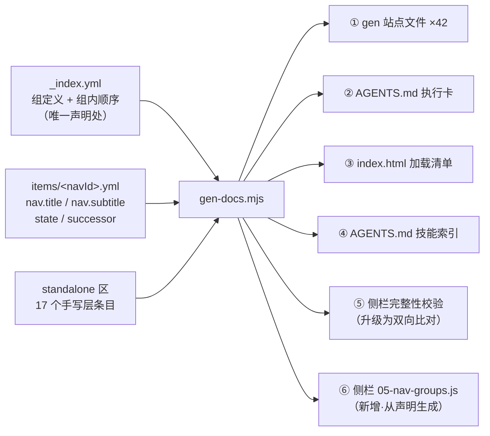
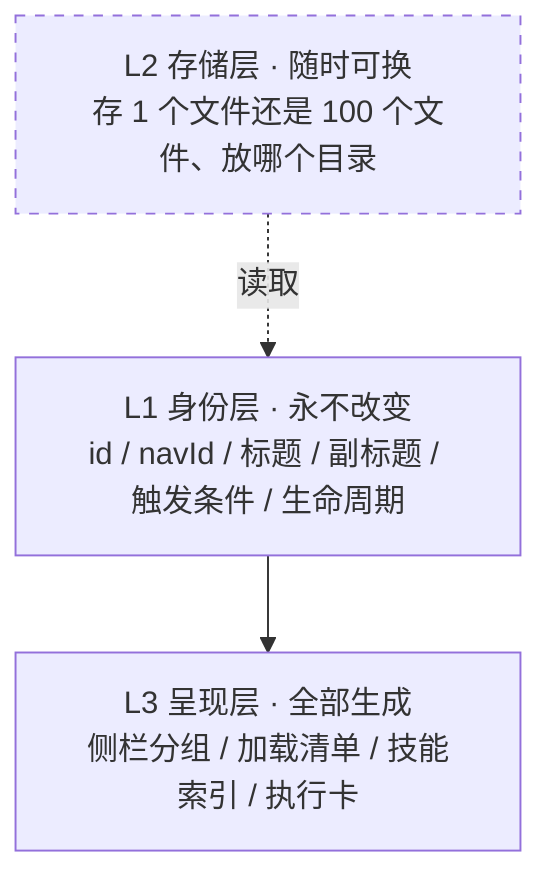

## 产品概述

给文档可视化站做一次架构级改造，根治「文档一膨胀就要改结构、调导航、全部重做一遍」的循环。核心是把现在绑死在一起的三件事拆开：**内容身份**（这篇叫什么、标题副标题是什么）、**存储位置**（存一个文件还是一百个文件）、**呈现方式**（侧栏分组、加载清单、技能索引）。拆开之后，文档怎么长都不会再触发全站重排，存储形态怎么切都不影响任何人和任何页面。

## 核心特性

- **侧栏全自动生成**：当前唯一的手写缺口 `05-nav-groups.js`（259 行 / 68 登记项）改为生成器产出，消除与真相源一字不差重复的 136 处标题副标题声明
- **加一篇只改一处**：组归属与顺序收进顺序清单，新建内容文件后只需在对应组加一行，侧栏、加载清单、技能索引、执行卡四处自动同步
- **存储形态与呈现解耦**：分片不再需要"规则"——存成 1 个文件还是 100 个文件都是可随时切换且无人察觉的实现细节
- **生命周期治理**：条目支持草案 / 生效 / 被吸收 / 废弃，被吸收的指向继任者、废弃的不进导航，内容一律保留不删除
- **重复检测**：跨篇重复的规则文本自动告警提示合并，从源头治「只增不减」

## 约束

42 篇正文一字不改；侧栏消费方（渲染脚本与派生模块）零改动；不动业务代码；不碰 `entity-meta.yml`。

## 技术栈

- 运行时：Node.js ESM（现有 `tools/gen-docs.mjs` 体系，五段产出架构）
- 数据格式：YAML（js-yaml，位于 `tools/node_modules`）
- 唯一生成器入口：`tools/gen-docs.mjs`
- 版本控制：Git（按逻辑分次提交，未获指示不 push）

## 实现方案

### 一句话策略

**把侧栏从"手写登记"改为"从声明生成"**，并用"生成结果与改造前逐字节相同"证明改造零风险；随后把组归属、生命周期、重复检测逐层加进同一份声明，让"加一篇"退化成改一行。

### 关键决策与取舍

**决策一：用 GEN 标记包裹数组段，保住手写文件头，才能做逐字节复现**

现有 `05-nav-groups.js` 前 12 行是手写注释（含「2026-09-04 收敛：删「表格功能框架模型」两组」的历史记录）。若整文件重写，文件头必然变化，"逐字节相同"这条最硬的验收就无法成立——而它是本次唯一能自证零风险的判据。所以：`DOC_VIZ.navGroups = [...]` 这一段用 `<!-- GEN:NAV:BEGIN/END -->` 包裹后生成，手写头部原样保留（也符合既有规则「演进不改历史」）。

**决策二：排版用声明字段驱动，不在生成器里写死**

实测同一文件里并存两种排版，且按组聚集：

- 单行紧凑式（组 `know-how`、`why-biz`、`ui-layer`）
- 多行展开式（组 `order-center`、`sys-admin`、`ops-analysis`、`ui-base`、`customer-app`、`archive-rules`）

在组声明里加 `style: compact | expanded` 字段，由声明决定排版。**排版是呈现参数，属于声明层，不该污染内容层**（与既有规则「上层只装配、下层只参数」一致）。

**决策三：组归属进顺序清单，不进内容文件**

内容文件（`items/<navId>.yml`）只管"这篇是什么"，不写"它属于哪个组"——归属是呈现问题。组定义、组内顺序、条目清单全部收进顺序清单，一处声明，四处产出。

**决策四：`state` 字段缺省即生效，保证 42 篇零改动**

生命周期字段设为可选，不写就是 `active`。这样第 ③ 步对现有 42 篇**一个字都不用改**，只有真正需要标记的篇才加字段。

**决策五：重复检测只告警不阻断**

跨篇重复的规则文本难以百分百避免误判（如通用自检句式）。定位是"提示该合并了"，不是"不许提交"。用 `⚠` 告警、退出码 0，与会阻断的守卫明确区分。

### 数据流



## 架构设计

### 三层解耦



**核心不变量：L2 怎么变，L1 和 L3 一个字都不用改。** 这直接消解"分片依据什么规则"这个问题——分片不再需要规则，它退化成随时可切、切了也没人察觉的实现细节。「重新分片 → 重排导航 → 重做 UI」的循环从根上消失。

### 不变量清单（违反即否决）

1. 任何内容只声明一次——标题、副标题、触发条件只在真相源，禁止第二套
2. 呈现层零手写——侧栏、加载清单、索引全部生成，手写的就是漂移源
3. 存储形态可换，换时不改内容
4. 历史只归档不删除——废弃篇保留内容，只退出导航

## 目录结构

```
文档可视化/data-source/methodology/
├── _index.yml                  # [MODIFY] 升级为「组定义 + 组内顺序」唯一声明处：
│                               #   groups: [{ id, title, hint, defaultOpen, style, items: [navId...] }]
│                               #   原有 order 列表迁入各组 items，保留三步法注释与「全量清单」说明
├── _nav.yml                    # [NEW] 第①步临时落点：9 个组定义 + standalone 区（17 个手写层条目）
│                               #   注：第②步组定义合并进 _index.yml 后，本文件仅保留 standalone 区
│                               #   standalone 登记内容不在真相源、只在 js/data/*.js 的条目：
│                               #   id / title / subtitle / group / style
└── items/                      # [MODIFY] 仅第③步给需标记的篇加可选 state / successor，正文一字不改

文档可视化/js/data/
└── 05-nav-groups.js            # [MODIFY] 数组段改为生成物：
                                #   手写文件头原样保留（含 2026-09-04 收敛历史）
                                #   DOC_VIZ.navGroups = [...] 用 GEN:NAV 标记包裹，由生成器产出
                                #   第①步硬判据：与改造前逐字节相同

tools/
└── gen-docs.mjs                # [MODIFY] ① 新增第 ⑥ 段「生成侧栏」（读声明 → 按 style 复现排版）
                                #          ② 第 ⑤ 段从「只校验」升级为「双向比对守卫」
                                #          ③ 新增生命周期校验（absorbed 必须带 successor 且目标存在）
                                #          ④ 新增重复检测（跨篇相同规则文本告警，不阻断）
                                #          ⑤ 第 ①~④ 段产出逻辑零改动

docs-coverage.md                # [MODIFY] 回写本次架构决策（三层解耦 + 四步 + 不变量清单）
AGENTS.md                       # [MODIFY] 手写总纲补充：加一篇只改顺序清单一处
```

## 实现要点（防回归）

**逐字节复现必须跨过的三个坑**（不处理就会让第 ① 步验收失败）：

1. **两种排版并存**——由组的 `style` 字段驱动，字段顺序固定为 `id / title / subtitle / enabled`，不得依赖 `JSON.stringify`（它无法复现手写缩进与换行）
2. **组 id 与条目 id 同名**——`customer-app` 既是组 id（第 232 行）又是条目 id（第 238 行）。生成器**不得假设 id 全局唯一**，重复检测与唯一性校验必须区分命名空间
3. **引号与转义**——手写稿用双引号、中文标点原样保留，生成时统一按此规则，禁止引入单引号或转义差异

**零漂移验证（每步的硬判据）**：

1. 改造前先跑一次生成器，把 `05-nav-groups.js` 及四处产物快照到 `/tmp` 作基线
2. 第 ① 步完成后重跑，`diff` 基线中的 `05-nav-groups.js` **必须逐字节相同**
3. 第 ②③④ 步完成后，解析生成的 `DOC_VIZ.navGroups` 对象与改造前**深度相等**（此时允许排版优化，但结构语义必须一致）
4. 任一环节不达标即回退排查，不允许带差异继续

**造错验证（四类，逐个实测）**：

- 某篇没登记进任何组 → 报错退出（不能静默不显示）
- 声明里登记了不存在的篇 → 报错退出
- `absorbed` 缺 `successor` 或目标不存在 → 报错退出
- 组 id 与条目 id 同名（`customer-app`）→ 不得误判为重复

**副作用控制**：本次不改 `js/app/070-render-scope-panel-demo.js`（侧栏渲染）与 `js/data/06-modules.js`（从侧栏派生 modules），二者零改动；不触碰业务代码，无需跑 `npm run build`；文档站（8123）由生成器自身保证一致性。

## 关键代码结构

**`_nav.yml` / `_index.yml` 的组声明结构**（生成器与人工共同依赖的契约）：

```
groups:
  - id: know-how              # 组 id（可与条目 id 同名，不要求全局唯一）
    title: 方法论库
    hint: 对话从这里进 · 标题即触发信号 · 登记进真相源才能被命中
    defaultOpen: true
    style: compact            # compact=单行紧凑 / expanded=多行展开，决定生成排版
    items:                    # 组内顺序即侧栏顺序；值 = items/<navId>.yml 的文件名
      - know-route
      - know-precipitate
      - know-method
      # …其余篇

standalone:                   # 内容不在真相源、只在 js/data/*.js 的条目
  - id: order-framework
    title: 订单中心 · 全局规则
    subtitle: 点值表 · 确认才写 · 槽可插
    group: order-center
    style: expanded
```

**条目生命周期字段**（`items/<navId>.yml` 顶层，可选）：

```
state: active                 # 缺省即 active，可选 draft | active | absorbed | deprecated
successor: <navId>            # 仅 state=absorbed 时必填，指向继任篇
```

**生成器第 ⑥ 段契约**：

```js
/**
 * 从组声明生成侧栏数组段，写入 05-nav-groups.js 的 GEN:NAV 标记之间。
 * @param {{groups: Array, standalone: Array}} navDecl  _nav.yml / _index.yml 的组声明
 * @param {Map<string, {title: string, subtitle: string, state: string}>} navById
 *        由 items/*.yml 的 nav 段 + state 字段按 navId 索引；standalone 条目直接取声明值
 * @returns {string} 与手写稿逐字节一致的数组段文本（含 DOC_VIZ.navGroups = [...] 赋值语句）
 */
function renderNavGroups(navDecl, navById) { /* … */ }
```

## Agent Extensions

### SubAgent

- **code-explorer**
- 用途：改造前全仓排查 `DOC_VIZ.navGroups` 与 68 个条目 id 的全部消费点，确认除已发现的两处（`070-render-scope-panel-demo.js`、`06-modules.js`）外无遗漏
- 预期结果：一份完整消费方清单，确保侧栏变生成物后不会破坏任何未被发现的依赖

### Skill

- **agent-browser**
- 用途：改造完成后打开文档可视化站（8123），验证侧栏 9 个组、68 个条目、展开/收起状态、点击跳转与改造前一致
- 预期结果：带截图的浏览器验收记录，作为"用户能感知的形态未变"的证据