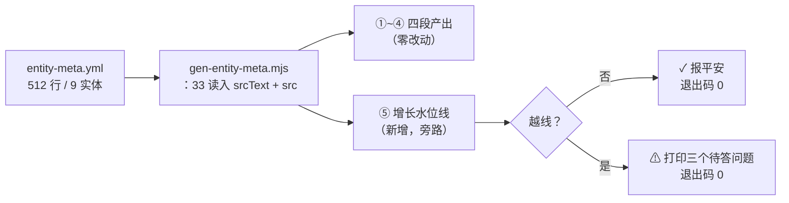

## 产品概述

给元模型登记表 `data-source/entity-meta.yml`（512 行 / 9 个实体）装一条"增长水位线"——不改文件结构，只在生成器里加阈值检查：越过阈值时主动提醒"该考虑分片了"，没越线就安静通过。

## 核心特性

- **只守门不分片**：文件保持单文件形态，不动一个字的内容
- **越线提醒**：行数或实体数超阈值时打印警告，说明现状数字、分片前必须回答的三个问题、可参照的既有做法
- **不阻断生成**：水位是提醒不是错误，退出码保持 0，与会中断生成的 vocabulary 一致性校验明确区分
- **决策留痕**：台账回写"为什么不分片"，避免以后有人再提同样的提议

## 约束

只动 `tools/gen-entity-meta.mjs` 一个文件；`entity-meta.yml` 任何内容不改；四处生成物零变更。

## 技术栈

- 运行时：Node.js ESM（现有 `tools/gen-entity-meta.mjs` 体系，378 行）
- 数据格式：YAML（js-yaml，位于 `tools/node_modules`）
- 不涉及前端构建（本次不触碰 frontend/backend，无需 `npm run build`）

## 实现方案

### 一句话策略

**在生成器末尾加一段旁路检查**——复用已读入的源文本算行数、复用已解析的 `entities` 算实体数，与阈值常量比对，越线就 `console.warn` 给结论，不越线就 `console.log` 报平安，全程不阻断生成。

### 关键决策与取舍

**决策一：不阻断，用 warn 而非 exit 1**

生成器里已有一个会中断的校验（第 0 段 vocabulary 一致性校验，`process.exit(1)`）。水位线与它性质不同：一致性校验不通过意味着产物是错的，必须拦；水位线越线只意味着"文件变大了"，产物依然正确。用 `exit 1` 会让每次生成都失败，逼人立刻分片——那等于替用户做了"现在必须重构"的决定。所以：**越线提醒、退出码 0、不写产物之外的任何东西**。

**决策二：阈值 800 行 / 16 实体，写成具名常量**

当前 512 行 / 9 实体，留约 60% 余量。为什么是这两个数：

- 800 行：yml 是配置不是散文，密度高；且这个文件需要整体协调看（加实体要同时动 entities + resources + pages），不能简单套用文档站"250 行上限"的判据
- 16 实体：9 个实体占 163 行，平均 18 行/实体；16 个约 290 行，与 800 行互补——行数没到但实体变多时也能兜住

**决策三：第 33 行拆成两行，避免二次读盘**

原代码 `const src = yaml.load(fs.readFileSync(srcFile, 'utf8'));` 把文本吃掉，行数无法复用。改为先存 `srcText` 再 `yaml.load(srcText)`，零额外 I/O。

**决策四：提醒里必须带"分片前要答的三个问题"**

只说"该分片了"会诱发一次准备不足的重构。这次探索已经踩出三个硬问题，必须写在提醒里：

1. Meta Studio 的整文件编辑模型怎么改（它会弄坏用户唯一的可视化配置入口）
2. relations 跨实体引用怎么不割裂（拆开后改一条关系要开两个文件）
3. 阈值要不要再调（也许到那时有更好的判据）

### 数据流



### 目录结构

```
tools/
└── gen-entity-meta.mjs   # [MODIFY] ① 第 33 行拆为 srcText + yaml.load(srcText)
                          #          ② 文件头部常量区新增 SHARD_LIMIT = { lines: 800, entities: 16 }（带理由注释）
                          #          ③ 末尾（第 378 行后）新增第 ⑤ 段「增长水位线」
                          #          ④ 第 ①~④ 段产出逻辑零改动

data-source/
└── entity-meta.yml       # [不改动] 单文件形态保留，内容一字不动

docs-coverage.md          # [MODIFY] 回写本次决策：为什么不分片 + 水位线阈值与触发后的处置口径
```

### 实现要点（防回归）

**插入位置**：必须在第 ①~④ 段产物全部写完**之后**（第 378 行末尾成功输出之后）。放在前面会让"提醒"出现在成功输出之前，读起来像失败；且万一未来水位线升级为阻断逻辑，产物已经落盘更安全。

**日志风格对齐**：沿用文件内既有三种前缀——`✓` 成功（`:115`、`:374`）、`⚠` 告警不阻断（`:84`）、`✗` 失败阻断（`:111`）。水位线用 `⚠`。

**零漂移验证（硬指标）**：

1. 改前先跑一次 `node tools/gen-entity-meta.mjs`，用 `git stash` 或文件快照留下基线
2. 加完水位线重跑
3. `git diff -- frontend/src/shared/config/entityMeta.generated.ts frontend/src/shared/config/entityRelations.generated.ts backend/src/services/generated/entityMeta.generated.ts 文档可视化/js/data/actions.generated.js` 必须为空
4. 非空说明改动污染了产出路径，回退排查，不允许带差异继续

**造错验证**：临时把 `SHARD_LIMIT.lines` 改成 100（低于当前 512），重跑应出现 `⚠` 提醒且**退出码仍为 0**；验证后改回 800 并再跑一次确认恢复。这一步是防"水位线写成了阻断"的唯一手段——不实测就不知道它到底会不会拦。

**副作用控制**：本次不触碰 `tools/meta-studio.mjs`（它的整文件编辑模型正是保留单文件的理由），不改任何业务代码，不跑前端构建。

## 验收判据

1. `node tools/gen-entity-meta.mjs` 输出含 `✓ 增长水位线：512/800 行 · 9/16 实体（未越线）`
2. 四处生成物 `git diff` 为空
3. 阈值临时调到 100 行重跑：出现 `⚠` 提醒且退出码为 0（不阻断），随后改回
4. `docs-coverage.md` 已回写：不分片的三个否决性事实 + 阈值 + 越线后必须答的三个问题
5. 一个逻辑提交，未获指示不 push