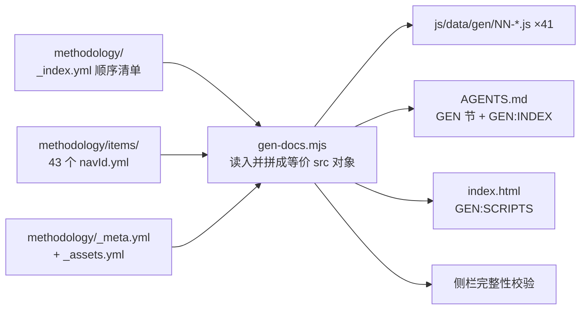

## 产品概述

把方法论真相源 `文档可视化/data-source/methodology.yml`（3598 行，43 个条目）拆成目录分片，同时保证所有生成产物逐字节不变。解决的核心痛点：AI/人要改一篇方法论，必须在几千行里搜索定位，多会话并发改不同篇还会撞同一个文件。

## 核心特性

- **目录化分片**：按篇拆成独立 yml 文件，文件名与生成物一一对应，看到篇名就知道开哪个文件，无需查表
- **顺序仍一处声明**：条目顺序由一份顺序清单决定，不退化成"按文件名排序"的隐式规则
- **零内容变更**：分片前后所有生成产物（41 个 js、执行卡、技能索引、页面加载清单）diff 必须为空
- **分片守卫**：目录与清单双向比对、文件名一致性、id 唯一性、旧单文件复活检测，出错即报错退出而非静默
- **旧副本清理**：删除已过时的整站部署快照，消除第二份真相源

## 约束

不改条目内部结构，不改生成器产出逻辑，不改生成物任何一行内容；只换存放位置。

## 技术栈

- 语言/运行时：Node.js ESM 脚本（现有 `tools/gen-docs.mjs` 体系）
- 数据格式：YAML（js-yaml，现有依赖，位于 `tools/node_modules`）
- 生成器唯一入口：`tools/gen-docs.mjs`
- 版本控制：Git（一次改动一个逻辑提交，未获指示不 push）

## 实现方案

### 一句话策略

**生产端分片、消费端不动、生成器只换读取方式**——把单文件真相源换成"目录 + 顺序清单"，生成器读入后原地拼回一个与原结构完全等价的对象，下游五段产出逻辑一行不改。

### 关键决策与取舍

**决策一：一片一篇，文件名 = navId（不带序号）**

- 生成物是 `js/data/gen/NN-<navId>.js`，分片文件是 `items/<navId>.yml`，映射零查表：看到 `01-know-table.js` 就知道改 `items/know-table.yml`
- 不带 NN 序号，是为了让"顺序"只有 `_index.yml` 一个来源。若文件名带序号，就会多出一个隐式顺序源，正是要消灭的漂移口子
- 取舍：目录里会有 43 个文件，但 `js/data/gen/` 本来就有 41 个，同量级、可管理
- 效果：单文件从 3598 行降到平均 80~90 行，最大 304 行

**决策二：生成器改造用"等价对象"手法，把改动压到最小**
现有代码只依赖 `src.items` / `src.assets` / `src.layers` / `src.meta?.version` 四处。改造时按清单读入分片，拼成等价的 `src` 对象，则第 ①~⑤ 段产出逻辑（生成 js、写执行卡、写加载清单、写技能索引、侧栏校验）**零改动**。

**决策三：分两次提交，规避自举冲突**
本次改的就是真相源本身。若在分片的同时新增规则条目，序号与产物都会变，"diff 为空"就无法验证。因此：

- 提交 1（chore）：纯分片 + 生成器改造 + 守卫，验证 diff 为空
- 提交 2（docs）：把规则补进**已有篇** `19-know-layout`，不新增条目，序号不变

**决策四：规则不是新发明，是把已有规则照到自己身上**
`19-know-layout`（文档项目怎么分层）已写明「单文件上限 ≤ 250 行 · 一章一文件 · 粒度标准是一次对话能读完再改写」。真相源 3598 行是这条规则唯一没被执行到的对象。提交 2 只需补一句"这条判据同样适用于真相源本身"。

### 数据流



## 目录结构

```
文档可视化/data-source/
├── methodology.yml                 # [DELETE] 整文件退休，由 methodology/ 目录取代
└── methodology/                    # [NEW] 分片后的真相源目录
    ├── _index.yml                  # [NEW] 唯一顺序清单：order: [navId...]，决定生成物 NN 序号、
    │                               #       侧栏阅读顺序、技能索引顺序。附「新增一篇三步法」注释
    ├── _meta.yml                   # [NEW] 原 meta 段（version/updated）+ layers 段（L0/L1 定义）
    ├── _assets.yml                 # [NEW] 原 assets 段（组件资产清单，152 行）
    └── items/                      # [NEW] 43 篇，文件名 = navId，内容 = 原单个条目原文
        ├── know-table.yml          #       最大一篇（约 304 行）
        ├── know-meta.yml
        ├── why-scope.yml
        └── …（其余 40 篇）

tools/
├── gen-docs.mjs                    # [MODIFY] ① 读取方式改为「读目录 + 按清单拼等价对象」
│                                   #          ② 新增分片守卫块（4 项校验）
│                                   #          ③ 第 7/12 行注释与第 100 行产出行文案同步新路径
│                                   #          ④ 第 54 行注释本次先不动（会改产物，留到提交 2）
└── extract-to-yaml.mjs             # [MODIFY] 一次性迁移脚本已完成使命，头部加弃用声明指向新目录，不删除（保留留痕）

AGENTS.md                           # [MODIFY] 第 3 行、第 121 行手写总纲中的单文件路径改为目录路径
docs-coverage.md                    # [MODIFY] 回写台账（方法与本次改动）
.workbuddy/deploy/                  # [DELETE] 过时的整站部署快照（删前备份到 /tmp）
```

## 实现要点（防回归）

**切片操作**：按 `^  - id: ` 行（第 170 行起，共 43 处）切分，每条从 `  - id:` 起至下一条   `- id:` 前止。切片后每个文件内容顶格写（原文件是 items 下的两空格缩进数组项，需去掉一层缩进后存为独立文档根），生成器读入时直接得到条目对象。

**零漂移验证（硬指标）**：

1. 分片前先跑一次 `node tools/gen-docs.mjs` 并让工作区产物处于已提交状态
2. 分片改造后重跑
3. `git diff -- 文档可视化/js/data/gen/ AGENTS.md 文档 visualizations/index.html` 必须为空
4. 非空即说明切片丢了内容或拼装顺序错了，回退排查，不允许带差异继续

**守卫清单（分片后新增的风险，必须显式拦截）**：

1. `items/` 下有文件但 `_index.yml` 未登记 → 报错
2. `_index.yml` 登记了但文件不存在 → 报错
3. 文件内容 `navId` 与文件名不一致 → 报错
4. `id` / `navId` 重复 → 报错
5. 旧单文件 `data-source/methodology.yml` 仍存在 → 报错提示删除（防复制复活）
以上均 `process.exitCode = 1` 并打印补法，禁止静默通过。

**旧副本裁决（用户授权，AI 决定：删除 `.workbuddy/deploy/`）**

- 现场事实：它是整站部署快照（index.html + css + js + data-source），未被 git 跟踪，全仓无任何脚本引用，内容停在 `version: 29 / 2026-08-30 / 22 条`，真相源现 44 条，落后一半
- 它正是"靠复制产生第二份真相"的实例，与本次要消灭的问题同源；留着只会被 AI 搜到当正版用
- 安全做法：删除前先 `cp -r` 到 `/tmp/` 留一手，删后确认 `artifacts/`（审查报告，有留痕价值）与 `memory/`（会话记忆，非本次范围）完好
- 不采纳"改成自动生成"：没有任何脚本在用它，为不存在的流程加自动化属于 YAGNI

**副作用控制**：本次不触碰业务代码（backend/frontend），无需跑 `npm run build`；文档可视化站点（8123）由生成器自身保证一致性。

## 验收判据

1. 三处产物 diff 为空（41 个 gen js、AGENTS.md 的 GEN 节与 GEN:INDEX、index.html 的 GEN:SCRIPTS）
2. `node tools/gen-docs.mjs` 输出 `✓ 侧栏完整性：43 条在 05-nav-groups.js 均有入口` 与 `✓ 生成完成：43 条`
3. 分片文件行数：平均 80~90 行，最大 ≤ 310 行
4. 五项守卫逐个人为造错，均报错退出而非静默通过
5. `.workbuddy/deploy/` 已删除，`/tmp/` 有备份，`artifacts/`、`memory/` 完好
6. 提交 2 后重跑生成器，产物同样稳定，台账已回写