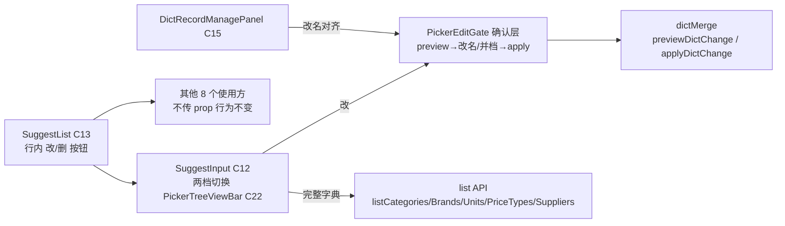

## 产品 Overview

字典项「重复治理」能力收敛：以既有 dictMerge 并档机制为唯一正确手段（并而非删），把「改/并档」与「删」能力下沉到检索列表行内，并统一全站改名口径。

## Core Features

- **SuggestList 行内管理按钮**：仅 `existing` 项、hover 时在行尾渲染「改 / 删」两个小按钮，其余 9 个使用方不传 prop 行为不变
- **改 → 确认层并档**：点「改」打开 PickerEditGate 同款确认层（输入新名 → 300ms 防抖实时 preview 影响行数 → 显示改名/并档模式与影响摘要 → 确认 apply）；无同名=改名，有同名=并档，需适配 popup 内打开（allowRoot）
- **删 → 单条确认**：沿用现有保护（modal.confirm「已使用的历史值作为字符串保留」；被引用由后端拦截并提示），不做批量删、不进勾选态
- **两档切换**：字典类字段（category/brand/supplier/priceType/unit）的 SuggestInput 默认接 PickerTreeViewBar（C22）：「检索结果 / 完整字典」，完整字典走既有 list API，行内同样有改/删
- **改名口径全站统一**：C15 管理面板（DictRecordManagePanel）改名从「重名拦截」改为走 dictMerge（同名=并档 preview→apply，无同名=改名）
- **废弃 DictFieldInput（C16）**：已无页面使用方，整组件与导出一并移除
- **验收**：e2e 截图核对产品档案（分类/品牌列）、供应商档案（名称列）、选品下拉的占位项、行内按钮、模式切换；`npm run build` 通过

## Tech Stack

- 前端：React + TypeScript + Vite（frontend/src/apps/staff，8080 生产 / 8081 dev），antd + 项目自有 Ds*/Picker* 组件体系
- 后端：不改。dictMerge（previewDictChange/applyDictChange）、list API（listCategories/listBrands/listUnits/listPriceTypes/listSuppliers）均已存在
- 文档：docs-coverage.md 台账回写；改方法论才动 `文档可视化/data-source/methodology.yml` + `node tools/gen-docs.mjs`（本次为纯代码任务，预期只回写台账）

## Implementation Approach

**策略：全部复用既有组件资产，不造第二套确认。**

1. **SuggestList（C13）扩展**（frontend/src/shared/components/SuggestList.tsx）：

- `SuggestListProps` 新增可选 `onRename?: (opt: SuggestOption) => void` / `onDelete?: (opt: SuggestOption) => void`
- DefaultRow 仅在 `opt.type === 'existing'` 且 prop 传入时，行尾（type 标签旁）hover 渲染编辑/删除图标按钮（`onMouseDown preventDefault` 防下拉失焦关闭，参考 DisplayCell 的 onMouseDown 坑）
- 点击「改/删」`stopPropagation`，不触发 onSelect

2. **确认层接线**：SuggestInput 的 popupRender 中把 onRename 转为打开 PickerEditGate 确认层：

- field → DictChangeKind 复用 `catalogDictField()` 映射（pickerCatalogImpact.ts 已有 brand/unit/category/priceType/supplier）
- PickerEditGate.open 已支持 `allowRoot` 选项（L172-179），popup 内（ant-select-dropdown 挂载点）传入 allowRoot 即可；anchor 传行内「改」按钮元素
- applyGlobal 走 `applyDictChange({ kind, fromId: opt.id, toName })`；成功后刷新 options 并同步输入框值

3. **SuggestInput 两档切换**（frontend/src/shared/components/SuggestInput.tsx）：

- 字典类字段（映射命中的 5 类）内部置入 PickerTreeViewBar（C22），views 用两档（检索结果/完整字典）
- 「检索结果」= 现 useSuggest 流程不变；「完整字典」= 调对应 list API 渲染 SuggestList（keyword 过滤在前端做，list 量级小）
- 两档下 onRename/onDelete 均生效；外部 fetcher 场景（表头级联等）不出现切换条

4. **C15 口径对齐**（frontend/src/shared/components/DictRefField.tsx）：DictRecordManagePanel.handleRename 改为先 `previewDictChange`，mode=merge 时展示影响并确认后 applyDictChange；mode=rename 直接 update；去掉 `resolveGuard('dict_item_rename')` 重名拦截（entityMeta.generated.ts 为生成文件，通过 `node tools/gen-entity-meta.mjs` 流程处理，不手改生成物）
5. **废弃 DictFieldInput**（frontend/src/shared/components/DictFieldInput.tsx）：删除组件 + index.ts 导出；contactMethodDict.ts 仅引类型，把 `DictFieldConfig` 类型迁到合适位置或内联；badge/registry.ts 移除 C16 登记

**性能与可靠性**：preview 防抖 300ms 已在 PickerEditGate 内；list 全量仅字典级数据量（数十~数百条）；所有新 prop 可选，零破坏性；不 push、按逻辑隔离 commit。

## Architecture Design



## Directory Structure

```
frontend/src/shared/components/
├── SuggestList.tsx                    # [MODIFY] 加可选 onRename/onDelete；DefaultRow 行尾 hover 按钮（仅 existing）
├── SuggestInput.tsx                   # [MODIFY] 字典类字段接 PickerTreeViewBar 两档切换；完整字典 list 接线；改名打开确认层
├── PickerTreeViewBar.tsx              # [不改] 复用 C22
├── DictRefField.tsx                   # [MODIFY] DictRecordManagePanel 改名改走 dictMerge（preview→merge 时确认→apply），去掉重名拦截
├── DictFieldInput.tsx                 # [DELETE] C16 已无使用方，整组件废弃
├── badge/registry.ts                  # [MODIFY] 移除 C16 登记
├── index.ts                           # [MODIFY] 移除 DictFieldInput/DictFieldConfig 导出（类型迁移）
└── product-picker/PickerEditGate.tsx  # [MODIFY·小] 支持从 popup 挂载点打开（allowRoot 场景复用），确认成功回调透出
frontend/src/shared/config/contactMethodDict.ts  # [MODIFY] DictFieldConfig 类型来源调整
frontend/src/shared/components/product-picker/pickerCatalogImpact.ts  # [不改] catalogDictField 复用
docs-coverage.md                     # [MODIFY] 台账回写本次覆盖状态
```

## Key Code Structures

```ts
// SuggestListProps 新增（可选，不传即现状）
export interface SuggestListProps<T = SuggestOption> {
  // …既有字段不变
  /** 行内改名：仅 existing 项 hover 显示「改」；点击后由调用方打开确认层 */
  onRename?: (opt: T) => void;
  /** 行内删除：仅 existing 项 hover 显示「删」；调用方负责 modal.confirm 保护 */
  onDelete?: (opt: T) => void;
}
```

## Agent Extensions

### Skill

- **playwright-cli**
- Purpose：e2e 行为验收——打开产品档案/供应商档案/选品场景，核对占位项、行内按钮 hover、两档切换、并档 preview，截图留证
- Expected outcome：可操作的验收截图与行为确认清单（按钮 hover 出现、preview 显示影响行数、并档后引用归并、build 通过）