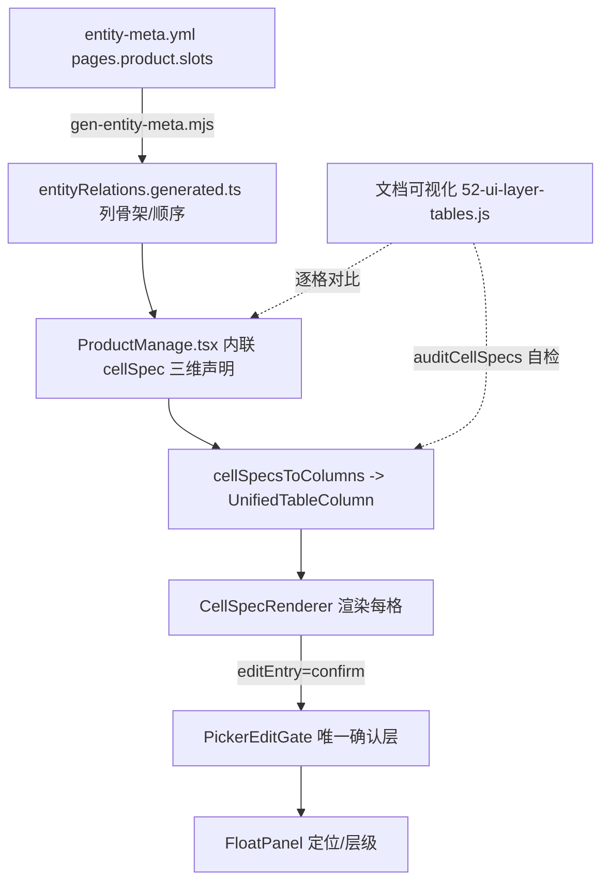

## 用户需求

根据《表格 UI 分层》规范，把「产品管理」这一个表功能真正落到 L1-L5 五层架构：每一层在每个功能上的具体配置参数都要能在文档中体现（装配层配了什么、骨架层、行列交互层每格的 display×editEntry×valueState×gate 参数），并能与代码实现逐格对比——一致即正确，不一致即参数有问题或架构未覆盖。当前产品管理列表 11 列全是 `renderMode:'custom'` 手写 JSX、零 cellSpec 化，编辑弹窗的矩阵格走的是旧接线，且确认层存在两个架构级 bug。

## 产品概述

以采购报价（阶段1 样板）为参照，将产品管理列表与编辑弹窗整体收敛到统一的 cellSpec 声明 + PickerEditGate 确认层唯一链路，并把列顺序/key/title/slot 收口到 `entity-meta.yml` 单一真相源；同步在文档可视化矩阵页登记产品管理各层参数，形成「配置↔代码」可对比基线。

## 核心功能

- 列表 11 列（分类/图/产品名/品牌/系列规格/单位/售价/进价/备注/状态/更新时间）迁到 cellSpec 三维参数，由 `cellSpecsToColumn` 驱动，消除 `renderMode:'custom'` 手写 JSX
- 单位/售价/进价列改为 `multi-record + expand + renderPanel`，矩阵在浮层展开（统一 L4 架构，删 `SkuPriceColumns` 重复形态声明）
- 编辑弹窗五段（产品信息/品牌/规格/单位+价格/图片）与 3 个矩阵（单位/售价/进价）接入统一 PickerEditGate 确认层链路，矩阵内格走确认层唯一链路
- 修复确认层定位 bug：矩阵内切格 / anchorRef 变化 / `confirmAndGo→reopen` 复用同面板时主动重算定位
- 修复售价进价确认层层级颠倒：列表场景下确认层层级高于承载它的 antd Popover
- 配置收口 `entity-meta.yml` 单一真相源，文档矩阵页体现产品管理各层参数，回写台账

## 技术栈

- 前端：React + TypeScript + Vite（沿用现有 `frontend`）
- 表格体系：UnifiedTable + CellSpec（L4）+ CellSpecRenderer + cellSpecAdapter（已建成）+ PickerEditGate / FloatPanel（L5 唯一确认层）
- 配置真相源：`data-source/entity-meta.yml`（`pages.slots` 段）→ 生成物 `entityRelations.generated.ts`
- 文档站点：`文档可视化/`（gen-docs 生成 `52-ui-layer-tables.js` 矩阵页）

## 实现思路

**总体策略**：以采购报价（阶段1 样板，`PurchaseQuote.tsx:1047` 用 `cellSpecsToColumns` 内联声明三维参数）为唯一已落地参照，镜像其模式迁移产品管理；列顺序/key/title/slot 由 `entity-meta.yml` 的 `pages.product.slots` 驱动（满足「L4 声明落点＝登记表 pages 段、禁第二套」的排序真相源），三维 cellSpec 参数在页面内声明（与样板一致，避免改动生成器引入回归）。文档矩阵页登记各层参数用于「配置↔代码」对比，靠 `auditCellSpecs` 做代码级自检。

**关键技术决策**：

1. 列表列用 `cellSpecsToColumns` 取代 `mergeColumns(deriveTableColumns, 手写render覆盖)`：骨架仍由登记表 `pages.product.slots` 生成，覆盖层改为 cellSpec 三维，彻底消灭 `renderMode:'custom'` 手写 JSX（审计已确认 11 列全在 custom）。
2. 售价/进价列 `multi-record + expand + renderPanel`：现有「antd Popover 内嵌 MatrixTable」改为确认层/展开浮层内渲染矩阵（PickerNameCell/PickerNumCell 已是 confirm 格），与「矩阵=并列引擎、浮层表承载贴格展开子集」规则一致，并顺带消除层级 bug 的部分诱因。
3. 定位 bug 修复在 `FloatPanel` 侧做最小改动：新增 `repositionKey` 受控重算信号，由 `PickerEditGate.open()` 与 `confirmAndGo→reopen()` 在每次换锚点/切格时自增，触发 `useLayoutEffect` 重算定位（不依赖 isVisible/滚动）。锚点实时取 `anchorRef.current` 的逻辑保留，只补「锚点身份变化触发重算」的缺失环节。
4. 层级 bug 修复：在 `canvasStage.resolveOverlayLayer` 把 `.ant-popover` 视同 modal 层（与 `.ant-modal-wrap` 同口径），使列表场景价格确认层落入 modal 浮层（z≈1050）高于承载 Popover（z≈1000）；编辑弹窗内 `.ant-modal-content` 场景原本即正常，不受影响。
5. 单一真相源：把产品列表列登记进 `entity-meta.yml` 的 `pages.product.slots`（key/title/slot/editor），删 `ProductManage.tsx` 的手写 `render` 覆盖与 `quickCreateConfig.ts` 中未被消费的重复字段声明（子代理确认 `confirmStrategy/suggestField` 等为死配置）。

**性能与可靠性**：cellSpec 仅声明不渲染，列数不变性能无影响；定位重算走 RAF 去抖，矩阵切格单次重算开销可忽略；`auditCellSpecs` 在构建期报错缺 gate 的列，防止静默遗漏。

## 实现要点（防回归）

- 复用既有 `CellSpecRenderer`/`PickerEditGate`，不另写确认层；门禁格统一走 `disabledReason`（视觉一致、点击提示「请先 X」），禁止置灰消失。
- 邻格快切保留 `cellSwitch`（rowId 空行 `__empty_${seq}` 兜底，沿用 `cellSpecAdapter` 现有逻辑）。
- 修层级时只扩 `resolveOverlayLayer` 的 modal 判定集合，不动 `FloatPanel` 的 z-index 算法，避免影响其他浮层。
- 改前端后必须跑 `npm run build`（8080 生产 / 8081 dev）；回写 `docs-coverage.md` 产品管理行与矩阵页。
- 不截 e2e 图（用户指定），验收以行为清单 + 构建/类型/文档体检为准。

## 架构设计



新增的对比闭环：文档矩阵页登记每格 `display×editEntry×valueState×gate` + 代码落点，与 `cellSpecsToColumns` 实际声明比对；不一致即参数或架构缺口。

## 目录结构与文件

```
data-source/entity-meta.yml                              # [MODIFY] 新增/补全 pages.product.slots：列顺序 key/title/slot/editor（排序单一真相源）
frontend/src/apps/staff/pages/ProductManage.tsx          # [MODIFY] 列表 11 列改 cellSpecsToColumns 声明，删 renderMode:custom 手写 render 覆盖
frontend/src/shared/config/SkuPriceColumns.tsx           # [MODIFY] 收敛：单位/售价/进价形态改由 cellSpec expand+renderPanel 承载，删重复手写形态
frontend/src/shared/components/table/cellSpec.ts         # [不改] 复用三维定义与 auditCellSpecs；确认 inline 分支已按计划删除
frontend/src/shared/components/table/cellSpecAdapter.tsx # [不改] 复用 cellSpecsToColumns
frontend/src/shared/components/FloatPanel.tsx            # [MODIFY] 新增 repositionKey 受控信号，useLayoutEffect 依赖它触发 updatePosition 重算定位
frontend/src/shared/utils/canvasStage.ts                 # [MODIFY] resolveOverlayLayer 把 .ant-popover 视同 modal 层，修正层级
frontend/src/shared/components/product-picker/PickerEditGate.tsx # [MODIFY] open() 与 confirmAndGo→reopen() 换锚点时自增 repositionKey
frontend/src/apps/staff/pages/ProductEditDialog.tsx      # [MODIFY] 五段接入统一 PickerEditGate 链路，删 ArchiveFieldCell 旧手写确认层接线
frontend/src/apps/staff/pages/product-manage/UnitSection.tsx        # [MODIFY] 单位矩阵走统一确认层
frontend/src/apps/staff/pages/product-manage/UnitPriceExpandPanel.tsx # [MODIFY] 售价/进价矩阵走统一确认层
frontend/src/shared/components/product-picker/PickerInlineCells.tsx  # [MODIFY] 矩阵格确认层接线对齐 PickerEditGate（删旧路径）
文档可视化/js/data/gen/52-ui-layer-tables.js            # [MODIFY] 登记产品管理 L1-L5 各层参数（每格 display×editEntry×valueState×gate + 代码落点）
docs-coverage.md                                         # [MODIFY] 回写产品管理行状态（✅ 架构落地）+ 待补项销项
```

## 关键代码结构（要点）

- `FloatPanel` 新增受控重算入口：`repositionKey?: number` 属性，`useLayoutEffect(..., [repositionKey, isVisible, parentId, panelId])` 内调用 `scheduleUpdate()`。
- `PickerEditGate.open(next, anchor, opts)`：在 `anchorRef.current = anchor` 后 `setRepositionKey(k => k+1)`；`confirmAndGo` 的 `reopen()` 同样自增。
- `cellSpec` 三维声明（沿用已建成类型）：`display × editEntry(confirm) × valueState` + `gate{title,input,search,bullets,onApply,allowEmpty}` + `disabledReason` + `hidden`。

## Agent Extensions

### SubAgent

- **code-explorer**
- 用途：扫描产品管理全貌（列表 11 列 + 编辑弹窗五段 + 3 个矩阵），逐格列出当前 `display×editEntry×valueState×gate` 实际形态与代码落点（file:line），作为「L1-L5 各层配置清单」基线。
- 预期产出：一份结构化调查报告，直接落到 `52-ui-layer-tables.js` 产品管理各层参数与 `docs-coverage.md` 基线，使后续迁移可逐格比对一致/不一致。