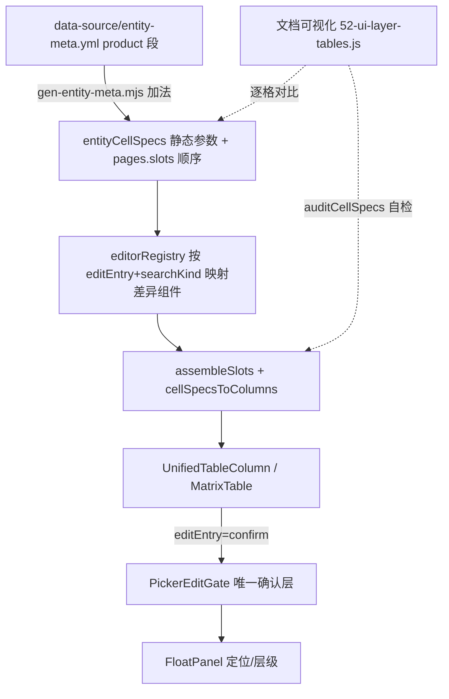

## 用户需求

根据《表格 UI 分层》规范，把「产品管理」这一个表功能真正落到 L1-L5 五层架构，并且贯彻一条更根本的原则：**分层必须配套「每表一份配置 + 各层按自己的参数消费、框架禁止页面手写」**。任何表放进框架就自动正确，不要每个功能各自手写 JSX。

## 产品概述

以采购报价（阶段1 样板）为参照，但纠正其「三维参数仍页面内联声明」的半手写做法。把产品管理列表与编辑弹窗整体收敛到**配置驱动**：列的顺序/key/title/slot 与每列的三维 cellSpec 参数（display×editEntry×valueState + gate 描述符 + hidden + disabledReason）全部登记进 `entity-meta.yml` 该表的配置段，由生成器产出，页面只做装配、不写任何列 render。同时在文档可视化矩阵页登记产品管理各层参数，形成「配置↔代码」可对比基线。

## 核心功能

- 每表一份配置：在 `entity-meta.yml` 的 `product` 段承载 L1-L5 各层参数（装配序列、行槽位、引擎、每列三维、确认层形态），生成器加法产出 `entityCellSpecs`，不动其余 19 页的旧输出
- 框架禁止手写：页面不再出现 `renderMode:'custom'` 手写 JSX；`auditCellSpecs` 与 `check-docs.mjs` 把「页面仍手写列」判为违规；各层差异组件（PickerNameCell/PickerNumCell/ArchiveFieldCell/ImageThumbCell/StatusTagCell/矩阵编辑器）注册进 editorRegistry，由配置按 editEntry+search 映射到对应组件
- 列表 11 列纯消费生成配置：分类/图/产品名/品牌/系列规格/单位/售价/进价/备注/状态/更新时间，门禁格统一走 `disabledReason`
- 单位/售价/进价列改为 `multi-record + expand + renderPanel`，矩阵由注册的矩阵编辑器承载（删 `SkuPriceColumns` 重复形态声明）
- 编辑弹窗五段与 3 个矩阵（单位/售价/进价）接入统一 PickerEditGate 确认层链路，矩阵内格走确认层唯一链路，消除「字典类值两种实现」的不一致
- 修复确认层定位 bug：矩阵内切格 / anchorRef 变化 / `confirmAndGo→reopen` 复用同面板时主动重算定位
- 修复售价进价确认层层级颠倒：列表场景下确认层层级高于承载它的 antd Popover
- 回写 docs-coverage.md 与文档可视化矩阵页（产品管理各层参数），给行为验收清单

## 技术栈

- 前端：React + TypeScript + Vite（沿用现有 frontend）
- 配置真相源：`data-source/entity-meta.yml`（每实体 `pages`/`columns` 段）→ 生成物 `entityRelations.generated.ts`
- 表格体系：UnifiedTable + CellSpec（L4 三维）+ CellSpecRenderer + cellSpecAdapter（已建成）+ PickerEditGate / FloatPanel（L5 唯一确认层）
- 装配入口：`pageAssembler.assembleSlots`（按 pages.slots 顺序装配，零手写列）
- 文档站点：`文档可视化/`（gen-docs 生成 `52-ui-layer-tables.js` 矩阵页）

## 实现思路

**总体策略**：用户的核心批评是「分层却允许手写 = 框架开后门」。因此本次不是把 cellSpec 搬到页面里写，而是让**配置成为唯一真相、生成器产出参数、页面只消费、editorRegistry 把参数映射到差异组件**。产品管理作为第一个真正贯彻该原则的表功能，同时成为其余 19 页的范式样本。

**关键技术决策**：

1. **每表一份配置 + 生成器加法产出**：在 `entity-meta.yml` 的 `product.columns` 段为每列增加 cellSpec 三维声明（display/editEntry/valueState + gate 描述符：input 类型、dictField/suggestField、search 种类、allowEmpty、disabledReason、hidden）。`gen-entity-meta.mjs` ③段新增一段，**加法** emit `entityCellSpecs: Record<string, GeneratedCellSpec[]>`（仅静态参数：显示/入口/值状态/检索种类/字典字段/门禁原因；onApply 等函数不放 yml，而由 editorRegistry 的注册组件按配置解释执行）。不改动现有 `renderMode` 输出，确保其余 19 页零回归。

2. **editorRegistry（差异组件注册表，新增）**：把「各层各自的差异组件」注册成 `{ editEntry, searchKind } → 编辑器组件` 的映射。例如字典类确认格 → `PickerNameCell`（内部已封装 onApply 走资源引擎/字典快建）、数值类 → `PickerNumCell`、备注 → `ArchiveFieldCell`、多记录 → 注册矩阵编辑器。页面不再写任何列 JSX，只把注册组件按 key 提供给装配器。这正实现用户说的「各层取各自参数决定用什么东西」。

3. **列表零手写**：`ProductManage.tsx` 删除 `mergeColumns(deriveTableColumns, 手写render覆盖)` 与 `SkuPriceColumns` 的重复形态，改为 `assembleProductColumns()` = `assembleSlots('product', editors)` 经 `cellSpecsToColumns(generatedCellSpecs['product'])` 产出。单位/售价/进价通过 `slot:'skuPrice'` 的 `expand + renderPanel` 指向注册的矩阵编辑器。

4. **框架禁止手写**：`cellSpec.auditCellSpecs` 扩展——把「页面仍使用 `renderMode:'custom'` 且带手写 render」判为违规（custom=认输，必须登记为配置例外并说明）；`tools/check-docs.mjs` 增加该判定；`ui-layer-model` 文档立「框架禁止手写 custom，列只能由配置+注册组件产出」规则并跑 `gen-docs`。

5. **修定位 bug（最小改动）**：`FloatPanel` 新增受控 `repositionKey?: number`，`useLayoutEffect(..., [repositionKey, isVisible, parentId, panelId])` 内调 `scheduleUpdate()`。`PickerEditGate.open()` 在 `anchorRef.current=anchor` 后、`confirmAndGo→reopen()` 复用同面板时各自 `setRepositionKey(k=>k+1)`，补上「锚点身份变化触发重算」的缺失环节（RAF 去抖，单次开销可忽略）。

6. **修层级 bug**：`canvasStage.resolveOverlayLayer` 把 `.ant-popover` 视同 modal 层（与 `.ant-modal-wrap` 同口径），列表场景价格确认层落入 modal 浮层（z≈1050）高于承载 Popover（z≈1000）；编辑弹窗内 `.ant-modal-content` 场景原本正常不受影响。只扩判定集合，不动 z-index 算法。

**性能与可靠性**：cellSpec 仅声明不渲染、列数不变，性能无影响；定位重算走 RAF；生成器加法不改旧输出，其余 19 页零回归；`auditCellSpecs` 在构建期报错缺 gate/手写的列，防静默遗漏。

## 实现要点（防回归）

- 复用既有 `CellSpecRenderer`/`PickerEditGate`/`MatrixTable`，不另写确认层或第二套矩阵
- 门禁格统一 `disabledReason`（视觉一致、点击提示「请先 X」），禁止置灰消失
- 邻格快切保留 `cellSwitch`（空行 `__empty_${seq}` 兜底，沿用 cellSpecAdapter 现有逻辑）
- 改前端后必须跑 `npm run build`（8080 生产 / 8081 dev）+ `npx tsc -b` + `node tools/check-docs.mjs`
- 不截 e2e 图（用户指定），验收以行为清单 + 构建/类型/文档体检为准

## 架构设计



新增的对比闭环：文档矩阵页登记每格 `display×editEntry×valueState×gate` + 代码落点，与 `entityCellSpecs` 实际声明比对；不一致即参数或架构缺口。框架禁止手写：任何列不在配置+注册组件内即被 `auditCellSpecs`/`check-docs` 拦截。

## 目录结构与文件

```
data-source/entity-meta.yml                          # [MODIFY] product 段 columns 加 cellSpec 三维 + gate 描述符；pages.slots 顺序为唯一列顺序
tools/gen-entity-meta.mjs                           # [MODIFY] ③段加法 emit entityCellSpecs（静态参数），不破坏旧 renderMode 输出
frontend/src/shared/config/entityRelations.generated.ts   # [由生成器产出，禁止手改] 新增 entityCellSpecs
frontend/src/shared/components/table/editorRegistry.ts    # [NEW] {editEntry, searchKind}→差异组件 注册表（PickerNameCell/PickerNumCell/ArchiveFieldCell/ImageThumbCell/StatusTagCell/矩阵编辑器）
frontend/src/shared/components/table/cellSpecAdapter.tsx # [MODIFY] 新增 cellSpecToColumnWithEditor：按生成参数映射注册编辑器
frontend/src/shared/components/table/cellSpec.ts    # [MODIFY] auditCellSpecs 把 renderMode:'custom' 手写 render 判违规（框架禁止手写）
frontend/src/shared/components/table/cellSpec.ts    # [不改] 三维类型与 hidden/disabledReason 复用
frontend/src/apps/staff/pages/ProductManage.tsx     # [MODIFY] 删 mergeColumns 手写覆盖，改 assembleProductColumns() 纯消费生成配置，零列 JSX
frontend/src/shared/config/SkuPriceColumns.tsx      # [MODIFY] 收敛：单位/售价/进价形态由注册矩阵编辑器 + slot:'skuPrice' 配置承载，删重复手写形态
frontend/src/shared/components/FloatPanel.tsx       # [MODIFY] 新增 repositionKey 受控重算信号
frontend/src/shared/utils/canvasStage.ts            # [MODIFY] resolveOverlayLayer 把 .ant-popover 视同 modal 层
frontend/src/shared/components/product-picker/PickerEditGate.tsx # [MODIFY] open()/reopen() 换锚点自增 repositionKey
frontend/src/apps/staff/pages/ProductEditDialog.tsx # [MODIFY] 五段接入统一 PickerEditGate 链路
frontend/src/apps/staff/pages/product-manage/UnitSection.tsx        # [MODIFY] 单位矩阵走统一确认层
frontend/src/apps/staff/pages/product-manage/UnitPriceExpandPanel.tsx # [MODIFY] 售价/进价矩阵走统一确认层
frontend/src/shared/components/product-picker/PickerInlineCells.tsx  # [MODIFY] 矩阵格确认层接线对齐 PickerEditGate（删旧路径）
文档可视化/js/data/gen/52-ui-layer-tables.js       # [MODIFY] 登记产品管理 L1-L5 各层参数（每格 display×editEntry×valueState×gate + 代码落点）
docs-coverage.md                                    # [MODIFY] 回写产品管理行状态 + 待补项销项 + ui-layer-model 补「框架禁止手写」规则
```

## 关键代码结构（要点）

- 生成配置（entity-meta.yml 内 product 列示例）：
- `columns` 每项扩展 `{ key, title, slot, cellSpec: { display, editEntry, valueState?, gate: { input, search:{kind:'dict', dictField}, disabledReason?, allowEmpty? }, hidden? } }`
- 生成物 `entityCellSpecs: Record<string, { key; display; editEntry; valueState?; gate:{ input; searchKind; dictField?; suggestField?; disabledReason?; allowEmpty? }; hidden? }[]>`
- `FloatPanel` 受控入口：`repositionKey?: number`；`useLayoutEffect(..., [repositionKey, isVisible, parentId, panelId])` 调 `scheduleUpdate()`
- `PickerEditGate.open(next, anchor, opts)`：在 `anchorRef.current=anchor` 后 `setRepositionKey(k=>k+1)`；`confirmAndGo` 的 `reopen()` 同样自增
- editorRegistry：`mapEditor(spec) => Component`，按 `editEntry==='confirm' && spec.gate.searchKind==='dict'` 选 PickerNameCell，数值选 PickerNumCell，多记录选矩阵编辑器

## Agent Extensions

### SubAgent

- **code-explorer**
- 用途：扫描产品管理全貌（列表 11 列 + 编辑弹窗五段 + 3 个矩阵），逐格列出当前 `display×editEntry×valueState×gate` 实际形态与代码落点（file:line），作为「L1-L5 各层配置清单」基线，并核实采购报价样板如何接线以确定生成器产物的消费方式。
- 预期产出：一份结构化调查报告，直接落到 `52-ui-layer-tables.js` 产品管理各层参数与 `docs-coverage.md` 基线，使后续迁移可逐格比对一致/不一致。