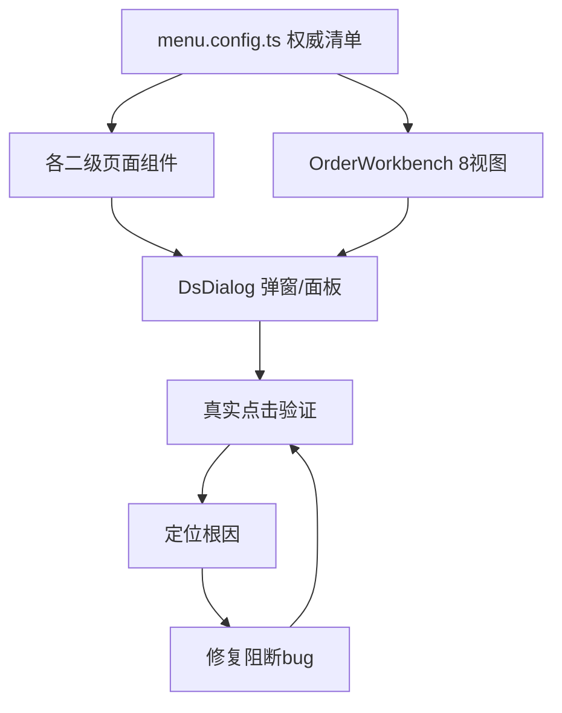

## 用户需求

用户要求对建材报价系统（员工端/后台管理端同一套应用）做一次"全面路"真实可用性走查：把现有系统涉及到的所有功能，像真实用户一样逐个真实操作、逐个面板展开使用，而不是只看代码判断"应该能跑"。发现"能展开但填不了/保存报错/数据不闭环/前后矛盾"的真问题后，直接查代码根因并修复。

## 产品概述

覆盖顶部导航四个一级模块下全部二级功能与订单协同工作台八个三级视图，逐页面、逐弹窗、逐面板进行真实交互验证与修复，确保全系统功能真实可用、数据闭环。

## 核心功能

- 全模块真实走查：订单中心（采购清单、订单协同工作台8视图）、基础数据（产品/客户/供应商/仓库/库存/待入库/欠库）、配货运营（供应商应付）、系统管理（授权码/访问申请/用户/角色/审计）
- 产品编辑窗分层渐进式录入真实验证：SPU信息→品牌→单位+售价进价展开面板→图片，多次保存不丢数据、不重复创建
- 每个面板逐项展开并触发所有按钮功能（新增品牌/删除/设基准/设主图/从库选图/批量调点位/规格切换与新增等）
- 业务链闭环验证：产品建档→采购清单新建单据→工作台各视图（采购报价→收款对账→统一配货→订单交付→成本标注→售后退款→销售汇总→定档归档）逐视图操作
- 发现"能展开但用不了"的真问题即定位代码根因并修复（本次不处理数据导出/Excel功能）

## 技术栈

- 前端：React 18 + TypeScript + Vite + Ant Design（antd）+ 自建设计令牌（CSS变量）
- 后端：Node.js + TypeScript + Prisma + Express风格路由
- 走查：代码静态走查 + 浏览器真实点击（agent-browser/playwright-cli 自动化）结合
- 本次不涉及导出能力（与用户决策一致，暂不实现 Excel/CSV 下载）

## 实现方法

采用"代码走查定位可疑点 → 起 dev 服务真实点击验证 → 定位根因并修复 → 再点验证闭环"的迭代闭环。先以 menu.config.ts 为权威清单枚举全部待走查页面与面板，再逐页对照组件代码标记可疑交互（disabled 透传、Popover 展开后输入、表单受控、保存事务幂等、多单位流转），最后用浏览器自动化真实操作复核并修复。

关键技术决策：

1. 以代码 menu.config.ts 为准（注意代码实际为四一级模块：订单中心/基础数据/配货运营/系统管理，与 memory 记录的三一级不同，走查以代码为准并核对导航显示）
2. 复用现有组件体系（DsDialog/DsButton/UnitPriceExpandPanel/SuggestInput/DictRefField 等），不新建模式，只修阻断可用的 bug
3. 渐进式录入验证重点是 ProductEditDialog 的多次保存幂等（savingRef 锁、brandIdx 重映射、单位降位重映射）——这些已有防御代码，需真实验证是否仍漏场景
4. 工作台8视图中 PaymentReconcile/Delivery/CostVerify 在 memory 标注"待画布实现"，需确认是真占位还是可操作

## 实现注意

- 性能：走查不引入新依赖；浏览器自动化仅做针对性点击验证，不跑全量 e2e 套件
- 日志：复用现有 antd message/modal 反馈，不新增日志
- 爆炸半径：只修使功能不可用的 bug，不重构、不改交互结构；修复后保持渐进式录入语义与现有设计令牌一致
- 数据闭环：重点核对多规格多单位数据在 产品建档→采购报价→统一配货→成本标注 间是否按单位与换算率正确流转，发现错位即修

## 架构设计

现有架构为前端按 menu.config.ts 懒加载各页组件，页面内嵌 DsDialog 弹窗与 Popover 展开面板；后端按 routes/staff.ts 暴露 API。本次不改变架构，仅在页面/面板组件层修复交互阻断。



## 目录结构（需走查/可能修改的文件）

```
frontend/src/apps/staff/
├── menu.config.ts                          # [READ] 权威导航清单，核对四一级模块显示
├── pages/
│   ├── ProductManage.tsx                    # [走查+可能修] 产品列表+编辑弹窗入口
│   ├── product-manage/
│   │   ├── ProductEditDialog.tsx            # [走查+可能修] 分层渐进录入主弹窗
│   │   ├── UnitPriceExpandPanel.tsx         # [走查+可能修] 售价/进价展开面板 disabled 透传
│   │   ├── SpecListPanel.tsx                # [走查+可能修] 规格管理面板
│   │   ├── BatchAdjustDialog.tsx            # [走查+可能修] 点位批量调整
│   │   └── ProductImageLibraryPicker.tsx    # [走查+可能修] 图片库选择
│   ├── DocumentList.tsx                     # [走查] 采购清单新建→进工作台
│   ├── OrderWorkbench.tsx                   # [走查] 工作台壳+8视图标签
│   ├── CustomerManage.tsx                    # [走查+可能修] 客户档案弹窗
│   ├── SupplierManage.tsx                    # [走查+可能修] 供应商档案弹窗
│   ├── WarehouseManage.tsx                   # [走查+可能修] 仓库档案
│   ├── InventoryManage.tsx                   # [走查+可能修] 库存台账
│   ├── InboundManage.tsx                     # [走查+可能修] 待入库
│   ├── BackorderManage.tsx                   # [走查+可能修] 欠库台账
│   ├── SupplierPayableManage.tsx            # [走查+可能修] 供应商应付
│   ├── AuthCodes.tsx                         # [走查+可能修] 授权码
│   ├── AccessRequests.tsx                   # [走查+可能修] 访问申请审核
│   ├── AdminUsers.tsx                        # [走查+可能修] 用户管理
│   ├── RolePermissions.tsx                   # [走查+可能修] 角色权限
│   └── AuditLogs.tsx                         # [走查] 审计日志
│   └── workbench/views/
│       ├── PurchaseQuote.tsx                # [走查+可能修] 采购报价
│       ├── PaymentReconcile.tsx              # [走查+可能修] 收款对账(待画布?)
│       ├── AllocationView.tsx               # [走查+可能修] 统一配货
│       ├── Delivery.tsx                      # [走查+可能修] 订单交付(待画布?)
│       ├── CostVerify.tsx                    # [走查+可能修] 成本标注(待画布?)
│       ├── RefundAfterSale.tsx               # [走查+可能修] 售后退款
│       ├── SalesSummary.tsx                  # [走查+可能修] 销售汇总
│       └── ArchiveView.tsx                   # [走查+可能修] 定档归档
├── shared/components/
│   ├── UnitManagePanel.tsx                   # [走查+可能修] 单位区基座
│   ├── DictRefField.tsx                      # [走查+可能修] 关联字段引用编辑
│   └── SuggestInput.tsx                      # [走查+可能修] 检索辅助录入
backend/src/
├── routes/staff.ts                           # [READ] 后端API核对
└── services/                                 # [走查+可能修] 保存事务/查询
```

## 走查标准（统一执行）

1. 进入页面：列表/表格加载、包含匹配筛选、分页可用
2. 打开新建/编辑弹窗：逐层展开所有面板（分类/名称/规格/品牌切换/单位区/售价进价展开/图片库/备注）
3. 渐进式录入：先录SPU→保存；再开品牌+单位→保存；再填售价进价→保存；再传图→保存；验证多次保存不丢数据、不重复创建
4. 触发每个按钮（新增品牌/删除/设基准/设主图/从库选图/批量调点位/规格切换/规格新增等）
5. 业务链：产品建档→采购清单新建单据→工作台8视图逐一点开操作
6. 发现"能展开但填不了/保存报错/数据不闭环"即记录并定位修复

## Agent Extensions

### Skill

- **agent-browser**
- 用途：启动本地 dev 服务后，用浏览器自动化真实点击各页面/弹窗/面板，验证"能展开但填不了"的运行时问题
- 预期结果：产出每页真实操作截图与可复现的阻断点清单（如面板展开后输入框不可聚焦、保存报错）
- **playwright-cli**
- 用途：对 agent-browser 覆盖不到的复杂表单流（渐进式多次保存、多单位流转）做脚本化点击与断言
- 预期结果：验证渐进式录入多次保存幂等、多单位数据在工作台视图间闭环流转

### SubAgent

- **code-explorer**
- 用途：在修复阶段跨多文件定位根因（如 disabled 透传链、保存事务、单位换算率流转），搜索范围超出单文件
- 预期结果：给出精确的待修文件与代码片段位置，支撑针对性修复