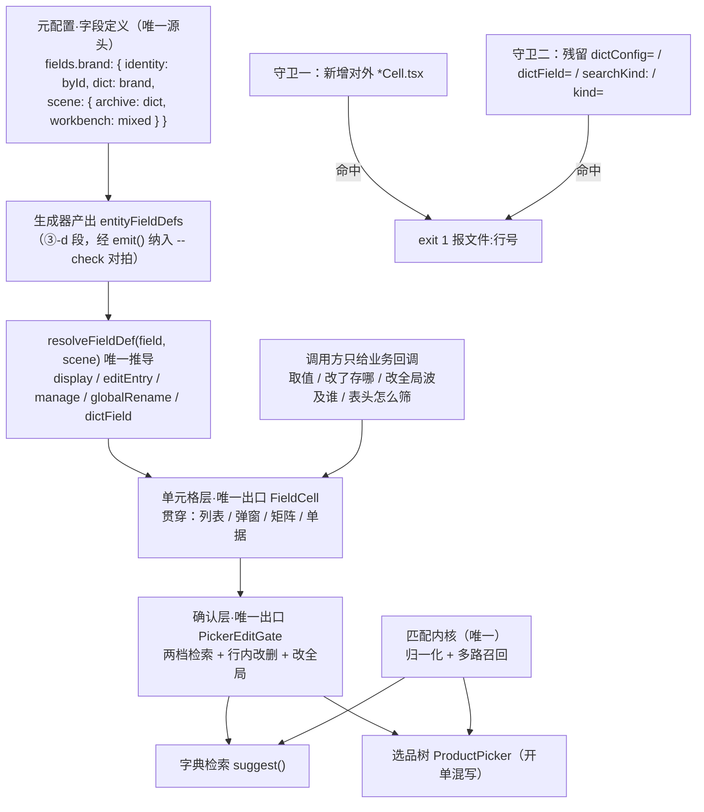

## 产品概述

本系统所有可编辑格子的"点值改值"这一件事，目前在**单元格层有至少 6 套组件并存**，导致同一字段在不同界面（列表 / 编辑弹窗 / 矩阵 / 单据）的确认层行为不一致：产品编辑弹窗的品牌格丢了「完整字典档 + 行内改/删 + 改全局」三项能力，而同弹窗的分类格接上了。

用户五轮追问后确立的问题定义：**这不是"确认层漏接链路"，而是分层没做完——层内组件不唯一。** 同一个（或相似的）组件代表解决某一个「方面／层级」的问题，它应当贯穿所有地方；差异应降为参数，而不是另立一个组件。

## 核心功能

1. **单元格层收敛为一个对外组件**：把 6 套并存的编辑型单元格（`ArchiveFieldCell` / `PickerNameCell` / `PickerNumCell` / `WorkbenchFieldCell` / `ArchiveEmptyFieldCell` / `PickerEmptyName`）与 3 套 `cell-editors`、7 套展示型单元格，收敛为唯一出口 `FieldCell`（差异降为 display / editEntry / variant 参数，内部渲染文件保留但不对外导出）。
2. **字段定义层作为唯一源头**：元配置新增字段级定义，顶级参数为 `identity`（byId＝标准·有 ID / byText＝非标·自由文本）、`dict`（值来源）、`scene`（填法：档案分列 / 开单混写）。确认层的路径与全部能力由框架从字段定义推导，调用方零分支。
3. **六处重复声明归一**：`entities.brand.layer`、`columns.dictKind`、`cellSpec.gate.search.dictField`、`dictConfig={brandDict}`、`kind="brand"`+`catalogDictField()`、`DICT_ENTRY_FIELDS` —— 统一以字段定义为准。
4. **标准／非标判定入配置**：`isRecognizedGoods`（有无 ID）从散落代码与"按行判定"分支，改为读字段定义的 `identity`。
5. **匹配规则统一为一套**：当前字典检索走 LIKE 子串（`backend/src/services/product/search.ts:1220`），选品走范式多路召回，同一词两处结果不同，违反方法论「匹配规则要同一套」。
6. **会失败的守卫**：① 单元格层只允许一个对外组件出口（新增 `*Cell.tsx` 并对外使用即 exit 1）；② 扫描残留手写参数（`dictConfig=` / `dictField=` / `searchKind:` / `kind="xxx"`）；③ 沿用已有 `--check` 对拍。均需负向验证。
7. **文档与台账**：真相源沉淀「一个层级一个组件」原则并重生成；回写覆盖台账与掌控台。

## 边界（防预期错位）

- **本次做到**：单元格层收敛为一个对外组件 ＋ 字段定义驱动 ＋ 六处重复声明归一 ＋ 匹配规则统一。
- **本次不做**：检索层 9 个 Picker 合并（金标准锁定，且解的是不同对象的选品）；`ProductEditDialog`（70KB）区块编排配置化（属 `pages` 段覆盖率 1/27 的另一工程）；`ProductPicker` / `UnitPicker` / `DsDialog` / `FloatPanel` 交互契约不动。
- **采购报价品牌格保留选品树形态**（方法论 `why-sales`：开单混写、档案分列，填法不要合成一个框），但改由 `scene` 声明驱动、且匹配规则与档案侧同源。
- **匹配规则统一**若体检后影响面过大，作为可独立交付子项，不阻塞主线。

## 技术栈

沿用项目现状，不引入新技术：React + TypeScript（Vite，前端 8080 生产 / 8081 dev）+ Express + Prisma 后端（3000）+ 既有 `shared/` 平台层。确认层唯一实现为 `PickerEditGate`（FloatPanel 承载，交互契约不动）。元配置链路沿用 `data-source/entity-meta.yml` → `tools/gen-entity-meta.mjs` → 前后端生成物。静态守卫用 Node 脚本（与 `tools/verify.mjs`、`tools/check-docs.mjs` 同风格）；单测沿用前端 Vitest（`frontend/tests/**`）。

## 实现思路（先升维定类）

**这属于哪一类问题**：不是「品牌格少传一个参数」，而是**分层不彻底 / 层内多元**——同一个层级的问题被多套组件各自解决。本项目 2026-09-04 命中过同源信号（「分层却允许手写＝框架开后门」），当时解法是配置驱动迁移，但只对齐了参数、没对齐组件，故本次是它的深化。

**通用最优范式**：一个层级（方面）一个问题、一个组件，贯穿全站；差异是参数不是组件。本项目现状版本＝**雏形**（确认层已唯一，单元格层仍是多元）。方案 ＝ 范式 − 差距 ＝ **层内收敛 + 字段定义推导 + 守卫**。

**为什么必须收敛到组件而不是对齐参数**：项目自总结「重复声明必然漂」——侧栏手写与真相源曾查出 16 处既成漂移。三个组件即使参数一时对齐，仍会各自演化。组件唯一才能从**结构**上排除不一致。

**为什么能一次到位**：① 真相源 `layer: globalDict` 已存在（category:20 / brand:34 / unit:48 / price_type:60），「哪些是全局字典」早有唯一声明，代码没消费它；② 「标准/非标＝有无 ID」早有统一判定 `isRecognizedGoods`（`documentLineInvariants.ts:9-13`），只是没进配置；③ 确认层已唯一，收敛只需动它下面一层。不必新造概念。

**判定违规的依据（真相源 `cell-gate-path` rules）**：第 1 条「同一值来源出现第二种路径=违规」；第 3 条「管理能力由参数驱动，**格子侧零分支**」。文档写零分支，代码是六处手写 + 六套组件，故本次为**双任务**（代码 ＋ 文档）。

## 架构设计

### 目标态：一个层级一个组件



### 层级唯一性契约（本次确立，写进守卫）

| 层级 | 解决什么 | 唯一出口 | 现状 |
| --- | --- | --- | --- |
| 确认层 | 改一个值 | `PickerEditGate` | ✅ 已唯一 |
| **单元格层** | 一格怎么显示、点下去怎么改 | **`FieldCell`** | ❌ ≥6 套，本次收敛 |
| 检索层 | 从一堆里选一个 | 9 个 Picker（**登记例外**） | 金标准锁定，不动 |
| 表格层 | 一组记录怎么排 | `UnifiedTable` / `MatrixTable`（**登记例外，并列引擎**） | 有意为之 |


### 能力推导表（声明层，不是调用方分支）

| identity | dict.layer | 推导结果 |
| --- | --- | --- |
| byId | globalDict | 完整字典档 + 行内改/删 + 改全局（并档预览） |
| byId | subject | 完整字典档 + 行内改/删 + 改全局（供应商） |
| byId | localDict | 仅检索 + 边用边建（联系方式、地址类型） |
| byText | — | 纯值确认层，无管理能力（备注、俗称） |


### 场景填法（顶层参数，非调用方分支）

`scene.archive = dict`（档案分列，字典检索）／`scene.workbench = mixed`（开单混写，选品树拼整串）。依据方法论 `why-sales`：「开单和管理不是同一套填法：开单混写；档案分列维护。**匹配规则要同一套，填法不要合成一个框**」。

### 收敛映射（6+3+7 → 1）

| 现有组件 | 收敛后 |
| --- | --- |
| `ArchiveFieldCell` / `PickerNameCell` / `WorkbenchFieldCell` / `PickerCellEditor` / `TextCellEditor` | `FieldCell`（editEntry=confirm） |
| `PickerNumCell` | `FieldCell`（display=number） |
| `ArchiveEmptyFieldCell` / `PickerEmptyName` | `FieldCell`（variant=empty，空行晋升） |
| 展示型 7 个（DateTime/StatusTag/ImageThumb/NameLink/LongText/Text/EnumInlineEdit） | 收为 `FieldCell` 的 **display 分支**，保留为内部私有渲染文件（不对外导出） |
| `DictRefCell`（已废弃零引用） | 删除 |


## 关键代码结构

```ts
/** 字段定义（生成器从 entity-meta.yml 的 fields 段产出；登记表即枚举来源） */
export interface GeneratedFieldDef {
  field: string;                                  // 'brand' | 'category' | 'unit' | 'priceType' | 'supplier' | 'remark' | ...
  identity: 'byId' | 'byText';                    // 顶级参数：标准（有 ID）/ 非标（自由文本）
  dict?: string;                                  // 值来源字典实体（byId 必填）
  layer?: 'globalDict' | 'subject' | 'localDict'; // 从 dict 实体继承，不重复声明
  scene?: Partial<Record<'archive' | 'workbench', { entry: 'dict' | 'mixed' | 'value' }>>;
  /** 以下由 identity + layer 推导，登记表不写 */
  display: 'text' | 'number' | 'image' | 'enum-tag' | 'date' | 'link' | 'long-text';
  editEntry: 'none' | 'confirm' | 'link' | 'expand';
  manage: boolean;                                // 完整字典档 + 行内改/删
  globalRename: boolean;                          // 改全局（并档预览）
  suggestField?: SuggestField;
  dictField?: DictChangeKind;
}
export const entityFieldDefs: Record<string, GeneratedFieldDef>;

/** 框架侧唯一推导入口（纯函数，可单测） */
export function resolveFieldDef(
  field: string | undefined,
  scene?: 'archive' | 'workbench',
): ResolvedFieldDef | undefined;

/** 过渡期兼容：旧 dictField / dictConfig / kind 归一到 field，命中即 warn（模块级去重） */
export function fieldFromLegacy(o: { dictField?: DictChangeKind; dictConfig?: unknown; kind?: string }): string | undefined;
```

调用方写法对比：

```
// 之前（手写参数 + 多套组件，选错静默丢能力）
<ArchiveFieldCell dictConfig={brandDict} … />     // 弹窗品牌：能力残缺
<PickerNameCell  kind="brand" … />                 // 列表 / 矩阵
<ArchiveDialogField dictField="category" … />      // 弹窗分类
pickerRender: (r) => skuPickerRender(r)            // 采购报价：手写选品树

// 之后（单元格层唯一出口 + 只声明字段名）
<FieldCell field="brand" … />                      // 列表 / 弹窗 / 矩阵 / 单据，处处同一组件
// 采购报价：field="brand" + scene=workbench 自动取 mixed，不再手写 pickerRender
```

## 目录结构

```
data-source/
└── entity-meta.yml                        # [MODIFY] 新增 fields 字段定义段（identity / dict / scene）；
                                           #          清理六处重复声明（columns.dictKind、cellSpec.gate.search.dictField 等）

tools/
├── gen-entity-meta.mjs                    # [MODIFY] 新增 ③-d 段产出 entityFieldDefs（沿用 ③-b「加法产出、未声明跳过」风格，
                                           #          经 emit() 出口纳入 --check 对拍）；③-c 段自检扩展（字段引用未登记字典 → 告警/阻断）
└── check-cell-layer.mjs                   # [NEW] 层内唯一守卫：① 扫描新增对外 *Cell.tsx（例外登记表外即 exit 1）；
                                           #          ② 扫描残留 dictConfig= / dictField= / searchKind: / kind="xxx"；
                                           #          报 文件:行号 + 改法；接入 verify.mjs 作为 S3c

frontend/src/shared/config/
├── fieldDef.ts                            # [NEW] resolveFieldDef() / fieldFromLegacy() / 类型定义：
                                           #       字段 → 确认层能力的唯一推导入口（纯函数，可单测）
├── recordDicts.ts                         # [MODIFY] 五个 DictRecordConfig 改为从 entityFieldDefs 取值来源；保留既有导出兼容过渡期
└── dictEntryViews.ts                      # [MODIFY] DICT_ENTRY_FIELDS / DICT_LIST_FN / DICT_DELETE_FN 改为按字段定义派生，消除第二份名单

frontend/src/shared/components/cells/
├── FieldCell.tsx                          # [NEW] 单元格层唯一对外出口：按 display / editEntry / variant 参数分派到内部渲染文件；
                                           #       确认层仍走 PickerEditGate（交互契约不动）
└── render/                                # [NEW] 内部私有渲染文件（不对外导出）：text / number / image / enum-tag /
                                           #       date / link / long-text，迁移自既有展示型 7 个组件

frontend/src/shared/components/product-picker/
├── PickerEditGate.tsx                     # [MODIFY] open() 时对 req 归一（fieldFromLegacy → resolveFieldDef）；
                                           #          :200 :409 :694 :220-237 四处能力判定统一改读推导结果
├── PickerInlineCells.tsx                  # [MODIFY] 五个导出组件改为 FieldCell 的薄封装（过渡期保留），内部改收 field；
                                           #          :336-340 注释按新口径改写
└── pickerCatalogImpact.ts                 # [MODIFY] catalogDictField() 改为委托 resolveFieldDef，删除与登记表重复的映射表

frontend/src/shared/components/
├── workbench/WorkbenchFieldCell.tsx       # [MODIFY] 改为 FieldCell 薄封装，行为不变
├── archive/ArchiveDialogField.tsx         # [MODIFY] 同上（编辑弹窗 SPU 行的分类 / 产品名 / 俗称）
├── archive/ArchiveSlotHost.tsx            # [MODIFY] slot 的 dictConfig 改由 slot 声明的 field 推导（:614 :982）
├── table/editorRegistry.tsx               # [MODIFY] CellHandlers 的 dictField / dictConfig / suggestField 收敛为单一 field 来源；
                                           #          :184-200 旧分支合并；renderCell 统一产出 FieldCell
├── table/CellSpecRenderer.tsx + cellSpecAdapter.tsx + cellSpec.ts
                                           # [DELETE] 遗留死代码三件套（零外部消费方，台账 §七 P2 已立项）
├── table/cell-editors/{PickerCellEditor,StaticCellEditor,TextCellEditor}.tsx
                                           # [DELETE] 并入 FieldCell，删除对外导出
├── DictRefCell.tsx                        # [DELETE] 已废弃、零引用
├── UnitPriceExpandPanel.tsx               # [MODIFY] 价格类型格（:653）、供应渠道格（:744）改 field 声明
└── archive/{ArchiveContactMatrixEditor,ArchiveSupplierAddressMatrixEditor}.tsx
                                           # [MODIFY] 矩阵格改 field（contactMethod / addressType 属 localDict，推导为"仅检索"，行为不变）

frontend/src/apps/staff/pages/product-manage/
├── ProductEditDialog.tsx                  # [MODIFY] :1343-1366 品牌格改 field="brand"（自动获得完整字典档 / 行内改删 / 改全局）；
                                           #          删除 :1350-1365 手写查重新建（交给 PickerEditGate.tsx:462 handleDictQuickCreate）；
                                           #          :1256-1272 分类格同改
└── UnitSection.tsx                        # [MODIFY] 单位格（:449）改 field="unit"

frontend/src/shared/config/
└── purchaseQuoteColumns.tsx               # [MODIFY] 产品名 / 品牌 / 规格三列的 pickerRender 改由 field + scene=workbench 声明驱动；
                                           #          单位列 :158-195「按行判定」改为读字段定义 identity

frontend/src/shared/utils/
└── documentLineInvariants.ts              # [MODIFY] isRecognizedGoods 改为读字段定义 identity（有无 ID），消除散落判定

backend/src/services/product/
└── search.ts                              # [MODIFY]（待体检定 A/B）suggest() 的 LIKE 子串（:1220）与 searchProducts 统一为同一匹配内核

frontend/tests/
└── fieldDef.test.ts                       # [NEW] 单测：byId+globalDict→完整链路；byId+localDict→仅检索；byText→纯值；
                                           #       旧写法兼容归一；未登记字段处理；含变异验证说明

文档可视化/data-source/methodology/items/
└── cell-gate-path.yml                     # [MODIFY] rules 新增「一个层级一个组件，差异是参数不是组件」「字段定义决定确认层行为」
                                           #          「入口不得二选一 / 同一事实只声明一次」；路径表增「identity → 能力」判定列

docs-coverage.md                           # [MODIFY] §二 产品档案行 + §六 本次会话行 + §七 待补清单回写
.codebuddy/memory/MEMORY.md                # [MODIFY] 开工前先精简（已超限被截断）：合并去重，保留有效事实
```

## 实现要点（防回归）

- **证据先行**：动手前用浏览器实测五格（分类 / 品牌 / 价格类型 / 供应渠道 / 单位）截图，把「用户推测 vs 代码事实」的差写进体检表，**不得按误判施工**（用户对价格类型/供应渠道的判断需实测证实或修正）。
- **迁移策略控爆炸半径**：先加字段定义与推导层并保留旧 prop 过渡（旧 prop 走 `fieldFromLegacy` 归一并 warn），保证每步可构建可验收 → 再逐类迁移（弹窗字段 → 矩阵格 → 列表列 → 单据格），每类迁完跑一次门禁 → warn 归零后删旧组件与 `catalogDictField()` 调用方分支。
- **组件收敛不等于重写渲染**：展示型 7 个组件**保留为内部私有渲染文件**（`cells/render/`），只收归一个对外出口，避免大范围重写引入回归；`ProductPicker` / `UnitPicker` / `FloatPanel` / `DsDialog` 交互契约一律不动（金标准锁定）。
- **复用既有模式，不新造**：生成器产出沿用 ③-b 段「加法产出、未声明则跳过」写法（其余页面零回归）；守卫沿用 ③-c 段「列清单告警」模板；**新增生成物必须经 `emit()` 出口**，否则不进 `--check` 对拍。
- **改平台层必补单测＋变异验证**：`resolveFieldDef` 属 `shared/` 关键逻辑，必须补 `frontend/tests/fieldDef.test.ts` 并故意改坏确认转红（本项目有「绿灯但零验证」前科）。
- **守卫必须负向验证**：新增对外 `*Cell.tsx` → `exit 1` 报文件行号；删除 → `exit 0`。残留手写参数同理。
- **性能**：`resolveFieldDef` 是 O(1) 表查询，不进热路径、零额外渲染；字典全量拉取仍走既有 `DICT_LIST_FN`（pageSize 500）。组件收敛后渲染路径变短，无新增开销。
- **日志**：过渡期旧写法归一命中时 `console.warn` 一次（模块级去重，非每次渲染），不含业务数据。
- **提交纪律**：开工先 `git status`（工作区已有 46 个文件未提交改动）；按 docs / feat / chore 分逻辑提交；**未获指示不 push**。
- **产物禁手改**：`*.generated.*`、`js/data/gen/**`、AGENTS.md 的 GEN 节一律不动；改元配置只改 `entity-meta.yml`（Meta Studio 整文件覆盖写回，保持单文件不分片）。

## 验收（可操作行为清单，执行后逐条核对）

1. 产品管理 → 进编辑弹窗 → 点品牌名：确认层出现「检索结果 / 完整字典」两档切换条；切到「完整字典」见全部品牌，行尾常驻「改」「删」。
2. 品牌确认层改名：出现「改全局」按钮并给影响预览（无同名=改名，有同名=并档），与分类格形态一致。
3. 同弹窗点分类、售价矩阵的价格类型、进价矩阵的供应渠道、单位区的单位：确认层形态与品牌完全一致；列表页品牌格与弹窗品牌格一致。
4. 采购报价品牌格点开仍是选品树（混写不变），但同一串词与产品管理侧召回的品牌结果一致（匹配规则同源）。
5. 代码层：`frontend/src` 中对外导出的单元格组件只剩 `FieldCell` 一个（其余为内部私有渲染文件，不对外导出）；检索无手写 `dictConfig=` / `dictField=` / `searchKind:` / `kind="xxx"`；`isRecognizedGoods` 改为读字段定义 `identity`。
6. 新建 `frontend/src/shared/components/cells/FooCell.tsx` 并对外导出使用 → 守卫 `exit 1` 并报文件:行号；删除 → `exit 0`。
7. `npm run verify` 退出码 0；文档站「格子点击 → 确认层」页出现新增规则；掌控台待办同步。

## Agent Extensions

### SubAgent

- **code-explorer**
- 用途：全站扫描单元格层与接线状态——所有 `*Cell.tsx` 的对外导出与使用点、`dictConfig=` / `dictField=` / `searchKind:` / `kind="xxx"` / `gate.open(` 调用点，按「字段名 → 当前组件 → 参数来源 → 应有能力」逐条取证；另核 `ArchiveSlotHost` 的 `slot.dictConfig` 是否会传入全局字典、采购报价三列除形态差异外有无别的接线问题、`isRecognizedGoods` 的全部散落判定点。
- 预期产出：完整接线体检表（每项含 文件路径:行号 + 结论），作为按格施工与守卫例外白名单的依据。

### Skill

- **playwright-cli**
- 用途：浏览器实证——登录 8080，打开产品管理 → 编辑弹窗，逐格（分类 / 品牌 / 价格类型 / 供应渠道 / 单位）点开确认层截图，判定「两档切换条、行内改/删、改全局」三件事是否存在；另在采购报价页同一串词验证与档案侧召回结果是否一致。
- 预期产出：修正或证实用户「价格类型和供应渠道也没有」的推测；修复后复跑同一组截图形成前后对照，作为验收证据。

- **lsp-code-analysis**
- 用途：精确求 `ArchiveFieldCell` / `PickerNameCell` / `WorkbenchFieldCell` / `PickerNumCell` / `PickerEmptyName` / `ArchiveEmptyFieldCell` 及展示型 7 个组件的全部引用点与调用层级；求 `brandDict` / `categoryDict` / `priceTypeDict` / `supplierDict` / `unitDict`、`isRecognizedGoods` 的引用全集。
- 预期产出：引用点全集（含透传层与间接引用），保证收敛不漏项、删除不误删、守卫既不漏报也不误报。