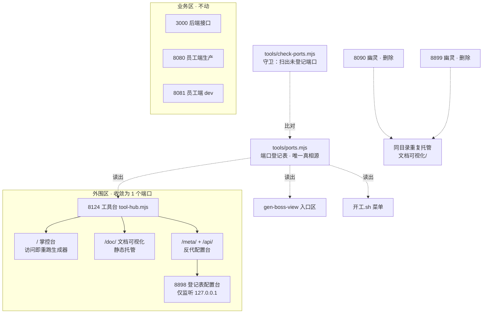

## 产品概述

按用户裁决「业务端口合理，要整改的是项目之外的部分」，把散落在 5 个端口上的外围工具（文档站 8123、掌控台 8124、登记表配置台 8898，加两个没人认领的幽灵 8090/8899）收敛成一个「工具台」端口并路径分流，同时建立端口登记账与自动守卫，让"随手开端口、无人记账"这件事不再复发。业务三端口（3000 后端 / 8080 员工端生产 / 8081 员工端 dev）一律不动。

## 核心功能

1. **端口登记表（唯一真相源）**：全项目监听端口集中声明在一处，标注归属（业务 / 外围）、用途、是否对外。所有脚本与页面都读它，禁止任何地方再手写端口号。
2. **工具台（单端口入口）**：把掌控台、文档可视化站、登记表配置台合成一个端口的路径分流服务。打开一个地址就能进三个工具。
3. **幽灵端口清理**：杀掉 8090、8899 两个重复托管同一目录的废品服务。
4. **端口守卫（防复发）**：一条命令扫出「在监听但没登记的端口」与「登记了却没起的端口」，把本次人工发现变成自动门禁。
5. **手机可达**：公网隧道补一条指向工具台，让手机在外网也能开掌控台与文档站。
6. **地址表收敛**：删掉已漂移的孤儿文件 `访问地址.md`，地址信息回归生成器产出。

## 范围边界

- **不动**：业务端口 3000 / 8080 / 8081 及其在 `dev.sh` 里的启动编排（用户明确裁决合理）
- **不动**：`dev.sh` 的整体结构与 `启动项目` / `停止项目` 等既有命令
- 不涉及业务代码、数据库、前端页面改动
- 公网隧道若受套餐条数限制，需用户拍板取舍（方案内含兜底）

## 技术栈

- 运行环境：Node 24 ESM，零新增依赖（`node:http` / `node:child_process` / `node:fs` / `node:path`），与 `tools/` 下现有脚本（gen-boss-view.mjs、meta-studio.mjs、control-server.mjs）保持一致
- 端口真相源：`tools/ports.mjs` 导出常量（不用 yaml，避免为几个数字引入解析依赖；脚本直接 import）
- 文档站静态托管：手写 MIME 映射 + `fs.createReadStream` 流式返回（原 `python3 -m http.server` 退役）
- 配置台反代：`http.request` 管道转发，重写路径前缀与 Host 头
- 守卫：`child_process` 调 `lsof` 解析监听端口，对照登记表比对
- 门禁：`node tools/check-ports.mjs`、`node tools/check-docs.mjs`、`node tools/gen-boss-view.mjs`、`node tools/gen-docs.mjs`

## 实施方案

### 一、先升维：这属于哪一类问题

这不是"端口太多"的数量问题，是**入口编排缺真相源**的问题。证据：8090、8899、8123 三个 Python 静态服务的**工作目录完全相同**（都是 `文档可视化/`），说明它们不是三个用途，而是同一次需求被起了三次、没人记账也没人回收。数量只是症状，缺账本才是病根。因此整改必须包含防复发机制，否则下周还会多出 8091。

### 二、端口登记表（第一步，其余步骤都依赖它）

新建 `tools/ports.mjs`，集中声明：

- 业务区（不动）：3000 后端接口、8080 员工端生产、8081 员工端 dev
- 外围区：8124 工具台（唯一对外）、8898 登记表配置台（仅本机 127.0.0.1，被工具台反代）
- 每条含：端口、名称、归属、一句话用途、是否对外暴露

**为什么先做它**：工具台、守卫、开工菜单、掌控台入口区四处都要用端口号。不先立真相源，就是在四个地方各写一遍——这正是本次漂移的成因。

### 三、工具台（改造而非新建的取舍）

新建 `tools/tool-hub.mjs`，`tools/control-server.mjs`（62 行）退役并删除。

**为什么不改造 control-server.mjs**：它的名字与职责会就此错位（叫"掌控台服务"却托管三个工具），后续维护者必然困惑；它只有 62 行、外部引用点仅 `~/.bmq/开工.sh` 的 `progress()` 一处，改名成本极低。宁可现在改一处，不留一个名不副实的模块。

路由规则（端口 8124）：

| 路径 | 目标 | 处理方式 |
| --- | --- | --- |
| `/`、`/项目掌控台.html` | 掌控台 | 保留现有「访问即重跑生成器」逻辑与 3 秒缓存 |
| `/health` | 健康检查 | 保留（`开工.sh` 正在探活） |
| `/doc/*` | `文档可视化/` 目录 | 静态托管，流式读取 |
| `/meta/*` | `127.0.0.1:8898` | 反代，剥离 `/meta` 前缀 |
| `/api/*` | `127.0.0.1:8898` | 反代，原样转发 |
| 其他 | — | 404 + 列出可用路径 |


**为什么 `/api/*` 也要转给配置台**：配置台的前端是绝对路径调用 `/api/yml`、`/api/entities` 等，挂在 `/meta/` 下后浏览器仍会请求 `/api/...`。工具台只服务外围、不与业务后端（3000）争路径，因此把 `/api/*` 一并转给 8898 是安全且最小改动的做法。配置台无外链静态资源（UI 全内联），不存在资源路径问题。

**降级保护**：生成器失败时沿用现有策略（有旧缓存就返回旧的，页面不至于打不开）；反代目标未启动时返回明确提示「配置台未启动，跑 node tools/meta-studio.mjs」，而不是让用户看到超时。

### 四、登记表配置台改只监听本机

`tools/meta-studio.mjs` 的 `server.listen(PORT)` 改为 `server.listen(PORT, '127.0.0.1')`。收敛后所有外部访问走 `/meta/`，8898 不再对外暴露——这正是"整改外围"的应有之义：内部端口内部用。

### 五、清幽灵 + 立守卫

1. 杀掉 8090、8899。动手前再探活一次并确认无活跃连接；已确认两者 cwd 与 8123 相同、属重复托管同一目录的废品，杀掉不影响文档站（文档站由工具台 `/doc/` 接管）。
2. 新建 `tools/check-ports.mjs`：扫 `lsof -nP -iTCP -sTCP:LISTEN`，对照 `tools/ports.mjs`，输出两类问题——**未登记的监听端口**（下一个幽灵）与**登记了却没起的服务**。有问题时退出码非 0，可接入门禁。
3. 把该守卫写进 `docs-coverage.md` 的自检清单，并挂到 `开工.sh` 的「项目状态」里。

**守卫的价值**：本次是人工发现端口散乱。没有守卫，三个月后同样的问题会再发生一次，且仍需人工发现。

### 六、公网隧道（含超限兜底）

`~/.cpolar/cpolar.yml` 现有三条隧道（ssh→22、website→8080、backend→3000）。新增第四条 `tools: http → 8124`。

若套餐限制导致四条隧道无法同时建立，按此顺序兜底并向用户说明：

1. 优先保留 website(8080，日常干活) 与 backend(3000，客户端接口)
2. ssh 隧道若用户在手机上不用可临时停用，让位给 tools
3. 都不行则只做局域网可达，公网维持现状，并在掌控台注明

### 七、地址表收敛

`开发规划.md:35` 已把 `访问地址.md` 认定为「孤儿文件，不入库」——项目自己早有结论。该文件当前还有三处硬伤：声称由已不存在的 `gen-access.mjs` 生成、仍用旧名「白话进度看板 / 项目进度看板.html」、端口表漏登记两个幽灵。

处理方式：**删除该文件**。地址信息回归两处既有产出：终端跑 `node tools/gen-boss-view.mjs --access`，浏览器开掌控台入口区（已是 JS 实时探测三套地址、只亮可达的）。同时更新 `gen-boss-view.mjs` 的 `SERVICES` / `EXTRA_PORTS`，改为从 `tools/ports.mjs` 读取，入口区新增工具台三项。

### 八、同步点清单

- `~/.bmq/开工.sh`：`BOARD_PORT` / `DOCS_PORT` 合并为工具台单端口；`start_docs()` 改为提示打开 `/doc/`；`progress()` 拉起 `tool-hub.mjs`；菜单文案同步
- `tools/gen-boss-view.mjs`：`SERVICES` / `EXTRA_PORTS` 改为读登记表；入口区加工具台三项
- `docs-coverage.md`：回写本轮整改 + 端口账
- `AGENTS.md` 第七节：检查是否含手写端口，若有则改为引用登记表（避免又一处漂移源）

## 实施要点

- **杀进程前必须复核**：探活 + 确认无活跃连接后再杀，并在回复里说明杀的是什么、如何恢复（重起命令）
- **路径重写是反代最容易错的地方**：`/meta/xxx` 转发时要剥离前缀，`/api/xxx` 不剥离，两者规则不同，实现时分开处理并各写一条验证
- **掌控台实时生成不能丢**：这是现有设计的优点（打开即最新），改造时必须保留 3 秒缓存与生成失败降级
- **先立登记表再动其他**：顺序反了就会在多个文件里各写一遍端口号，重蹈覆辙
- 改动按逻辑拆提交（`feat` 工具台 / `chore` 清幽灵与守卫 / `docs` 台账），未获指示不推送

## 架构设计



## 目录结构

```
tools/
├── ports.mjs              # [NEW] 端口登记表（唯一真相源）
│                          #   业务区 3 条（3000/8080/8081，标注「不动」）
│                          #   + 外围区 2 条（8124 工具台对外 / 8898 配置台仅本机）
│                          #   每条：端口 · 名称 · 归属 · 用途 · 是否对外
│                          #   所有脚本与页面从此读取，禁止任何地方再手写端口号
├── tool-hub.mjs           # [NEW] 工具台：单端口 8124 承载三个外围工具
│                          #   ① `/` 与 `/项目掌控台.html` → 掌控台，保留访问即重跑 + 3 秒缓存
│                          #   ② `/health` → 健康检查（开工.sh 在探活）
│                          #   ③ `/doc/*` → 静态托管 文档可视化/ 目录（含 MIME 映射）
│                          #   ④ `/meta/*` → 反代 127.0.0.1:8898，剥离 /meta 前缀
│                          #   ⑤ `/api/*` → 反代 8898，不剥离前缀（配置台前端用绝对路径调用）
│                          #   ⑥ 反代目标未起 → 明确提示而非超时；生成器失败 → 降级返回旧缓存
├── control-server.mjs     # [DELETE] 退役。职责已被 tool-hub.mjs 完全覆盖，
│                          #   仅 ~/.bmq/开工.sh 的 progress() 一处引用，同步改掉
├── check-ports.mjs        # [NEW] 端口守卫（防复发核心）
│                          #   扫 lsof 监听端口 ↔ 对照 ports.mjs
│                          #   报「在监听但没登记」（下一个幽灵）与「登记了却没起」
│                          #   有问题退出码非 0，接入门禁与开工.sh「项目状态」
├── meta-studio.mjs        # [MODIFY] listen 改为只监听 127.0.0.1（不再对外暴露）
└── gen-boss-view.mjs      # [MODIFY] SERVICES / EXTRA_PORTS 改为读 ports.mjs；
                           #   入口区新增工具台三项（掌控台 / 文档站 / 配置台）

~/.bmq/
└── 开工.sh                # [MODIFY] BOARD_PORT 与 DOCS_PORT 合并为工具台单端口；
                           #   start_docs() 改为提示 /doc/；progress() 拉起 tool-hub.mjs；
                           #   「项目状态」接入 check-ports.mjs

~/.cpolar/
└── cpolar.yml             # [MODIFY] 新增 tools 隧道 http → 8124（超限则按兜底顺序处理）

访问地址.md                 # [DELETE] 项目自认的孤儿文件（开发规划.md:35），且存在三处漂移：
                           #   声称由已不存在的 gen-access.mjs 生成、旧名、漏登记幽灵端口
                           #   地址信息回归 --access 终端模式与掌控台入口区

docs-coverage.md           # [MODIFY] 回写本轮整改、端口账与守卫接入
AGENTS.md                  # [CHECK] 第七节若含手写端口，改为引用 ports.mjs
```

## 关键代码结构

```js
// tools/ports.mjs —— 端口登记表，全项目唯一真相源
export const PORTS = {
  // 业务区：用户裁决合理，一律不动
  backend:  { port: 3000, name: '后端接口',        zone: 'biz',    public: true,  desc: '业务接口，客户端与员工端都走它' },
  staff:    { port: 8080, name: '员工端（日常）',  zone: 'biz',    public: true,  desc: '生产包，秒开，公网映射的就是它' },
  staffDev: { port: 8081, name: '员工端（开发）',  zone: 'biz',    public: false, desc: '改代码热更新，开发时看效果' },
  // 外围区：本轮收敛为 1 个对外端口
  hub:      { port: 8124, name: '工具台',          zone: 'tool',   public: true,  desc: '掌控台 / 文档站 / 配置台的统一入口' },
  meta:     { port: 8898, name: '登记表配置台',    zone: 'tool',   public: false, desc: '仅本机监听，由工具台 /meta/ 反代' },
};
```

```js
// tools/check-ports.mjs —— 守卫契约
// 返回 { unregistered: [...], missing: [...] }
// unregistered：在监听但登记表里没有 → 下一个 8090，必须在它活过一周前发现
// missing：登记表里声明了但没在跑 → 工具挂了而没人知道
// 有任一类非空即退出码 1，可接门禁
export function auditPorts(): { unregistered: PortHit[]; missing: PortEntry[] };
```

工具台需要一个给用户看的入口页——打开 8124 时若只丢出一个掌控台，用户仍不知道文档站和配置台在哪。因此在工具台根路径提供一个极简导航页作为跳转枢纽，再由此进入三个工具。

## 设计风格

内部工具台，使用者是业务负责人本人（非终端客户）与 AI，取向是**工具感与信息密度**：低饱和底色、清晰分组、状态可辨，不做营销式装饰。与掌控台现有的暗色头部加浅色卡片语言保持一致，避免又长出一个视觉体系。

## 页面板块

**顶部标题条**：深色实底，左侧「工具台」，右侧一行小字说明当前设备（本机 / 同热点 / 公网），让用户知道自己在哪套地址上。

**工具卡片区**：三张并排卡片，每张含图标、名称、一句话说明、进入按钮。分别是掌控台（看进度、待拍板）、文档可视化站（方法论规则）、登记表配置台（高级，给 AI 用）。卡片在窄屏下纵向堆叠。

**状态行**：每张卡片右下角显示该工具当前是否可达（绿点在线 / 灰点未启动），不可达时给出启动提示而非静默灰掉——沿用项目既有纪律「门禁用提示不用静默」。

**底部地址条**：列出本机 / 同热点 / 公网三套地址，与掌控台入口区一致地由 JS 实时探测、只亮可达的那套，用户不需要判断自己在什么网络。

## 交互细节

- 卡片整块可点，不必精确点按钮
- 每个工具的状态在页面加载时并行探测，探测中不显示"未启动"，避免误报
- 键盘可用：Tab 顺序为三张卡片，回车进入
- 窄屏下状态行与地址条吸底，卡片区滚动

## SubAgent

- **code-explorer**
- 用途：动手前复核两处风险点。① 确认 8090 / 8899 除自身外无任何活跃连接与其他会话依赖（杀之前必须证实）；② 全仓扫出手写端口号的位置（dev.sh、AGENTS.md、部署运维手册.md、开工.sh、各生成器），确保登记表落地后没有遗漏的第二处真相源。
- 预期产出：幽灵端口可安全杀除的证据清单；一份完整的手写端口位置清单，供同步改动时逐点覆盖。