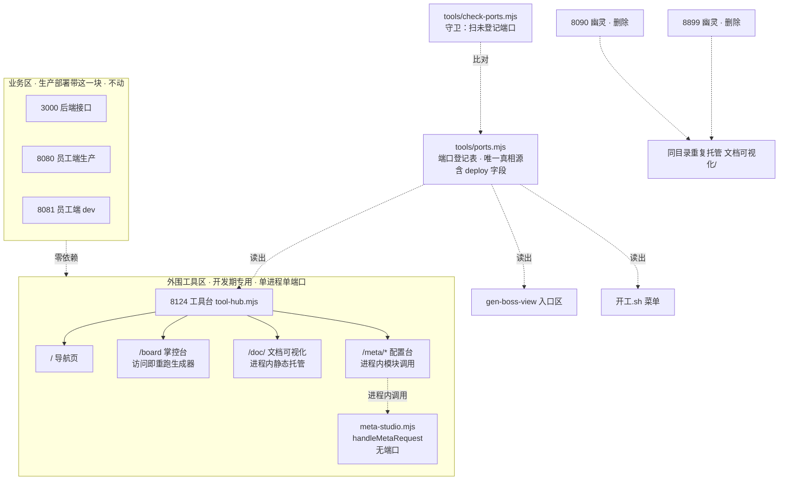

## 产品概述

按用户三条裁决整改端口乱象：

1. 业务端口合理，整改的是"项目之外"的外围工具
2. 生产级部署不带运维文档类工具，业务系统与开发期工具**不是一个东西**
3. **工具台的目的是"整合所有辅助项目开发的工具"，不是"转发到别处"**——因此配置台不得另占端口

把散落在 5 个端口上的外围工具（文档站 8123、掌控台 8124、登记表配置台 8898，加两个无人认领的幽灵 8090/8899）真正合并进**一个进程、一个端口**：文档站与掌控台成为工具台的路由，配置台降级为工具台进程内的模块（8898 端口取消），砍掉两个幽灵，并立端口登记账与自动守卫防复发。

## 核心功能

1. **端口登记表（唯一真相源）**：全项目监听端口集中声明在一处，标注归属、用途、**deploy（是否随生产部署）**。所有脚本与页面读它，禁止任何地方再手写端口号。
2. **工具台（单进程单端口）**：掌控台、文档可视化站、登记表配置台在同一个 Node 进程内以路由/模块方式提供，打开一个地址进三个工具。
3. **配置台降级为模块**：不再有独立服务与端口；被工具台 import 后在进程内直接调用，不经过网络。
4. **幽灵端口清理**：杀掉 8090、8899 两个重复托管同一目录的废品服务。
5. **端口守卫（防复发）**：一条命令扫出「在监听但没登记的端口」与「登记了却没起的服务」。
6. **开发期手机可达**：公网隧道补一条指向工具台，仅服务于开发期远程查看，与生产形态无关。
7. **地址表收敛**：删掉已漂移的孤儿文件 `访问地址.md`，地址信息回归生成器产出。

## 范围边界

- **不动**：业务端口 3000 / 8080 / 8081 及其在 `dev.sh` 里的启动编排（用户明确裁决合理）
- **不动**：`dev.sh` 整体结构与 `启动项目` / `停止项目` 等既有命令
- **硬约束**：业务代码、前端页面、后端接口均不得引用 8124 或工具台任何路径
- **硬约束**：真正的整合而非转发——三个工具在同一进程内提供，禁止 HTTP 转发到另一个进程
- 不涉及业务代码、数据库、业务页面改动
- 公网隧道若受套餐条数限制，按兜底顺序处理并向用户说明

## 技术栈

- 运行环境：Node 24 ESM，零新增依赖（`node:http` / `node:child_process` / `node:fs` / `node:path`），与 `tools/` 下现有脚本一致
- 端口真相源：`tools/ports.mjs` 导出常量（不用 yaml，避免为几个数字引入解析依赖；脚本直接 import）
- 文档站静态托管：手写 MIME 映射 + `fs.createReadStream` 流式返回（`python3 -m http.server` 退役）
- 配置台整合：`export async function handleMetaRequest(req, res, pathname)`，工具台进程内直接调用
- 守卫：`child_process` 调 `lsof` 解析监听端口，对照登记表比对
- 门禁：`node tools/check-ports.mjs`、`node tools/check-docs.mjs`、`node tools/gen-boss-view.mjs`、`node tools/gen-docs.mjs`

## 先升维：这属于哪一类问题

不是"端口太多"的数量问题，是**入口编排缺真相源**。证据：8090、8899、8123 三个 Python 服务的工作目录**完全相同**（都是 `文档可视化/`）——不是三个用途，而是同一次需求被起了三次、没人记账也没人回收。数量是症状，缺账本才是病根，所以整改必须含防复发机制。

第二层：用户点明生产部署不带外围工具，说明是**两类东西混跑在一台开发机**的问题。所以不光收敛端口，还要在登记表与界面上把「业务 / 开发期工具」这条边界显式化。

第三层（本轮修正）：工具台的意图是**整合**。用 HTTP 反代到另一个进程只是"转发"，配置台仍在后台跑着、仍占端口——这是半吊子。真正的整合是让它成为进程内的一个模块。

## 实施方案

### 一、端口登记表（第一步，其余都依赖它）

新建 `tools/ports.mjs`：

- 业务区（不动）：3000 后端接口、8080 员工端生产、8081 员工端 dev
- 外围区：8124 工具台（唯一对外端口）
- 每条含：端口、名称、归属（biz/tool）、用途、**deploy（是否随生产部署）**、是否对外

`deploy` 字段直接承载用户裁决：3000/8080 为 `true`，8081 与 8124 为 `false`。「生产带什么」从此可查询，不靠人记。

**8898 不再出现在登记表里**——它没有端口了，是模块。

**为什么先做它**：工具台、守卫、开工菜单、掌控台入口区四处都要用端口号。不先立真相源，就是在四个地方各写一遍，重蹈本次漂移的覆辙。

### 二、配置台从服务降级为模块（本轮核心变更）

改 `tools/meta-studio.mjs`：

```
现状：const server = http.createServer(async (req,res) => { ...路由... })
      （末尾由主模块守卫决定 ensureUI(); server.listen(PORT)）

改为：export async function handleMetaRequest(req, res, pathname) { ...路由... }
      const server = http.createServer(handleMetaRequest)   // 仅在直接运行时用
```

路由函数新增 `pathname` 参数（去掉前缀后的路径），而不是在函数内部读 `req.url`——因为工具台会把 `/meta/xxx` 剥离前缀后交给它，它必须按剥离后的路径匹配。

`renderUI(basePath)` 接收路径前缀：直接运行时 `basePath=''`，工具台调用时 `basePath='/meta'`。前端所有 API 请求变成 `/meta/api/yml`，工具台据此路由。

**两种用法都保留**（靠上轮已加的主模块守卫）：

- 直接 `node tools/meta-studio.mjs`：仍是独立服务，开 8898（兼容既有习惯）
- 被工具台 import：不开端口，作为模块

### 三、工具台（新建，取代 control-server.mjs）

新建 `tools/tool-hub.mjs`，**不改造** `control-server.mjs`。理由：后者叫"掌控台服务"却要托管三个工具，名实不符；它只有 62 行、外部引用仅 `开工.sh` 的 `progress()` 一处，改名成本极低。宁可现在改一处，不留名不副实的模块。

路由规则（端口 8124）：

| 路径 | 目标 | 处理方式 |
| --- | --- | --- |
| `/`、`/index.html` | 工具台导航页 | 三张工具卡片 + 状态探测 |
| `/board`、`/项目掌控台.html` | 掌控台 | 保留「访问即重跑生成器」+ 3 秒缓存 |
| `/health` | 健康检查 | 保留（`开工.sh` 正在探活） |
| `/doc/*` | `文档可视化/` 目录 | 静态托管，流式读取 |
| `/meta/*` | 配置台模块 | **进程内调用** `handleMetaRequest`，剥离 `/meta` 前缀 |
| 其他 | — | 404 + 列出可用路径 |


**路径策略**：配置台前端请求统一走 `/meta/api/*`，工具台剥离 `/meta` 后交给模块。这样 `/api/*` 不被全局占用，将来工具台自身要加 API 也不会打架——比"把 /api/* 全给配置台"更彻底。

**降级保护**：生成器失败沿用现有策略（有旧缓存就返回旧的）；配置台模块出错返回明确提示而非超时——沿用项目纪律「门禁用提示不用静默」。

### 四、清幽灵 + 立守卫

1. 杀掉 8090、8899。动手前再探活一次并确认无活跃连接；已确认两者 cwd 与 8123 相同、属重复托管同一目录的废品。恢复方式：文档站由「文档站」命令重新拉起（工具台 `/doc/` 静态托管，不依赖 python）。
2. 新建 `tools/check-ports.mjs`：扫 `lsof -nP -iTCP -sTCP:LISTEN` 对照 `ports.mjs`，输出两类问题——**未登记的监听端口**（下一个幽灵）与**登记了却没起的服务**。有问题退出码非 0。
3. 守卫写进 `docs-coverage.md` 自检清单，挂到 `开工.sh` 的「项目状态」。

### 五、公网隧道（含超限兜底）

`~/.cpolar/cpolar.yml` 现有 ssh→22、website→8080、backend→3000。新增 `tools: http → 8124`，**仅服务开发期**，生产环境根本没有工具台。

若四条无法同时建立，按序兜底并明确告知用户：① 优先保 website(8080) 与 backend(3000)；② ssh 若不用可临时停用让位；③ 都不行则只做局域网可达。

### 六、地址表收敛与同步点

- 删除 `访问地址.md`（`开发规划.md:35` 已认其为孤儿文件；且三处漂移：声称由已不存在的 `gen-access.mjs` 生成、旧名、漏登记幽灵）。地址信息回归 `--access` 终端模式与工具台入口区。
- `~/.bmq/开工.sh`：`BOARD_PORT`/`DOCS_PORT` 合并为单端口；`start_docs()` 改为提示 `/doc/`；`progress()` 拉起 `tool-hub.mjs`；「项目状态」接入 `check-ports.mjs`；菜单文案同步。
- `tools/gen-boss-view.mjs`：`SERVICES`/`EXTRA_PORTS` 改为读登记表；入口区新增工具台。
- `AGENTS.md` 第七节：若含手写端口，改为引用登记表。

## 实施要点

- **杀进程前必须复核**：探活 + 确认无活跃连接，回复里说明杀的是什么、如何恢复
- **路径重写最易错**：`/meta/xxx` 剥离前缀后交给模块，模块内部按剥离后路径匹配，两者分离处理并各写一条验证
- **掌控台实时生成不能丢**：现有优点（打开即最新），保留 3 秒缓存与生成失败降级
- **先立登记表再动其他**：顺序反了就是在多个文件各写一遍端口号
- **解耦验证**：改完 grep 证实业务代码零处引用 8124，这是用户裁决的硬约束
- 改动按逻辑拆提交（feat 工具台 / chore 清幽灵与守卫 / docs 台账），未获指示不推送

## 架构设计



## 目录结构

```
tools/
├── ports.mjs              # [NEW] 端口登记表（唯一真相源）
│                          #   业务区 3 条（3000/8080 deploy:true，8081 deploy:false，均标注「不动」）
│                          #   + 外围区 1 条（8124 工具台，deploy:false）
│                          #   每条：端口 · 名称 · 归属 · 用途 · deploy · 是否对外
│                          #   8898 不再登记——它没有端口了
├── tool-hub.mjs           # [NEW] 工具台：单进程单端口 8124 承载三个外围工具
│                          #   ① `/` 导航页（三卡片 + 实时状态探测 + 三套地址）
│                          #   ② `/board`、`/项目掌控台.html` → 掌控台，保留访问即重跑 + 3 秒缓存
│                          #   ③ `/health` → 健康检查（开工.sh 在探活）
│                          #   ④ `/doc/*` → 静态托管 文档可视化/（含 MIME 映射）
│                          #   ⑤ `/meta/*` → 进程内调用 handleMetaRequest，剥离 /meta 前缀
│                          #   ⑥ 出错给明确提示而非超时；生成器失败降级返回旧缓存
├── meta-studio.mjs        # [MODIFY] 从服务降级为模块
│                          #   ① 抽出 export async function handleMetaRequest(req, res, pathname)
│                          #   ② renderUI(basePath) 接收前缀，前端 API 请求走 /meta/api/*
│                          #   ③ 直接运行时仍 listen 8898（主模块守卫，兼容单独使用）
│                          #   ④ 被 import 时不开端口
├── control-server.mjs     # [DELETE] 退役。职责已被 tool-hub.mjs 覆盖，
│                          #   仅 ~/.bmq/开工.sh 的 progress() 一处引用，同步改掉
├── check-ports.mjs        # [NEW] 端口守卫（防复发核心）
│                          #   扫 lsof 监听端口 ↔ 对照 ports.mjs
│                          #   报「在监听但没登记」（下一个幽灵）与「登记了却没起」
│                          #   有任一类非空即退出码 1，接入门禁与开工.sh「项目状态」
└── gen-boss-view.mjs      # [MODIFY] SERVICES / EXTRA_PORTS 改为读 ports.mjs；入口区新增工具台

~/.bmq/
└── 开工.sh                # [MODIFY] BOARD_PORT 与 DOCS_PORT 合并为工具台单端口；
                           #   start_docs() 改为提示 /doc/；progress() 拉起 tool-hub.mjs；
                           #   「项目状态」接入 check-ports.mjs；菜单文案同步

~/.cpolar/
└── cpolar.yml             # [MODIFY] 新增 tools 隧道 http → 8124（开发期用，超限按兜底顺序）

访问地址.md                 # [DELETE] 项目自认的孤儿文件，且三处漂移

docs-coverage.md           # [MODIFY] 回写本轮整改、端口账与守卫接入
AGENTS.md                  # [CHECK] 第七节若含手写端口，改为引用 ports.mjs
```

## 关键代码结构

```js
// tools/ports.mjs —— 端口登记表，全项目唯一真相源
// deploy 字段承载用户裁决：生产级部署带什么、不带什么
export const PORTS = {
  // 业务区：用户裁决合理，一律不动
  backend:  { port: 3000, name: '后端接口',       zone: 'biz',  deploy: true,  public: true,  desc: '业务接口，客户端与员工端都走它' },
  staff:    { port: 8080, name: '员工端（日常）', zone: 'biz',  deploy: true,  public: true,  desc: '生产包，秒开，公网映射的就是它' },
  staffDev: { port: 8081, name: '员工端（开发）', zone: 'biz',  deploy: false, public: false, desc: '改代码热更新，开发时看效果' },
  // 外围区：开发期工具，生产不带，全部收敛到这一个端口
  hub:      { port: 8124, name: '工具台',         zone: 'tool', deploy: false, public: true,  desc: '掌控台 / 文档站 / 配置台的统一入口，开发环境专用' },
};
// 注：登记表里不该有 8898——配置台已是进程内模块，不再占端口
```

```js
// tools/meta-studio.mjs —— 从服务降级为模块的契约
// 路由逻辑从 createServer 回调里抽出，接收已剥离前缀的 pathname
export async function handleMetaRequest(req, res, pathname);
export function renderUI(basePath?: string): string;  // '' 或 '/meta'
// 直接运行时：ensureUI(); server.listen(8898)
// 被 import 时：不开端口
```

```js
// tools/check-ports.mjs —— 守卫契约
// 返回 { unregistered: [...], missing: [...] }
// unregistered：在监听但登记表里没有 → 下一个 8090，必须在它活过一周前发现
// missing：登记表里声明了但没在跑 → 工具挂了而没人知道
// 有任一类非空即退出码 1，可接门禁
export function auditPorts(): { unregistered: PortHit[]; missing: PortEntry[] };
```

## 工具台导航页（8124 根路径）

打开 8124 若只丢出一个掌控台，用户仍不知道文档站和配置台在哪。根路径提供一个极简导航页作为跳转枢纽。使用对象是业务负责人本人（非终端客户）与 AI；用户常用手机远程，窄屏表现与电脑同等重要。

## 页面板块

**顶部标题条**：深色实底（#1C2024），左侧「工具台」，右侧一行小字标注「开发环境专用 · 生产部署不含这一块」——把用户裁决的边界直接写在界面上，避免日后误以为它是系统的一部分。

**工具卡片区**：三张并排卡片，每张含名称、一句话说明、进入按钮。卡片整块可点，窄屏纵向堆叠。

- 掌控台：看进度、待拍板、待办
- 文档可视化站：方法论规则（AI 行为规则的源头）
- 登记表配置台：高级，给 AI 用

**状态行**：每张卡片右下角显示该工具当前是否可达（绿点在线 / 灰点未启动），不可达时给出启动提示而非静默灰掉——沿用项目纪律「门禁用提示不用静默」。页面加载时并行探测，探测中不显示"未启动"以免误报。

**底部地址条**：列出本机 / 同热点 / 公网三套地址，由 JS 实时探测、只亮可达的那套，用户不需要判断自己在什么网络。与掌控台入口区保持同一套探测逻辑与视觉。

## 交互与响应式

- 卡片 hover 轻微上浮与边框高亮，反馈明确但不喧宾夺主
- 键盘可用：Tab 顺序为三张卡片，回车进入
- 窄屏下状态行与地址条吸底，卡片区滚动；地址条按钮尺寸保证手指可点

## 视觉取向

工具感与信息密度：低饱和底色、清晰分组、状态可辨，不做营销式装饰。与掌控台现有的深色头部加浅色卡片语言保持一致，避免又长出一个视觉体系。

## Agent Extensions

### SubAgent

- **code-explorer**
- 用途一：动手前复核风险点。确认 8090 / 8899 除自身外无任何活跃连接与其他会话依赖（杀之前必须证实），并确认 8123 文档站的唯一用途。
- 用途二：全仓扫出手写端口号的位置（dev.sh、AGENTS.md、部署运维手册.md、开工.sh、各生成器、掌控台 HTML），确保登记表落地后没有遗漏的第二处真相源。
- 用途三：确认 `frontend/`、`backend/` 业务代码零处引用 8124 / 8898 / 工具台路径（这是用户「他俩就不是一个东西」裁决的验收硬项）。
- 预期产出：幽灵端口可安全杀除的证据清单；完整的手写端口位置清单供同步改动逐点覆盖；业务代码零依赖的 grep 证据。