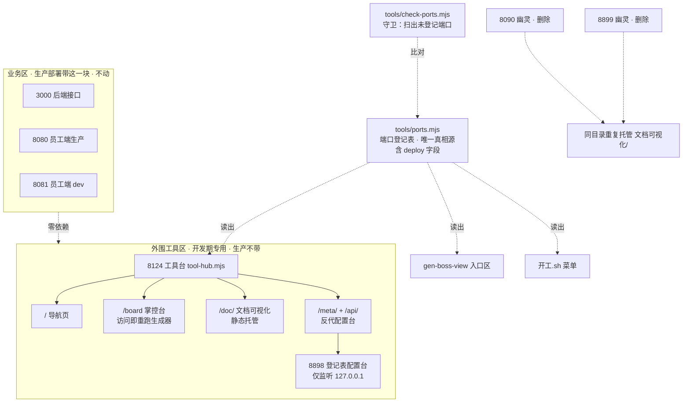

## 产品概述

按用户裁决「业务端口合理，要整改的是项目之外的部分」+「生产级部署肯定不带运维的文档相关的东西，他俩就不是一个东西」，把散落在 5 个端口上的开发期外围工具（文档站 8123、掌控台 8124、登记表配置台 8898，加两个没人认领的幽灵 8090/8899）收敛成一个「工具台」端口并路径分流，同时建立端口登记账与自动守卫，让"随手开端口、无人记账"不再复发。

业务三端口（3000 后端 / 8080 员工端生产 / 8081 员工端 dev）一律不动，且业务系统与工具台彻底解耦。

## 核心功能

1. **端口登记表（唯一真相源）**：全项目监听端口集中声明在一处，标注归属（业务 / 外围）、用途、**是否随生产部署**。所有脚本与页面读它，禁止任何地方再手写端口号。
2. **工具台（单端口入口）**：掌控台、文档可视化站、登记表配置台合成一个端口的路径分流服务，打开一个地址进三个工具。
3. **幽灵端口清理**：杀掉 8090、8899 两个重复托管同一目录的废品服务。
4. **端口守卫（防复发）**：一条命令扫出「在监听但没登记的端口」与「登记了却没起的服务」，把本次人工发现变成自动门禁。
5. **开发期手机可达**：公网隧道补一条指向工具台，仅服务于开发期远程查看，不影响生产部署形态。
6. **地址表收敛**：删掉已漂移的孤儿文件 `访问地址.md`，地址信息回归生成器产出。

## 范围边界

- **不动**：业务端口 3000 / 8080 / 8081 及其在 `dev.sh` 里的启动编排（用户明确裁决合理）
- **不动**：`dev.sh` 整体结构与 `启动项目` / `停止项目` 等既有命令
- **硬约束**：业务代码、前端页面、后端接口均不得引用 8124 或工具台任何路径——工具台是开发期外挂，生产不带，它挂了业务照常跑
- 不涉及业务代码、数据库、业务页面改动
- 公网隧道若受套餐条数限制，按兜底顺序处理并向用户说明

## 技术栈

- 运行环境：Node 24 ESM，零新增依赖（`node:http` / `node:child_process` / `node:fs` / `node:path`），与 `tools/` 下现有脚本（gen-boss-view.mjs、meta-studio.mjs、control-server.mjs）保持一致
- 端口真相源：`tools/ports.mjs` 导出常量（不用 yaml，避免为几个数字引入解析依赖；脚本直接 import）
- 文档站静态托管：手写 MIME 映射 + `fs.createReadStream` 流式返回（原 `python3 -m http.server` 退役）
- 配置台反代：`http.request` 管道转发，重写路径前缀与 Host 头
- 守卫：`child_process` 调 `lsof` 解析监听端口，对照登记表比对
- 门禁：`node tools/check-ports.mjs`、`node tools/check-docs.mjs`、`node tools/gen-boss-view.mjs`

## 先升维：这属于哪一类问题

这不是"端口太多"的数量问题，是**入口编排缺真相源**的问题。证据：8090、8899、8123 三个 Python 静态服务的**工作目录完全相同**（都是 `文档可视化/`）——它们不是三个用途，而是同一次需求被起了三次、没人记账也没人回收。数量只是症状，缺账本才是病根。因此整改必须包含防复发机制，否则下周还会多出 8091。

另一层：用户点明生产部署不带外围工具，说明这是**两类东西混跑在一台开发机上**的问题。因此方案不只要收敛端口，还要在登记表与界面上把「业务 / 开发期工具」这条边界显式化，防止将来有人把工具台当成系统的一部分。

## 实施方案

### 一、端口登记表（第一步，其余步骤都依赖它）

新建 `tools/ports.mjs`，集中声明：

- 业务区（不动）：3000 后端接口、8080 员工端生产、8081 员工端 dev
- 外围区：8124 工具台（唯一对外）、8898 登记表配置台（仅本机 127.0.0.1，被反代）
- 每条含：端口、名称、归属（biz/tool）、用途、**deploy（是否随生产部署）**、是否对外

关键设计：`deploy` 字段直接承载用户裁决——业务区 3000/8080 为 `true`，8081 与外围区全部为 `false`。这条字段让「生产带什么」变成可查询的事实，而不是靠人记。

**为什么先做它**：工具台、守卫、开工菜单、掌控台入口区四处都要用端口号。不先立真相源，就是在四个地方各写一遍——这正是本次漂移的成因。

### 二、工具台（新建而非改造的取舍）

新建 `tools/tool-hub.mjs`，`tools/control-server.mjs`（62 行）退役并删除。

**为什么不改造 control-server.mjs**：它的名字与职责会就此错位（叫"掌控台服务"却托管三个工具），后续维护者必然困惑；它只有 62 行、外部引用点仅 `~/.bmq/开工.sh` 的 `progress()` 一处，改名成本极低。宁可现在改一处，不留一个名不副实的模块。

路由规则（端口 8124）：

| 路径 | 目标 | 处理方式 |
| --- | --- | --- |
| `/`、`/index.html` | 工具台导航页 | 三张工具卡片 + 状态探测（见 design） |
| `/board`、`/项目掌控台.html` | 掌控台 | 保留现有「访问即重跑生成器」逻辑与 3 秒缓存 |
| `/health` | 健康检查 | 保留（`开工.sh` 正在探活） |
| `/doc/*` | `文档可视化/` 目录 | 静态托管，流式读取 |
| `/meta/*` | `127.0.0.1:8898` | 反代，剥离 `/meta` 前缀 |
| `/api/*` | `127.0.0.1:8898` | 反代，原样转发 |
| 其他 | — | 404 + 列出可用路径 |


**为什么 `/api/*` 也要转给配置台**：配置台前端是绝对路径调用 `/api/yml`、`/api/entities`，挂在 `/meta/` 下后浏览器仍会请求 `/api/...`。工具台只服务外围、不与业务后端（3000）争路径，因此把 `/api/*` 一并转给 8898 是安全且最小改动的做法。配置台无外链静态资源（UI 全内联），不存在资源路径问题。

**降级保护**：生成器失败时沿用现有策略（有旧缓存就返回旧的，页面不至于打不开）；反代目标未启动时返回明确提示「配置台未启动，跑 node tools/meta-studio.mjs」，而不是让用户看到超时——沿用项目纪律「门禁用提示不用静默」。

### 三、登记表配置台改只监听本机

`tools/meta-studio.mjs` 的 `server.listen(PORT)` 改为 `server.listen(PORT, '127.0.0.1')`。收敛后所有外部访问走 `/meta/`，8898 不再对外暴露——这正是"整改外围"的应有之义：内部端口内部用。

### 四、清幽灵 + 立守卫

1. 杀掉 8090、8899。动手前再探活一次并确认无活跃连接；已确认两者 cwd 与 8123 相同、属重复托管同一目录的废品，杀掉不影响文档站（文档站由工具台 `/doc/` 接管）。恢复方式：文档站可由 `开工.sh` 的「文档站」命令重新拉起。
2. 新建 `tools/check-ports.mjs`：扫 `lsof -nP -iTCP -sTCP:LISTEN`，对照 `tools/ports.mjs`，输出两类问题——**未登记的监听端口**（下一个幽灵）与**登记了却没起的服务**。有问题时退出码非 0。
3. 把该守卫写进 `docs-coverage.md` 的自检清单，并挂到 `开工.sh` 的「项目状态」里。

**守卫的价值**：本次是人工发现端口散乱。没有守卫，三个月后同样的问题会再发生一次，且仍需人工发现。

### 五、公网隧道（含超限兜底）

`~/.cpolar/cpolar.yml` 现有三条隧道（ssh→22、website→8080、backend→3000）。新增第四条 `tools: http → 8124`。**该隧道仅服务于开发期手机远程查看，与生产部署形态无关**——生产环境根本没有工具台。

若套餐限制导致四条无法同时建立，按此顺序兜底并明确告知用户：

1. 优先保留 website(8080 日常干活) 与 backend(3000 客户端接口)
2. ssh 隧道若用户在手机上不用可临时停用，让位给 tools
3. 都不行则只做局域网可达，公网维持现状，并在掌控台注明

### 六、地址表收敛

`开发规划.md:35` 已把 `访问地址.md` 认定为「孤儿文件，不入库」。该文件当前还有三处硬伤：声称由已不存在的 `gen-access.mjs` 生成、仍用旧名「白话进度看板 / 项目进度看板.html」、端口表漏登记两个幽灵。

处理方式：**删除**。地址信息回归两处既有产出：终端 `node tools/gen-boss-view.mjs --access`，浏览器开掌控台 / 工具台入口区（JS 实时探测三套地址、只亮可达的）。同时更新 `gen-boss-view.mjs` 的 `SERVICES` / `EXTRA_PORTS`，改为从 `tools/ports.mjs` 读取。

### 七、同步点清单

- `~/.bmq/开工.sh`：`BOARD_PORT` / `DOCS_PORT` 合并为工具台单端口；`start_docs()` 改为提示打开 `/doc/`；`progress()` 拉起 `tool-hub.mjs`；「项目状态」接入 `check-ports.mjs`；菜单文案同步
- `tools/gen-boss-view.mjs`：`SERVICES` / `EXTRA_PORTS` 改为读登记表；入口区新增工具台
- `docs-coverage.md`：回写本轮整改、端口账、守卫接入
- `AGENTS.md` 第七节：若含手写端口，改为引用登记表（避免又一处漂移源）

## 实施要点

- **杀进程前必须复核**：探活 + 确认无活跃连接后再杀，并在回复里说明杀的是什么、如何恢复
- **路径重写是反代最容易错的地方**：`/meta/xxx` 转发要剥离前缀，`/api/xxx` 不剥离，两者规则不同，实现时分开处理并各写一条验证
- **掌控台实时生成不能丢**：现有设计的优点（打开即最新），改造时必须保留 3 秒缓存与生成失败降级
- **先立登记表再动其他**：顺序反了就会在多个文件里各写一遍端口号，重蹈覆辙
- **解耦验证**：改完必须确认业务代码零处引用 8124（grep 证实），这是用户裁决的硬约束
- 改动按逻辑拆提交（feat 工具台 / chore 清幽灵与守卫 / docs 台账），未获指示不推送

## 架构设计



## 目录结构

```
tools/
├── ports.mjs              # [NEW] 端口登记表（唯一真相源）
│                          #   业务区 3 条（3000/8080 deploy:true，8081 deploy:false）
│                          #   + 外围区 2 条（8124 工具台对外 / 8898 配置台仅本机，均 deploy:false）
│                          #   每条：端口 · 名称 · 归属 · 用途 · deploy · 是否对外
├── tool-hub.mjs           # [NEW] 工具台：单端口 8124 承载三个外围工具
│                          #   ① `/` 导航页（三卡片 + 实时状态探测 + 三套地址）
│                          #   ② `/board`、`/项目掌控台.html` → 掌控台，保留访问即重跑 + 3 秒缓存
│                          #   ③ `/health` → 健康检查（开工.sh 在探活）
│                          #   ④ `/doc/*` → 静态托管 文档可视化/（含 MIME 映射）
│                          #   ⑤ `/meta/*` → 反代 127.0.0.1:8898，剥离 /meta 前缀
│                          #   ⑥ `/api/*` → 反代 8898，不剥离前缀
│                          #   ⑦ 反代目标未起 → 明确提示而非超时；生成器失败 → 降级返回旧缓存
├── control-server.mjs     # [DELETE] 退役。职责已被 tool-hub.mjs 覆盖，
│                          #   仅 ~/.bmq/开工.sh 的 progress() 一处引用，同步改掉
├── check-ports.mjs        # [NEW] 端口守卫（防复发核心）
│                          #   扫 lsof 监听端口 ↔ 对照 ports.mjs
│                          #   报「在监听但没登记」（下一个幽灵）与「登记了却没起」
│                          #   有任一类非空即退出码 1，接入门禁与开工.sh「项目状态」
├── meta-studio.mjs        # [MODIFY] listen 改为只监听 127.0.0.1（不再对外暴露）
└── gen-boss-view.mjs      # [MODIFY] SERVICES / EXTRA_PORTS 改为读 ports.mjs；
                           #   入口区新增工具台

~/.bmq/
└── 开工.sh                # [MODIFY] BOARD_PORT 与 DOCS_PORT 合并为工具台单端口；
                           #   start_docs() 改为提示 /doc/；progress() 拉起 tool-hub.mjs；
                           #   「项目状态」接入 check-ports.mjs；菜单文案同步

~/.cpolar/
└── cpolar.yml             # [MODIFY] 新增 tools 隧道 http → 8124（开发期用，超限按兜底顺序）

访问地址.md                 # [DELETE] 项目自认的孤儿文件（开发规划.md:35），且三处漂移：
                           #   声称由已不存在的 gen-access.mjs 生成、旧名、漏登记幽灵端口

docs-coverage.md           # [MODIFY] 回写本轮整改、端口账与守卫接入
AGENTS.md                  # [CHECK] 第七节若含手写端口，改为引用 ports.mjs
```

## 关键代码结构

```js
// tools/ports.mjs —— 端口登记表，全项目唯一真相源
// deploy 字段承载用户裁决：生产级部署带什么、不带什么
export const PORTS = {
  // 业务区：用户裁决合理，一律不动
  backend:  { port: 3000, name: '后端接口',       zone: 'biz',  deploy: true,  public: true,  desc: '业务接口，客户端与员工端都走它' },
  staff:    { port: 8080, name: '员工端（日常）', zone: 'biz',  deploy: true,  public: true,  desc: '生产包，秒开，公网映射的就是它' },
  staffDev: { port: 8081, name: '员工端（开发）', zone: 'biz',  deploy: false, public: false, desc: '改代码热更新，开发时看效果' },
  // 外围区：开发期工具，生产部署不带，本轮收敛为 1 个对外端口
  hub:      { port: 8124, name: '工具台',         zone: 'tool', deploy: false, public: true,  desc: '掌控台 / 文档站 / 配置台的统一入口，开发环境专用' },
  meta:     { port: 8898, name: '登记表配置台',   zone: 'tool', deploy: false, public: false, desc: '仅本机监听，由工具台 /meta/ 反代' },
};
```

```js
// tools/check-ports.mjs —— 守卫契约
// 返回 { unregistered: [...], missing: [...] }
// unregistered：在监听但登记表里没有 → 下一个 8090，必须在它活过一周前发现
// missing：登记表里声明了但没在跑 → 工具挂了而没人知道
// 有任一类非空即退出码 1，可接门禁
export function auditPorts(): { unregistered: PortHit[]; missing: PortEntry[] };
```

## 工具台导航页（8124 根路径）

打开 8124 时若只丢出一个掌控台，用户仍不知道文档站和配置台在哪。因此根路径提供一个极简导航页作为跳转枢纽，再由此进入三个工具。

使用对象：业务负责人本人（非终端客户）与 AI。用户常用手机远程，因此窄屏表现与电脑同等重要。

## 页面板块

**顶部标题条**：深色实底（#1C2024），左侧「工具台」，右侧一行小字标注「开发环境专用 · 生产部署不含这一块」——把用户裁决的边界直接写在界面上，避免日后误以为它是系统的一部分。

**工具卡片区**：三张并排卡片，每张含名称、一句话说明、进入按钮：

- 掌控台：看进度、待拍板、待办
- 文档可视化站：方法论规则（AI 行为规则的源头）
- 登记表配置台：高级，给 AI 用

卡片整块可点，窄屏下纵向堆叠。

**状态行**：每张卡片右下角显示该工具当前是否可达（绿点在线 / 灰点未启动），不可达时给出启动提示而非静默灰掉——沿用项目纪律「门禁用提示不用静默」。页面加载时并行探测，探测中不显示"未启动"以免误报。

**底部地址条**：列出本机 / 同热点 / 公网三套地址，由 JS 实时探测、只亮可达的那套，用户不需要判断自己在什么网络。与掌控台入口区保持同一套探测逻辑与视觉。

## 交互与响应式

- 卡片 hover 时轻微上浮与边框高亮，反馈明确但不喧宾夺主
- 键盘可用：Tab 顺序为三张卡片，回车进入
- 窄屏下状态行与地址条吸底，卡片区滚动；地址条按钮尺寸保证手指可点

## 视觉取向

工具感与信息密度：低饱和底色、清晰分组、状态可辨，不做营销式装饰。与掌控台现有的深色头部加浅色卡片语言保持一致，避免又长出一个视觉体系。

## SubAgent

- **code-explorer**
- 用途一：动手前复核风险点。确认 8090 / 8899 除自身外无任何活跃连接与其他会话依赖（杀之前必须证实），并确认 8123 文档站的唯一用途。
- 用途二：全仓扫出手写端口号的位置（dev.sh、AGENTS.md、部署运维手册.md、开工.sh、各生成器、掌控台 HTML），确保登记表落地后没有遗漏的第二处真相源。
- 预期产出：幽灵端口可安全杀除的证据清单；一份完整的手写端口位置清单，供同步改动时逐点覆盖。