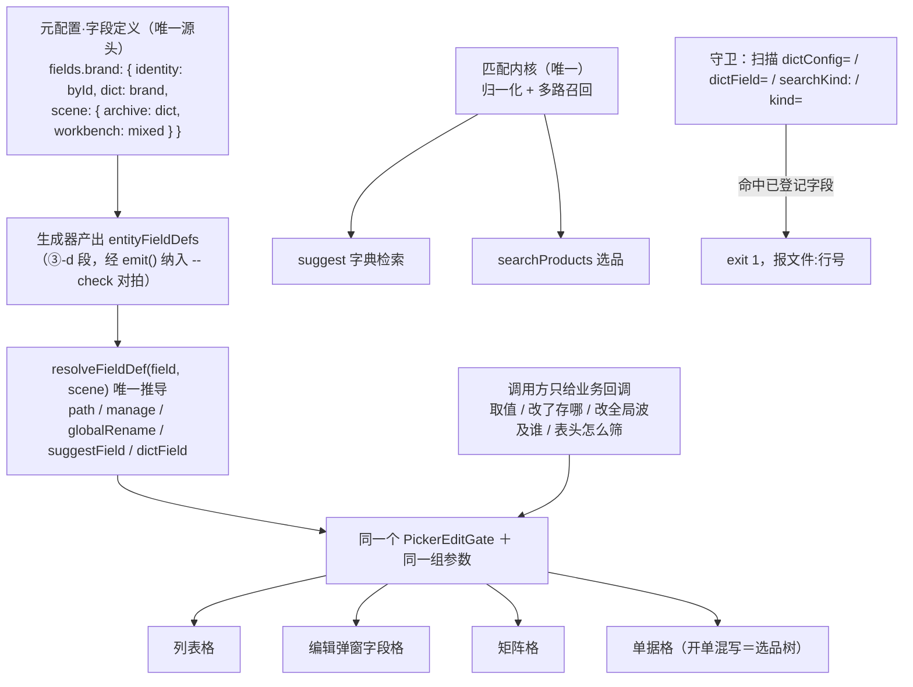

## 用户原话（verbatim，最高优先级）

**第一轮（报问题）**

> 产品编辑矩阵中分类的确认层的选用检索正确接到了链路上 品牌还没有 以此看价格类型和供应商进价的渠道肯定也没有  这是大问题 架构级问题

**第二轮（追问）**

> 我想请问 矩阵类的字段点击的确认层的表现是另一种独立的实现方式吗? 我理想的效果的 比如每个字段的参数元配置描述了一次 其他地方应该自动正确  矩阵内也好 还是放到采购报价的品牌字段也好难道他们的确认 层不是一回事吗 使用同一个组件 使用同一组参数 可变的部分大概在调用方的差异?

**第三轮（拍范围）**：一次到位，连元配置一起做；采购报价品牌列（走选品树）先查再说。

**第四轮（纠正概念层级，本次立论）**

> 不是叫引用字典的这么狭隘的概念 而是 本身各个能力都是根据一个唯一的源头来处理   如果不同功能中需要有差异   比如产品管理和采购报价的品牌确认层就应该是一回事 但是采购管理有选品吗还是  然后费油非标和标准的概念 实际上就是有误id的概念 本质上应该是可以明确的顶级参数啊 应该是调用方的层面   我想表达的意思能力不是分了层 比如确认层等等 某个字段定义了就应该是所有地方它的确认层行为都是一致的

（"费油"＝"非标"；"有误id"＝"有无 ID"）

## 产品概述

本系统里所有可编辑格子的确认层，目前是"同一个组件、参数各处手写"：全站只有一个 `PickerEditGate`，但"给不给完整字典能力"取决于调用方在两个能力不对等的入口（`dictField` / `dictConfig`）中选了哪个，选错不报错、静默丢能力——产品编辑弹窗的品牌格正是因此丢了「完整字典档 + 行内改/删 + 改全局」三项能力，而同弹窗的分类格接上了。

本次要把它改成：**字段在元配置里定义一次（identity + dict + scene），确认层的路径与全部能力由框架推导，列表 / 编辑弹窗 / 矩阵 / 单据格处处一致**。调用方只提供业务回调。

## 核心功能

1. **字段定义层**：元配置新增字段级定义，顶级参数为 `identity`（byId＝标准·有 ID / byText＝非标·自由文本）、`dict`（值来源）、`scene`（填法：档案分列 / 开单混写）。能力由 `identity + dict` 推导，不手写、不分层。
2. **六处重复声明收敛为一处**：清理 `columns.dictKind`、`cellSpec.gate.search.dictField`、`dictConfig={brandDict}`、`kind="brand"` + `catalogDictField()`、`DICT_ENTRY_FIELDS` 等散落声明，统一以字段定义为准。
3. **全站迁移，手写参数清零**：所有引用字典的格子改为只声明字段名，`dictField` / `dictConfig` / `searchKind` / `kind="xxx"` 的调用方手写全部消除——弹窗品牌格因此自动补齐三项能力。
4. **匹配规则统一为一套**：当前字典检索走 LIKE 子串、选品走范式多路召回，同一词两处结果不同，违反方法论「匹配规则要同一套」。统一为同一匹配内核。
5. **标准 / 非标判定入配置**：`isRecognizedGoods`（有无 ID）从散落代码与"按行判定"分支，改为读字段定义的 `identity`。
6. **会失败的守卫 + 单测**：扫描残留手写参数即 `exit 1` 并报文件行号；推导逻辑补单测并做变异验证。
7. **文档与台账**：真相源补「字段定义决定确认层行为」「匹配规则同一套」规则并重生成；回写覆盖台账与掌控台。

## 边界（防预期错位）

- 本次做到：**字段级确认层路径与能力全覆盖**（列表 / 弹窗 / 矩阵 / 单据格）＋ 匹配规则统一。
- 本次不做：`ProductEditDialog`（70KB）的区块编排配置化（属 `pages` 段覆盖率 1/27 的另一工程）；`ProductPicker` / `UnitPicker` / `DsDialog` / `FloatPanel` 交互契约不动（金标准锁定）。
- 采购报价品牌格**保留选品树形态**（方法论 `why-sales`：开单混写、档案分列，填法不要合成一个框），但改由 `scene` 声明驱动、且匹配规则与档案侧同源。

## 技术栈

沿用项目现状，不引入新技术：React + TypeScript（Vite，前端 8080 生产 / 8081 dev）+ Express + Prisma 后端（3000）+ 既有 `shared/` 平台层组件。确认层唯一实现为 `PickerEditGate`（FloatPanel 承载，交互契约不动）。元配置链路沿用 `data-source/entity-meta.yml` → `tools/gen-entity-meta.mjs` → 前后端生成物。静态守卫用 Node 脚本（与 `tools/verify.mjs`、`tools/check-docs.mjs` 同风格）；单测沿用前端 Vitest（`frontend/tests/**`）。

## 实现思路（先升维定类）

**这属于哪一类问题**：不是「品牌格少传一个参数」，而是**框架开后门**——框架把同一个决策（值属于哪个字典、走哪条路）开放成多个能力不对等的入口由调用方自选，且选错静默。本项目 2026-09-04 命中过同一信号（「分层却允许手写＝框架开后门」），当时的解法是配置驱动迁移，本次同构。

**通用最优范式**：能力由声明推导、调用方零分支、同一事实只声明一次。本项目现状版本＝**误用**（能力已建好，判决权却留在调用方）。方案 ＝ 范式 − 差距 ＝ **字段定义层 + 推导 + 迁移 + 守卫 + 匹配规则同源**。

**为什么能一次到位**：真相源里 `layer: globalDict` **已经存在**（`entity-meta.yml` 的 category:20 / brand:34 / unit:48 / price_type:60），「哪些是全局字典」早有唯一声明，只是代码没消费它；「标准/非标＝有无 ID」也早有统一判定函数 `isRecognizedGoods`（`documentLineInvariants.ts:9-13`），只是没进配置。不必新造概念，只需新增字段定义层并让代码读它。

**判定违规的依据（真相源 `cell-gate-path` rules）**：第 1 条「同一值来源出现第二种路径=违规」；第 3 条「管理能力由参数驱动，**格子侧零分支**」。文档写零分支，代码是六处手写，故本次为**双任务**（代码 ＋ 文档）。

**关于「能力分层」的落实**：用户明确反对"能力分了层"。本方案不是取消差异，而是把差异的**判决权从调用方移到声明层**——`byId / byText` 是字段的客观属性（数据层事实），不是 UI 形态选项。调用方看不到"层"，只声明字段名。

## 架构设计

### 目标态：字段定义一次，框架推导，处处一致



### 能力推导表（声明层，不是调用方分支）

| identity | dict.layer | 推导结果 |
| --- | --- | --- |
| byId | globalDict | 完整字典档 + 行内改/删 + 改全局（并档预览） |
| byId | subject | 完整字典档 + 行内改/删 + 改全局（供应商） |
| byId | localDict | 仅检索 + 边用边建（联系方式、地址类型） |
| byText | — | 纯值确认层，无管理能力（备注、俗称） |


### 场景填法（顶层参数，非调用方分支）

`scene.archive = dict`（档案分列，字典检索）／`scene.workbench = mixed`（开单混写，选品树拼整串）。依据方法论 `why-sales`：「开单和管理不是同一套填法：开单混写；档案分列维护。**匹配规则要同一套，填法不要合成一个框**」。

### 匹配规则统一（补现行缺陷）

现状：字典检索 `suggest()` 后端为 `{ name: { contains: kw } }`（`backend/src/services/product/search.ts:1220`，LIKE 子串）；选品 `searchProducts()` 走 v29/v30 范式多路召回。同一词两处结果不同。
两条候选（体检量化影响面后定）：A 把 `suggest` 切到范式检索（全站字典检索受益，面大）；B 抽共享匹配函数，两者各自调用、共用同一套归一化与召回规则（面小）。**该子项可独立交付，不阻塞主线收口。**

## 关键代码结构

```ts
/** 字段定义（生成器从 entity-meta.yml 的 fields 段产出；登记表即枚举来源） */
export interface GeneratedFieldDef {
  field: string;                                  // 'brand' | 'category' | 'unit' | 'priceType' | 'supplier' | 'remark' | ...
  identity: 'byId' | 'byText';                    // 顶级参数：标准（有 ID）/ 非标（自由文本）
  dict?: string;                                  // 值来源字典实体（byId 必填）
  layer?: 'globalDict' | 'subject' | 'localDict'; // 从 dict 实体继承，不重复声明
  scene?: Partial<Record<'archive' | 'workbench', { entry: 'dict' | 'mixed' | 'value' }>>;
  /** 以下由 identity + layer 推导，登记表不写 */
  manage: boolean;                                // 完整字典档 + 行内改/删
  globalRename: boolean;                          // 改全局（并档预览）
  suggestField?: SuggestField;
  dictField?: DictChangeKind;
}
export const entityFieldDefs: Record<string, GeneratedFieldDef>;

/** 框架侧唯一推导入口（纯函数，可单测） */
export function resolveFieldDef(
  field: string | undefined,
  scene?: 'archive' | 'workbench',
): ResolvedFieldDef | undefined;

/** 过渡期兼容：旧 dictField / dictConfig / kind 归一到 field，命中即 warn（模块级去重） */
export function fieldFromLegacy(o: { dictField?: DictChangeKind; dictConfig?: unknown; kind?: string }): string | undefined;
```

调用方写法对比：

```
// 之前（四种手写参数，选错静默丢能力）
<ArchiveFieldCell dictConfig={brandDict} … />     // 弹窗品牌：能力残缺
<PickerNameCell  kind="brand" … />                 // 列表 / 矩阵
<ArchiveDialogField dictField="category" … />      // 弹窗分类
pickerRender: (r) => skuPickerRender(r)            // 采购报价：手写选品树

// 之后（只声明字段名，能力全自动；传未登记值类型报错）
<ArchiveFieldCell   field="brand" … />
<PickerNameCell     field="brand" … />
<ArchiveDialogField field="category" … />
// 采购报价：field="brand" + scene=workbench 自动取 mixed，不再手写 pickerRender
```

## 目录结构

```
data-source/
└── entity-meta.yml                        # [MODIFY] 新增 fields 字段定义段（identity / dict / scene）；
                                           #          清理六处重复声明（columns.dictKind、cellSpec.gate.search.dictField 等）

tools/
├── gen-entity-meta.mjs                    # [MODIFY] 新增 ③-d 段产出 entityFieldDefs（沿用 ③-b 加法产出风格，经 emit() 出口纳入对拍）；
                                           #          ③-c 段自检扩展：字段引用了未登记字典 / 代码残留手写 → 告警或阻断
└── check-field-gate.mjs                   # [NEW] 静态守卫：扫描 frontend/src/** 的 dictConfig= / dictField= / searchKind: / kind="xxx"
                                           #       残留，命中已登记字段即 exit 1（报文件:行号 + 改法）；接入 verify.mjs

frontend/src/shared/config/
├── fieldDef.ts                            # [NEW] resolveFieldDef() / fieldFromLegacy() / 类型定义：值来源 → 确认层能力的唯一推导入口（纯函数，可单测）
├── recordDicts.ts                         # [MODIFY] 五个 DictRecordConfig 改为从 entityFieldDefs 取值来源；保留既有导出以兼容过渡期
└── dictEntryViews.ts                      # [MODIFY] DICT_ENTRY_FIELDS / DICT_LIST_FN / DICT_DELETE_FN 改为按字段定义派生，消除第二份名单

frontend/src/shared/components/product-picker/
├── PickerEditGate.tsx                     # [MODIFY] open() 时对 req 归一（fieldFromLegacy → resolveFieldDef）；
                                           #          :200 :409 :694 :220-237 四处能力判定统一改读推导结果
├── PickerInlineCells.tsx                  # [MODIFY] ArchiveFieldCell / ArchiveEmptyFieldCell / PickerNameCell / PickerEmptyName 改收 field；
                                           #          :336-340 注释按新口径改写
└── pickerCatalogImpact.ts                 # [MODIFY] catalogDictField() 改为委托 resolveFieldDef，删除与登记表重复的映射表

frontend/src/shared/components/
├── workbench/WorkbenchFieldCell.tsx       # [MODIFY] 透传层改传 field，行为不变
├── archive/ArchiveDialogField.tsx         # [MODIFY] 同上（编辑弹窗 SPU 行的分类 / 产品名 / 俗称）
├── archive/ArchiveSlotHost.tsx            # [MODIFY] slot 的 dictConfig 改由 slot 声明的 field 推导（:614 :982）
├── table/editorRegistry.tsx               # [MODIFY] CellHandlers 的 dictField / dictConfig / suggestField 收敛为单一 field 来源；:184-200 旧分支合并
├── UnitPriceExpandPanel.tsx               # [MODIFY] 价格类型格（:653）、供应渠道格（:744）改 field 声明
└── archive/{ArchiveContactMatrixEditor,ArchiveSupplierAddressMatrixEditor}.tsx
                                           # [MODIFY] 矩阵格改 field（contactMethod / addressType 属 localDict，推导为"仅检索"，行为不变）

frontend/src/apps/staff/pages/product-manage/
├── ProductEditDialog.tsx                  # [MODIFY] :1343-1366 品牌格改 field="brand"（自动获得完整字典档 / 行内改删 / 改全局）；
                                           #          删除 :1350-1365 手写查重新建（交给 PickerEditGate.tsx:462 handleDictQuickCreate）；:1256-1272 分类格同改
└── UnitSection.tsx                        # [MODIFY] 单位格（:449）改 field="unit"

frontend/src/shared/config/
└── purchaseQuoteColumns.tsx               # [MODIFY] 产品名 / 品牌 / 规格三列的 pickerRender 改由 field + scene=workbench 声明驱动；
                                           #          单位列 :158-195「按行判定」改为读字段定义 identity

backend/src/services/product/
└── search.ts                              # [MODIFY]（待体检定 A/B）suggest() 的 LIKE 子串（:1220）与 searchProducts 统一为同一匹配内核

frontend/tests/
└── fieldDef.test.ts                       # [NEW] 单测：byId+globalDict→完整链路；byId+localDict→仅检索；byText→纯值；旧写法兼容归一；未登记字段处理；含变异验证说明

文档可视化/data-source/methodology/items/
└── cell-gate-path.yml                     # [MODIFY] rules 新增「字段定义决定确认层行为，处处一致」「入口不得二选一 / 同一事实只声明一次」；
                                           #          路径表增「identity → 能力」判定列

docs-coverage.md                           # [MODIFY] §二 产品档案行 + §六 本次会话行 + §七 待补清单回写
.codebuddy/memory/MEMORY.md                # [MODIFY] 开工前先精简（已超限被截断）：合并去重，保留有效事实
```

## 实现要点（防回归）

- **证据先行**：动手前用浏览器实测五格（分类 / 品牌 / 价格类型 / 供应渠道 / 单位）截图，把「用户推测 vs 代码事实」的差写进体检表，**不得按误判施工**（用户对价格类型/供应渠道的判断需实测证实或修正）。
- **复用既有模式，不新造**：生成器产出沿用 ③-b 段「加法产出、未声明则跳过」的写法（其余页面零回归）；守卫沿用 ③-c 段「列清单告警」模板；**新增生成物必须经 `emit()` 出口**，否则不进 `--check` 对拍。
- **迁移策略控爆炸半径**：先加声明层与推导并保留旧 prop 过渡（旧 prop 走 `fieldFromLegacy` 归一并 warn），保证每步可构建可验收 → 再分类迁移（弹窗字段 → 矩阵格 → 列表列 → 单据格），每类迁完跑一次门禁 → warn 归零后删旧 prop 与 `catalogDictField()` 调用方分支。
- **消除重复声明与重复实现**：迁移后 `catalogDictField()`（`pickerCatalogImpact.ts:55-62`）与 `DICT_ENTRY_FIELDS`（`dictEntryViews.ts:37`）改为从 `entityFieldDefs` 派生或删除，不得与登记表并存两套名单；删除 `ProductEditDialog.tsx:1350-1365` 手写查重新建。
- **改平台层必补单测＋变异验证**：`resolveFieldDef` 属 `shared/` 关键逻辑，必须补 `frontend/tests/fieldDef.test.ts` 并故意改坏确认转红（本项目有「绿灯但零验证」前科）。
- **守卫必须负向验证**：改坏 → `exit 1` 报文件行号，还原 → `exit 0`。
- **不重写既有组件**：`PickerEditGate` / `FloatPanel` / `ProductPicker` / `UnitPicker` / `DsDialog` 交互契约不动（金标准锁定）。
- **性能**：`resolveFieldDef` 是 O(1) 表查询，不进热路径、零额外渲染；字典全量拉取仍走既有 `DICT_LIST_FN`（pageSize 500）。
- **日志**：过渡期旧写法归一命中时 `console.warn` 一次（模块级去重，非每次渲染），不含业务数据。
- **提交纪律**：开工先 `git status`（工作区已有 46 个文件未提交改动）；按 docs / feat / chore 分逻辑提交；**未获指示不 push**。
- **产物禁手改**：`*.generated.*`、`js/data/gen/**`、AGENTS.md 的 GEN 节一律不动；改元配置只改 `entity-meta.yml`（Meta Studio 整文件覆盖写回，保持单文件不分片）。

## 验收（可操作行为清单）

1. 产品管理 → 进编辑弹窗 → 点品牌名：确认层出现「检索结果 / 完整字典」两档切换条；切到「完整字典」见全部品牌，行尾常驻「改」「删」。
2. 品牌确认层改名：出现「改全局」按钮并给影响预览（无同名=改名，有同名=并档），与分类格形态一致。
3. 同弹窗点分类、售价矩阵的价格类型、进价矩阵的供应渠道、单位区的单位：确认层形态与品牌完全一致；列表页品牌格与弹窗品牌格一致。
4. 采购报价品牌格点开仍是选品树（混写不变），但同一串词与产品管理侧召回的品牌结果一致（匹配规则同源）。
5. 检索代码：再无手写 `dictConfig=` / `dictField=` / `searchKind:` / `kind="xxx"`（透传层除外），字典格只声明 `field`；`isRecognizedGoods` 的判定改为读字段定义 `identity`。
6. 故意把某格改回手写写法 → 守卫 `exit 1` 并报文件:行号；还原 → `exit 0`。
7. `npm run verify` 退出码 0；文档站「格子点击 → 确认层」页出现新增规则；掌控台待办同步。

## Agent Extensions

### SubAgent

- **code-explorer**
- 用途：全站扫描确认层格的接线状态——所有 `dictConfig=` / `dictField=` / `searchKind:` / `kind="xxx"` / `gate.open(` 调用点，按「字段名 → 当前参数来源 → 应有能力」逐条取证；另核 `ArchiveSlotHost` 的 `slot.dictConfig` 是否会传入全局字典、采购报价三列除形态差异外有无别的接线问题、`isRecognizedGoods` 的全部判定散落点。
- 预期产出：完整接线体检表（每项含 文件路径:行号 + 结论），作为按格施工与守卫白名单的依据。

### Skill

- **playwright-cli**
- 用途：浏览器实证——登录 8080，打开产品管理 → 编辑弹窗，逐格（分类 / 品牌 / 价格类型 / 供应渠道 / 单位）点开确认层截图，判定「两档切换条、行内改/删、改全局」三件事是否存在。
- 预期产出：修正或证实用户「价格类型和供应渠道也没有」的推测；修复后复跑同一组截图形成前后对照，作为验收证据。

- **lsp-code-analysis**
- 用途：精确求 `brandDict` / `categoryDict` / `priceTypeDict` / `supplierDict` / `unitDict` 的全部引用点，以及 `ArchiveFieldCell` / `PickerNameCell` / `isRecognizedGoods` 的调用层级。
- 预期产出：引用点全集（含透传层与间接引用），保证迁移不漏项、守卫既不漏报也不误报。