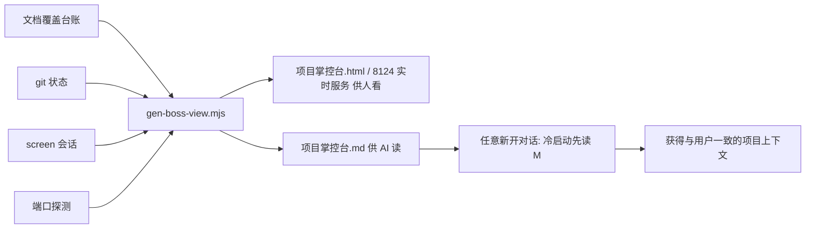

## 产品概述

掌控台本是为「不懂代码的用户」远程看进度而建，但用户指出一个更深的架构问题：用户照着掌控台的信息跟 AI 说，新开的对话（CLI screen 会话、IDE 对话）往往理解不了——因为多对话各自上下文不同、随时新建。掌控台应超越「给人看的仪表盘」，升级为**人和所有 AI 的共同事实源**：用户只要说一句「读项目掌控台」，任何新对话都能自动获得与用户一致的实时项目状态，不再依赖用户转述。

## 核心功能

- 掌控台感知「正在进行的 AI 对话」：从 `screen -ls` 提取当前开着的 CLI 对话会话名与状态，显示在掌控台（人和 AI 都能看到谁在干活、如何接回）。
- 新会话冷启动钩子：在任何新对话处理任务前，自动（或被规则要求）刷新并读取 `项目掌控台.md`，获得一致上下文。
- 有活跃会话时给出明确引导：想接着聊就说「接回对话」，而非盲目新开。
- 规则、执行卡、台账三处同步挂上该钩子，保证 CLI 与 IDE 同源、跨对话一致。

## 技术栈

- 沿用现有工具链：Node.js 脚本（`tools/gen-boss-view.mjs` 掌控台生成器）+ Markdown 规则文件（`.codebuddy/rules/boss-view.md`）+ 执行卡（`AGENTS.md`）+ 台账（`docs-coverage.md`）。无新增依赖。

## 实现方法

**核心策略：用单条 Node 补丁脚本一次性完成 `gen-boss-view.mjs` 的四处修改**，规避之前逐行 `replace_in_file` 反复读取同一处导致的循环故障。脚本读文件→字符串替换四处锚点→写回→`node --check` 校验。其余 Markdown 文件（boss-view.md 全量重写；AGENTS.md / docs-coverage.md 同脚本追加或 `replace_in_file`）单独处理。

**关键修改点（锚点，执行前由 code-explorer 复核当前行号）**：

1. `tools/gen-boss-view.mjs`

- `collectAccess()` 函数结尾、汇总注释前：新增 `collectSessions()`——`execSync('screen -ls')` 解析 `\d+\.(\S+)\s*\(([^)]+)\)` 得到会话名与状态。
- 汇总区 `const access = collectAccess();` 后追加 `const sessions = collectSessions();`
- HTML「要注意」三元块（约 410–416 行）改为 `notices` 数组组装：原仓库未提交/未推送提示保留；有活跃会话时追加「有 AI 对话开着（状态）…想接着聊说『接回对话』，新开对话让 AI 先读『项目掌控台.md』」。
- md 输出「## 工作区状态」前插入「## 正在进行的 AI 对话」段 + 冷启动提示行（任何新对话先跑生成器刷新再读本文件）。

2. `.codebuddy/rules/boss-view.md`：新增「新会话冷启动」条款——处理任何任务前先 `node tools/gen-boss-view.mjs` 刷新并读 `项目掌控台.md`。
3. `AGENTS.md` 第七节（在 `<!-- GEN:BEGIN -->` 前）：加跨对话一致性条款（同上钩子）。
4. `docs-coverage.md`：掌控台台账行回写（标注 v2.1 会话感知）。

## 性能与可靠性

- `screen -ls` 与端口探测均为轻量本地命令，开销可忽略；`control-server.mjs` 已有 3 秒缓存避免重复生成。
- 补丁脚本先做锚点命中检查，未命中 `process.exit(1)` 并提示，避免盲目替换破坏文件。
- 生成器语法 `node --check` 校验 + 实跑一次 `node tools/gen-boss-view.mjs` 验证产物。

## 架构设计

掌控台作为唯一事实源，向上同时服务两类消费者（人：8124 实时 HTML；AI：项目掌控台.md），向下从台账/git/screen 单一提取：



## 目录结构

```
tools/
└── gen-boss-view.mjs        # [MODIFY] 加 collectSessions() + 四处插入会话感知
（临时）tools/_patch-sessions.mjs  # [NEW→删除] 一次性补丁脚本，执行后移除
.codebuddy/rules/
└── boss-view.md             # [MODIFY] 加「新会话冷启动」条款
AGENTS.md                    # [MODIFY] 第七节加跨对话一致性条款
docs-coverage.md             # [MODIFY] 掌控台台账行回写 v2.1
```