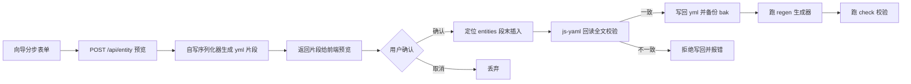

## 产品概述

按掌控台「下一步该干什么」管道顺序，推进当前不被卡住的三项 P2：Meta Studio 新增实体向导、roles 页归属核实与处置、文档站旧档案模型组退役。承接上一轮「待办全量核实、该清的清」的收尾——本轮继续用同一把尺子：先判断该不该做，再动手。

## 核心功能

1. **Meta Studio 新增实体向导**：当前配置台只能编辑已登记实体，新增实体必须手写 yml。补一个分步向导，填完身份（实体名/中文名/数据表名/层级/主键）、字段清单、列表列声明后，自动生成符合现有风格的 yml 片段并写回，写完自动跑生成器与校验。
2. **roles 页归属核实**：先判断「RolePermissions 页面收进档案框架」这条待办到底成不成立，再决定是收框架、改判据、还是清掉待办。角色列表加权限树勾选是双栏配置执行形态，与档案框架「一个弹窗改完一整类档案」的前提差异明显，需按适配度三问逐个核实。
3. **旧档案模型组退役**：文档站有 27 个数据文件仍在首页被加载，但侧栏查无登记，属导航不可达的死内容（约 96K 白下载）。核实零消费方后删除文件并清理引用。

## 范围边界

- 两套消费适配器统一（editorRegistry 与 cellSpecAdapter）：用户已裁决暂缓，本轮不做。
- 两条 P1（角色权限与审计日志对齐、经营报表维度）：被并行会话占用文件，本轮暂缓，解除条件为对方提交后再动。
- v23 两条数据库结构升级：已转长期目标态，不排期。

## 视觉效果

Meta Studio 是内部配置台（8898 端口，零依赖静态页）。新增实体向导沿用配置台现有视觉语言，做成顶部步骤条加分步面板的形式：左侧步骤指示当前进度，右侧为当前步的表单，底部固定操作条（上一步/下一步/生成预览）。字段编辑采用行式表格，每字段一行、可增删排序。最后一步展示将要写入的 yml 片段，带等宽字体与语法着色，确认后才落盘。

## 技术栈

- 工具链：Node ESM 脚本（tools/meta-studio.mjs），纯静态 HTML 加原生 JS 界面，零运行时依赖
- YAML 处理：复用 `tools/gen-entity-meta.mjs` 已使用的 `js-yaml`（同为 tools 目录下脚本，解析路径一致）
- 文档站：静态 HTML 加全局 `DOC_VIZ` 对象，侧栏由 `tools/gen-docs.mjs` 第 6 段生成
- 门禁：`npm run build`（frontend）、`tsc -b --force`、`node tools/check-docs.mjs`、`node tools/gen-entity-meta.mjs`

## 实施方案

### 核心判断：先升维归类，再动手

三项各自属于不同类型的问题，不能用同一套动作处理：

| 项 | 属于哪一类 | 动作 |
| --- | --- | --- |
| Meta Studio 向导 | 重复劳动（28 个实体全靠手写 yml） | 按三次原则，值得做成工具 |
| roles 收框架 | **待核实**——可能是又一条非真实待办 | 先核实，再决定收、改判据、还是清 |
| 旧档案模型组退役 | 死内容清理 | 直接删，但必须先证实零消费方 |


### 一、Meta Studio 新增实体向导

**写入策略（最关键的技术决策）**：`entity-meta.yml` 是唯一真相源，且现有写回模型是「整文件编辑、整文件写回」（`tools/meta-studio.mjs` 第 28 行注释明确：写回用原文，避免 YAML 格式漂移）。因此新增实体**不能用 `yaml.dump` 整体重写**——那会丢注释、改变缩进与 flow map 风格，造成全文件漂移。

采用三段式：

1. **定位**：复用现有的 `topSection(text, 'entities')` 切出 entities 段，找到段末插入点
2. **生成**：自写一个约 60 行的小型序列化器，专门输出项目现有风格（2 空格缩进实体名、4 空格缩进字段、行内 flow map `{ label: 品牌ID, dataType: int }`）。不用 `yaml.dump`，因为它输出的是 block 风格，与手写段混在一起会出现两种风格
3. **校验**：插入后立刻用 `js-yaml` 回读全文，比对新实体的结构化结果与向导输入是否一致；不一致则拒绝写回并报错。这是格式漂移的兜底闸门

**为什么自写序列化器而不是模板克隆**：模板克隆受限于模板实体的字段结构，新增实体的字段千变万化；自写序列化器一次投入、全场景复用，且能保证风格唯一。用户偏好明确为「长期架构方向 > 短期低成本」。

**接口设计**：新增 `POST /api/entity`，接收结构化实体定义，返回将写入的 yml 片段（供前端预览）；`POST /api/entity?confirm=1` 才真正写回。写回前自动备份 `.bak`，写回后自动跑 regen 与 check。

**与增长水位线的关系**：`gen-entity-meta.mjs` 的水位线告警中，问题①正是「Meta Studio 的整文件编辑到整文件写回模型怎么改」，而当前实体数 28 已远超阈值 16。向导落地后，新增实体不再需要人肉整文件编辑，水位线问题①的「编辑模型」部分得到缓解；但「文件会继续长大」仍在。因此向导写回前执行一次水位线检查，越线则在返回体里带上提醒，由界面提示，不阻断写入。分片与否不在本轮决定。

### 二、roles 归属核实

按「复用前适配度三问」逐条核实，产出明确结论：

1. **它当初为谁设计**：`ArchiveSlotHost` 为「一个弹窗里改完一整类档案」设计（产品、供应商、客户、库房范本）
2. **我的场景差在哪**：`RolePermissions.tsx` 是「左角色列表 + 右权限树勾选」双栏；保存的是权限集 JSON 而非档案字段；角色的增删改走 `DsDialog` 表单；核心交互是 `antd Tree` 的勾选与父子枝联动（`buildPermissionTree`、`setBranch`）
3. **差异是否超阈值**：三条差异都是结构性的。初步判断**超阈值，不该归档案框架**

核实动作：用 code-explorer 子代理对照 `AdminUsers`（已收框架）、`WarehouseManage`、`CustomerManage` 三者的实际形态，与 `RolePermissions` 逐项比对，确认结论。

三种处置分支（核实后按结论选一）：

- 结论为不该收：清掉这条待办，把判据补进真相源（登记「配置执行页」这一独立形态槽，写明判据：有从属树面板且主操作是配置执行而非档案编辑的，不归档案框架），避免以后再有人来问第二次
- 结论为部分可收：只把角色元数据的列表列改配置驱动，权限树区保留页面级实现（custom 需登记理由）
- 结论为可收：因涉及用户可感知的形态变更，先摆 2 到 3 个候选方案让用户选

### 三、旧档案模型组退役

**删除前必须证伪零消费方**。这 27 个文件定义的 `DOC_VIZ.supplierModel`、`DOC_VIZ.productModel`、`DOC_VIZ.warehouseModel`、`DOC_VIZ.customerModel` 等键，需全站 grep 确认无任何渲染器或数据文件消费，再删。

**易误伤的邻居（必须在计划中点名）**：

- `js/data/14-kinds.js`：与待删目录 `14-tables/` 编号相同，但是独立单文件，**保留**
- `js/data/33-canvas-ui.js`、`34-order-framework.js`：编号相邻，属渲染器，**保留**
- `js/data/38-get-module-meta.js`：与待删的 `39-get-module-tables.js` 成对，只删 39，**保留 38**，除非 grep 证实 38 依赖 39

**清理范围**：`文档可视化/index.html` 第 197 至 204 行、208 至 211 行、213 至 216 行（10-product-model 共 12 个）、223 至 233 行（30、31、32 共 11 个）、250 行（39-get-module-tables），合计 27 个 script 标签。

## 实施要点

- **格式漂移是本项目已踩过的坑**（上一轮实测：侧栏手写与真相源曾有 16 处既成漂移）。新增实体写回必须走「生成 + 回读校验」双闸门
- **写回前备份**：沿用现有 `.bak` 机制，出错可回滚
- **禁止手改生成物**：`frontend/src/shared/components/MetaStudio/index.html` 由 `meta-studio.mjs` 的 `ensureUI()` 产出，向导 UI 必须改模板源文件
- **roles 若判定不该收，不要顺手重构页面**——页面正在正常工作，动它属于「拿重构逃避交付」
- **删除操作一并提交一个 chore**，与向导的 feat 分开，便于回滚
- 每步跑门禁：`node tools/gen-entity-meta.mjs` 校验 yml、`node tools/check-docs.mjs` 校验文档站无死链

## 架构设计

新增实体向导的数据流：



## 目录结构

```
tools/
└── meta-studio.mjs                    # [MODIFY] 新增实体向导的后端与界面
                                       #   ① 新增 POST /api/entity（预览 + 确认写入两步）
                                       #   ② 新增 serializeEntity()：输出项目现有 flow map 风格的 yml
                                       #   ③ 新增 insertEntityBlock()：定位 entities 段末插入
                                       #   ④ 新增 verifyWriteBack()：js-yaml 回读比对，漂移即拒绝
                                       #   ⑤ 新增 checkWatermark()：写回前水位线提醒，不阻断
                                       #   ⑥ HTML 模板加向导 UI（步骤条 + 分步面板 + yml 预览）
                                       #   注意：前端 index.html 是生成物，只改本文件的模板字符串

文档可视化/
├── index.html                         # [MODIFY] 删除 27 个已退役数据文件的 script 引用
│                                      #   行 197-204/208-211/213-216（10-product-model 12 个）
│                                      #   行 223-233（30/31/32 共 11 个）、行 250（39-get-module-tables）
│                                      #   严禁误删：14-kinds.js(206) / 33 / 34 / 38
└── js/data/                           # [DELETE] 27 个文件
    ├── 10-product-model/              # 12 个 js
    ├── 14-tables/                     # 4 个 js
    ├── 30-supplier-model/             # 5 个 js
    ├── 31-warehouse-model/            # 3 个 js
    ├── 32-customer-model/             # 3 个 js
    └── 39-get-module-tables.js        # 1 个 js

文档可视化/data-source/methodology/
└── items/know-table.yml               # [MODIFY 可能] 若 roles 判定不该收框架，
                                       # 在此登记「配置执行页」形态槽与判据（有从属树面板 + 主操作为配置执行 ≠ 档案框架）
                                       # 并同步 _index.yml（加一篇两步：建文件 + 组里加一行）

frontend/src/apps/staff/pages/
└── RolePermissions.tsx                # [待定] 仅在核实结论为「可收」时才改；
                                       # 若可收，先摆候选方案给用户选再动

docs-coverage.md                       # [MODIFY] 回写三项结果 + roles 核实结论 + 新形态槽登记
项目掌控台.html / .md                  # [REGEN] 跑 node tools/gen-boss-view.mjs
```

## 关键代码结构

新增实体向导的接口契约（供实现时对齐）：

```ts
// POST /api/entity 请求体：新增实体的结构化定义
interface NewEntityPayload {
  key: string;            // 实体键名，如 backorder
  label: string;          // 中文名，如 欠库
  table: string;          // 数据表名
  layer: 'globalDict' | 'subject' | 'document' | string;  // 层级
  primaryKey: string;     // 主键，通常 id
  behavior?: { quickCreate?: boolean; deleteGuard?: string };
  fields: Array<{
    name: string;         // 字段名
    label: string;        // 中文名
    dataType: 'int' | 'string' | 'decimal' | 'datetime' | string;
    required?: boolean;
    unique?: 'global' | 'parent';
    defaults?: unknown;
    confirmStrategy?: 'direct' | 'dialog';
    searchLayer?: string;
  }>;
  columns?: Array<{       // 仅列表页形态需要
    key: string; title: string; dataIndex: string;
    renderMode: 'static' | 'text' | 'picker' | 'enum-tag' | 'number' | 'date';
    minWidth?: string; align?: 'left' | 'center' | 'right';
    order: number; confirmStrategy?: string; dictKind?: string;
  }>;
  relations?: Array<{ field: string; to: string; type: 'manyToOne' | 'oneToMany' }>;
  confirm?: boolean;      // false 时只返回预览片段，true 时才写回
}
```

## 设计风格

内部配置台（登记表配置台，8898 端口），使用者是 AI 与高级维护者，不是终端业务用户。因此视觉取向是**工具感与信息密度**，不做营销式装饰。沿用 Meta Studio 现有的暗色侧栏加浅色内容区结构，向导作为内容区的一个模式切入。

风格关键词：紧凑、等宽、低饱和、状态可辨。

## 页面板块设计

**顶部步骤条**：横向四段（身份信息、字段清单、列表列声明、预览确认），已完成步骤显示勾号并可点击回跳，当前步骤高亮，未到达步骤弱化但可见（不隐藏，避免「还要几步」不可知）。

**第一步 身份信息**：单列表单，字段为实体键名、中文名、数据表名、层级、主键。层级用下拉选择（全局选项库、主体、单据等），选中后右侧即时给出一行说明，讲清该层级意味着什么，避免选错。实体键名输入框做重名即时校验，与已有 28 个实体比对，重名时报错并指出已存在的那个。

**第二步 字段清单**：行式表格编辑。每字段一行，列为字段名、中文名、数据类型、必填、唯一、确认策略、操作。底部「添加字段」按钮。行内删除需二次确认。数据类型与确认策略用下拉，避免手输出错。支持上下移动调整顺序，顺序即最终 yml 中的字段顺序。

**第三步 列表列声明**：仅在第二步完成后提供，可跳过。同样行式表格，列为列键、标题、数据字段、渲染模式、最小宽度、对齐、顺序、确认策略。渲染模式用下拉并附简短说明。

**第四步 预览确认**：等宽字体展示将要写入的 yml 片段，关键字着色（键名、字符串、数字分色），顶部显示插入位置提示（entities 段末尾）。底部固定操作条：上一步、取消、确认写入。确认写入后展示生成器与校验的执行结果，成功显示生成的接口与列数，失败显示错误原文并保留已填写内容。

## 交互细节

- 每一步切换时保留已填内容，不做清空
- 确认写入是唯一有副作用的动作，需显式点击且按钮视觉上区分于其他操作
- 校验错误就近显示在字段下方，不用全局弹窗
- 写入中禁用写入按钮并显示进行中状态，避免重复提交
- 全程键盘可用：回车在表单内为确认当前步，字段表格内为新增下一行

## 响应式

配置台主要在桌面使用。窄屏下步骤条转为纵向紧凑排列，字段表格横向滚动，底部操作条固定吸底。

## Agent Extensions

### SubAgent

- **code-explorer**
- 用途一：核实 roles 归属。对照 `AdminUsers.tsx`（已收框架）、`WarehouseManage.tsx`、`CustomerManage.tsx` 三者的实际形态，与 `RolePermissions.tsx` 逐项比对（有无树面板、主操作是编辑还是配置执行、保存的是档案字段还是权限集），产出「该收／不该收／部分可收」的明确结论与代码行号证据
- 用途二：核实旧档案模型组零消费方。全站 grep `DOC_VIZ.supplierModel`、`DOC_VIZ.productModel`、`DOC_VIZ.warehouseModel`、`DOC_VIZ.customerModel` 及 39-get-module-tables 导出的键，确认无任何渲染器或数据文件消费后再删
- 预期产出：两份带文件行号证据的核实结论，直接决定第二项与第四项的动作分支