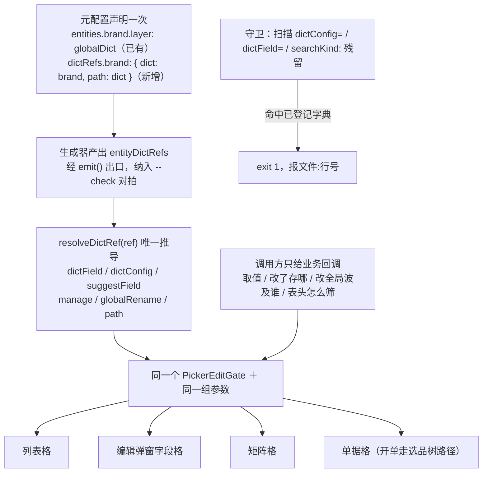

## 用户原话（verbatim）

**第一轮（报问题）**：

> 产品编辑矩阵中分类的确认层的选用检索正确接到了链路上 品牌还没有 以此看价格类型和供应商进价的渠道肯定也没有  这是大问题 架构级问题

**第二轮（追问，把目标态抬高一层）**：

> 我想请问 矩阵类的字段点击的确认层的表现是另一种独立的实现方式吗? 我理想的效果的 比如每个字段的参数元配置描述了一次 其他地方应该自动正确  矩阵内也好 还是放到采购报价的品牌字段也好难道他们的确认 层不是一回事吗 使用同一个组件 使用同一组参数 可变的部分大概在调用方的差异?

**第三轮（拍范围）**：

- 范围：**一次到位，连元配置一起做**
- 采购报价品牌列（走选品树）：**先查再说**，体检阶段判定后再决定是否纳入

## 需求重述

产品编辑弹窗里同属「全局字典」的格子，点开确认层后能力不一致：分类能查字典、能从完整字典里挑、能行内改名/删、能改全局；品牌只能手打检索，后三项全无。用户由「品牌没有」类推售价的价格类型、进价的供应渠道也丢了能力。

已实证澄清用户第二轮的追问：**不是另一套实现**——全站只有一个 `PickerEditGate`，矩阵格、档案槽位、列表列、弹窗字段全部进它。差异在「参数从哪来」：同一个品牌实测三种写法，列表读元配置（正确）、弹窗手写 `dictConfig`（残缺）、采购报价手写 `searchKind:'picker'`（选品树，形态合理）。

真正的架构级缺陷：**「这个格子的值属于哪个字典」被声明了六处**（`entities.brand.layer`、`columns.dictKind`、`columns.cellSpec.gate.search.dictField`、`dictConfig={brandDict}`、`kind="brand"` + `catalogDictField()`、`DICT_ENTRY_FIELDS`），而确认层给不给完整能力，取决于调用方在两个能力不对等的入口里选了哪个。选错不报错，静默丢能力。

用户要的目标态：**字段的字典归属在元配置里声明一次，列表 / 弹窗 / 矩阵 / 单据格自动同组件、同参数；调用方只提供业务回调**。

## 核心功能

1. **全站接线体检**：逐格实证「值来源 → 当前参数来源 → 应有能力」，输出对照表；用浏览器实测证实或修正用户「价格类型和供应渠道也没有」的推测；顺带判定采购报价品牌列（选品树）是否另有接线问题。
2. **新增字段级字典引用声明层**（`dictRefs`）：一个字段的字典归属只在元配置声明一次，能力（完整字典档 / 行内改删 / 改全局）由 `layer` 推导，不再手写。
3. **生成器产出 + 框架推导**：生成器按现有 ③-b 段风格产出 `entityDictRefs`；`resolveDictRef()` 成为确认层能力的唯一推导入口。
4. **全站迁移，手写参数清零**：列表列、编辑弹窗字段格、矩阵格、单据格一律改为只声明 `dictRef`；`dictField` / `dictConfig` / `searchKind` 的调用方手写全部消除（品牌格因此自动补齐三项能力）。
5. **加会失败的守卫**：① 扫描代码里残留的手写参数；② 校验 `dictRef` 均已登记；③ 沿用已有 `--check` 对拍。均需负向验证。
6. **文档与台账**：真相源补「值来源 → 必须走哪条入口」判定列与「入口不得二选一 / 只声明一次」规则并重生成；回写覆盖台账与掌控台。

## 边界（防预期错位，须向用户讲明）

- **本次做到「字段级确认层路径」全覆盖**：凡引用了字典的格子（列表 / 编辑弹窗 / 矩阵 / 单据格），路径与能力一律从声明推导。
- **本次不做「弹窗整体装配配置化」**：`ProductEditDialog`（70KB）的区块编排（SPU 行 / 品牌 tab / 规格 / 单位 / 售价矩阵 / 进价矩阵 / 图片）仍是代码——那是 `pages` 段覆盖率 1/27 的另一个工程。本次只把它的**字段格**接上元配置，不动布局。

## 验收（可操作的行为清单）

1. 产品管理 → 进编辑弹窗 → 点品牌名：确认层出现「检索结果 / 完整字典」两档切换条；切到「完整字典」见全部品牌，行尾常驻「改」「删」。
2. 品牌确认层改名：出现「改全局」按钮并给影响预览（无同名=改名，有同名=并档），与分类格形态一致。
3. 同弹窗点分类、售价矩阵的价格类型、进价矩阵的供应渠道、单位区的单位：确认层形态与品牌完全一致；列表页品牌格与弹窗品牌格一致。
4. 检索代码里再无手写的 `dictConfig=` / `dictField=` / `searchKind:`（透传层除外），全站字典格只声明 `dictRef`。
5. 故意把某格改回手写写法 → 守卫 `exit 1` 并报文件:行号；还原 → `exit 0`。
6. `npm run verify` 退出码 0；文档站「格子点击 → 确认层」页出现新增规则；掌控台待办同步。

## 技术栈

沿用项目现状，不引入新技术：React + TypeScript（Vite，前端 8080 生产 / 8081 dev）+ Express + Prisma 后端（3000）+ 既有 `shared/` 平台层。确认层唯一实现为 `PickerEditGate`（FloatPanel 承载，交互契约不动）。元配置链路沿用 `data-source/entity-meta.yml` → `tools/gen-entity-meta.mjs` → 前后端生成物。静态守卫用 Node 脚本（与 `tools/verify.mjs`、`tools/check-docs.mjs` 同风格）。单测沿用前端 Vitest（`frontend/tests/**`）。

## 实现思路（先升维定类）

**这属于哪一类问题**：不是「品牌格少传个参数」，而是**框架开后门**类——框架把同一个决策（值属于哪个字典、走哪条路径）开放成多个能力不对等的入口，由调用方自选，且选错静默。本项目 2026-09-04 命中过同一信号（「分层却允许手写＝框架开后门」），当时的解法是配置驱动迁移，本次同构。

**通用最优范式**：能力由声明推导、调用方零分支、同一事实只声明一次。本项目现状版本＝**误用**（能力已建好，判决权却留在调用方）。方案 = 范式 − 差距 = **声明层 + 推导 + 迁移 + 守卫**。

**为什么能一次到位**：真相源里 `layer: globalDict` **已经存在**（`entity-meta.yml` 的 category:20 / brand:34 / unit:48 / price_type:60），「哪些是全局字典」早有唯一声明，只是代码没消费它。不必新造概念，只需新增一层「字段级引用声明」并让代码读它。

**判定违规的依据**：真相源 `cell-gate-path` rules 第 1 条「同一值来源出现第二种路径=违规」、第 3 条「管理能力由参数驱动，**格子侧零分支**」。文档写零分支、代码是六处手写，故本次为**双任务**（代码＋文档）。

## 架构设计

### 目标态：声明一次，框架推导



三条链路（全局字典 / 本地字典 / 无字典）**能力天然不等，但判决权从调用方移到框架**。路径形态（字典检索 vs 选品树）由「值来源层级」决定——这正是 AGENTS.md 已有硬纪律「编辑矩阵形态由层级＋表类型推导」，本次只是让它落到配置上。

### 关键代码结构

```ts
/** 字段级字典引用（生成器从 entity-meta.yml 的 dictRefs 段产出，登记表即枚举来源） */
export interface GeneratedDictRef {
  ref: string;                    // 'brand' | 'category' | 'unit' | 'priceType' | 'supplier' | 'contactMethod' | ...
  dict: string;                   // 指向 entities 里的字典实体
  layer: 'globalDict' | 'subject' | 'localDict';
  path: 'dict' | 'picker';        // 值来源层级推导：单值引用=dict，复合体成员=picker
  /** 以下由 layer + path 推导，登记表不写 */
  manage: boolean;                // 完整字典档 + 行内改/删
  globalRename: boolean;          // 改全局（并档预览）
  suggestField?: SuggestField;
  dictField?: DictChangeKind;
}
export const entityDictRefs: Record<string, GeneratedDictRef>;

/** 框架侧唯一推导入口（纯函数，可单测） */
export function resolveDictRef(ref: string | undefined): ResolvedDictRef | undefined;

/** 过渡期兼容：把旧的 dictField / dictConfig 写法归一到 dictRef，并 warn */
export function dictRefFromLegacy(o: { dictField?: DictChangeKind; dictConfig?: any }): string | undefined;
```

调用方写法对比：

```
// 之前（四种手写参数，选错即静默丢能力）
<ArchiveFieldCell dictConfig={brandDict} … />
<PickerNameCell  kind="brand" … />
<ArchiveDialogField dictField="category" … />

// 之后（只声明"我是哪个字典引用"，能力全自动，传未登记值类型报错）
<ArchiveFieldCell  dictRef="brand" … />
<PickerNameCell    dictRef="brand" … />
<ArchiveDialogField dictRef="category" … />
```

### 迁移策略（控爆炸半径）

1. 先加声明层与推导，**保留旧 prop 作为过渡**（旧 prop 走 `dictRefFromLegacy` 归一并 `console.warn`），保证每一步都可构建、可验收。
2. 再逐类迁移调用点（弹窗字段 → 矩阵格 → 列表列 → 单据格），每类迁完跑一次门禁。
3. warn 归零后删旧 prop 与 `catalogDictField()` 的调用方分支。
4. 守卫上线，拦住手写回潮。

## 实现要点（防回归）

- **证据先行**：动手前先用浏览器实测五格（分类 / 品牌 / 价格类型 / 供应渠道 / 单位）截图，把「用户推测 vs 代码事实」的差写进体检表，不得按误判施工。
- **复用既有模式，不新造**：生成器产出沿用 ③-b 段「加法产出、未声明则跳过」的写法（其余页面零回归）；守卫沿用 ③-c 段「列清单告警」的模板；新增生成物必须经 `emit()` 出口，否则不进 `--check` 对拍。
- **消除重复声明**：迁移后 `catalogDictField()`（`pickerCatalogImpact.ts:55-62`）与 `DICT_ENTRY_FIELDS`（`dictEntryViews.ts:37`）改为从 `entityDictRefs` 派生或删除，不得与登记表并存两套名单。
- **删重复实现**：`ProductEditDialog.tsx:1350-1365` 手写的「查重→复用/新建」删除，交给 `PickerEditGate.tsx:462` 已有的 `handleDictQuickCreate`。
- **改平台层必补单测＋变异验证**：`resolveDictRef` 属 `shared/` 关键逻辑，必须补 `frontend/tests/dictRef.test.ts` 并故意改坏确认转红（本项目有「绿灯但零验证」前科）。
- **守卫必须负向验证**：改坏 → `exit 1`，还原 → `exit 0`。
- **不重写既有组件**：`PickerEditGate` / `FloatPanel` / `ProductPicker` / `UnitPicker` / `DsDialog` 交互契约不动（金标准锁定）。
- **性能**：`resolveDictRef` 是 O(1) 表查询，不进热路径、零额外渲染；字典全量拉取仍走既有 `DICT_LIST_FN`（pageSize 500）。
- **日志**：过渡期旧写法归一命中时 `console.warn` 一次（模块级去重，非每次渲染），不含业务数据。
- **提交纪律**：开工先 `git status`（工作区已有 46 个文件未提交改动）；本次按 docs / feat / chore 分逻辑提交；**未获指示不 push**。
- **产物禁手改**：`*.generated.*`、`js/data/gen/**`、AGENTS.md 的 GEN 节一律不动；改元配置只改 `entity-meta.yml`（Meta Studio 整文件覆盖写回，故保持单文件不分片）。

## 目录结构

```
data-source/
└── entity-meta.yml                        # [MODIFY] 新增 dictRefs 段（字段级字典引用：dict / layer / path）；
                                           #          清理 columns 里重复的 dictKind 与 cellSpec.gate.search.dictField
                                           #          （改为引用 dictRef，能力不再手写）

tools/
├── gen-entity-meta.mjs                    # [MODIFY] 新增 ③-d 段：产出 entityDictRefs（沿用 ③-b 加法产出风格，经 emit() 出口）；
                                           #          ③-c 段自检扩展：dictRef 引用了未登记字典 / 代码残留手写 → 告警或阻断
└── check-dict-ref.mjs                     # [NEW] 静态守卫：扫描 frontend/src/** 的 dictConfig= / dictField= / searchKind: /
                                           #       kind="xxx" 残留，命中已登记字典即 exit 1（报文件:行号 + 改法）；接入 verify.mjs

frontend/src/shared/config/
├── dictRef.ts                             # [NEW] resolveDictRef() / dictRefFromLegacy() / 类型定义：
                                           #       值来源 → 确认层能力的唯一推导入口（纯函数，可单测）
├── recordDicts.ts                         # [MODIFY] 五个 DictRecordConfig 改为从 entityDictRefs 取值来源；
                                           #          保留 brandDict 等导出以兼容过渡期
└── dictEntryViews.ts                      # [MODIFY] DICT_ENTRY_FIELDS / DICT_LIST_FN / DICT_DELETE_FN 改为按登记表派生，
                                           #          消除与 dictRefs 并存的第二份名单

frontend/src/shared/components/product-picker/
├── PickerEditGate.tsx                     # [MODIFY] open() 时对 req 归一（dictRefFromLegacy → resolveDictRef）；
                                           #:200 :409 :694 :220-237 四处能力判定统一改读推导结果
├── PickerInlineCells.tsx                  # [MODIFY] ArchiveFieldCell / ArchiveEmptyFieldCell / PickerNameCell /
                                           #          PickerEmptyName 改收 dictRef；:336-340 注释按新口径改写
└── pickerCatalogImpact.ts                 # [MODIFY] catalogDictField() 改为委托 resolveDictRef，删除与登记表重复的映射表

frontend/src/shared/components/
├── workbench/WorkbenchFieldCell.tsx       # [MODIFY] 透传层改传 dictRef，行为不变
├── archive/ArchiveDialogField.tsx         # [MODIFY] 同上（编辑弹窗 SPU 行的分类/产品名/俗称走此层）
├── archive/ArchiveSlotHost.tsx            # [MODIFY] slot 的 dictConfig 改由 slot 声明的 dictRef 推导（:614 :982）
└── table/editorRegistry.tsx               # [MODIFY] CellHandlers 的 dictField/dictConfig/suggestField 回调
                                           #          收敛为单一 dictRef 来源；:184-200 旧分支合并

frontend/src/apps/staff/pages/product-manage/
├── ProductEditDialog.tsx                  # [MODIFY] :1343-1366 品牌格改 dictRef="brand"（自动获得完整字典档/行内改删/改全局）；
                                           #          删除 :1350-1365 手写查重/新建；:1256-1272 分类格同改
└── UnitSection.tsx                        # [MODIFY] 单位格（:449）改 dictRef="unit"

frontend/src/shared/components/
├── UnitPriceExpandPanel.tsx               # [MODIFY] 价格类型格（:653）、供应渠道格（:744）改 dictRef
└── archive/{ArchiveContactMatrixEditor,ArchiveSupplierAddressMatrixEditor}.tsx
                                           # [MODIFY] 矩阵格改 dictRef（contactMethod / addressType 属本地字典，
                                           #          推导结果为"仅检索"，行为与现状一致）

frontend/src/shared/config/
└── purchaseQuoteColumns.tsx               # [MODIFY]（待体检判定）品牌列若形态合理则只登记不换形态：
                                           #          gate.searchKind:'picker' 改为 dictRef="skuBrand"（path: picker）

frontend/tests/
└── dictRef.test.ts                        # [NEW] 单测：全局字典→完整链路；本地字典→仅检索；无字典→纯值；
                                           #       旧写法兼容归一；未登记 ref 的处理；含变异验证说明

文档可视化/data-source/methodology/items/
└── cell-gate-path.yml                     # [MODIFY] 路径表增「值来源 → 必须走哪条入口」判定列；
                                           #          rules 新增「入口不得二选一」「同一事实只声明一次」
                                           #          （含为什么：能力不对等、选错静默丢能力）

docs-coverage.md                           # [MODIFY] §二 产品档案行 + §六 本次会话行 + §七 待补清单回写
.codebuddy/memory/MEMORY.md                # [MODIFY] 开工前先精简（已超限被截断）：合并去重，保留有效事实
```

## Agent Extensions

### SubAgent

- **code-explorer**
- 用途：全站扫描确认层格的接线状态——所有 `dictConfig=` / `dictField=` / `searchKind:` / `kind="xxx"` / `gate.open(` 调用点，按「值来源 → 当前参数来源 → 应有能力」逐条取证；另核 `ArchiveSlotHost` 的 `slot.dictConfig` 声明来源是否会传入全局字典，以及采购报价品牌列（`purchaseQuoteColumns.tsx`）除形态差异外是否存在别的接线问题
- 预期产出：完整接线体检表（每格含 文件路径:行号 + 结论），作为按格施工与守卫白名单的依据

### Skill

- **playwright-cli**
- 用途：浏览器实证——登录 8080，打开产品管理 → 编辑弹窗，逐格（分类 / 品牌 / 价格类型 / 供应渠道 / 单位）点开确认层截图，判定「两档切换条、行内改/删、改全局」三件事是否存在
- 预期产出：修正或证实用户「价格类型和供应渠道也没有」的推测；修复后复跑同一组截图形成前后对照，作为验收证据

- **lsp-code-analysis**
- 用途：精确求 `brandDict` / `categoryDict` / `priceTypeDict` / `supplierDict` / `unitDict` 的全部引用点，以及 `ArchiveFieldCell` / `PickerNameCell` 的调用层级
- 预期产出：引用点全集（含透传层与间接引用），保证迁移不漏项、守卫不误报