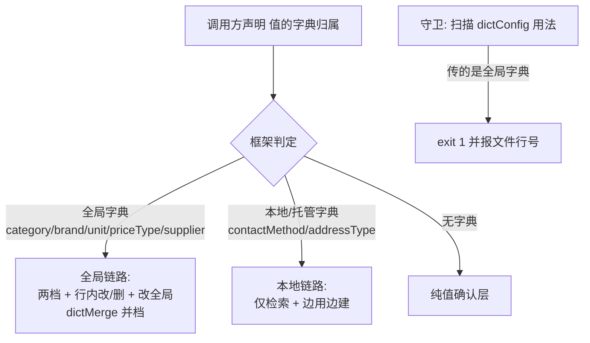

## 用户原话（verbatim）

> 产品编辑矩阵中分类的确认层的选用检索正确接到了链路上 品牌还没有 以此看价格类型和供应商进价的渠道肯定也没有  这是大问题 架构级问题

## 需求重述

产品编辑弹窗里，同属「全局字典」的几个格子，点开确认层后能力不一致：分类格能查字典、能从完整字典里挑、能行内改名/删、能改全局；品牌格只能手打检索，没有完整字典档、没有行内改/删、没有改全局。同类还有售价的价格类型、进价的供应渠道——用户由「品牌没有」类推这两处也丢了能力。

这不是某一格漏配参数的小修，而是**架构级缺陷**：确认层「给不给完整字典管理能力」由调用方在两个能力不对等的入口（`dictField` / `dictConfig`）里自行二选一决定，没有任何机制保证「值是全局字典就必须走全局链路」。分类接上是偶然（人记得传对），品牌漏接是必然（人忘了）——下一个新格子还会再犯。

## 核心功能

1. **全站接线体检**：列出所有确认层格 × 值来源（全局字典 / 本地字典）× 当前入口 × 应有能力，逐格实证（含分类、品牌、价格类型、供应渠道、单位），输出对照表；用浏览器实测证实或修正用户「价格类型和供应商渠道也没有」的推测。
2. **修品牌**：产品编辑弹窗品牌格改走全局字典链路，补齐「完整字典档 + 行内改名/删 + 改全局」，删除手写的查重/新建重复实现。
3. **架构收口**：把「值来源 → 确认层能力」改由框架按字典归属唯一推导，调用方只声明「我这个值属于哪个字典」；入口二选一收敛为单一声明。
4. **加会失败的守卫**：扫描全站「给全局字典传本地字典入口」的用法，发现即报错退出，并做负向验证（故意改坏必须转红）。
5. **文档与台账**：真相源补「入口不得二选一」规则并重生成四处产物；回写覆盖台账与掌控台。

## 验收（可操作的行为清单，执行后逐条核对）

1. 打开产品管理 → 点任一产品进编辑弹窗 → 点品牌名 → 确认层应出现「检索结果 / 完整字典」两档切换条；切到「完整字典」能看到全部品牌，行尾有常驻的「改」「删」。
2. 品牌确认层改名 → 应出现「改全局」按钮并给出影响预览（无同名=改名，有同名=并档，与分类格形态一致）。
3. 同弹窗点分类、售价矩阵里的价格类型、进价矩阵里的供应渠道、单位区的单位 → 确认层形态与品牌完全一致（同一套两档 + 行内改/删 + 改全局）；品牌与列表页品牌格形态一致。
4. 故意把品牌改回旧写法 → 守卫命令 exit 1 并指出文件行号；还原后 exit 0。
5. `npm run verify` 退出码 0；文档站「格子点击 → 确认层」页出现新增规则；掌控台待办同步。

## 技术栈

沿用项目现状，不引入新技术：React + TypeScript（Vite，前端 8080 生产 / 8081 dev）+ Express/Prisma 后端（3000）+ 既有 `shared/` 平台层组件。确认层唯一实现为 `PickerEditGate`（FloatPanel 承载，交互契约不变）。静态守卫用 Node 脚本（与 `tools/verify.mjs`、`tools/check-docs.mjs` 同风格）。

## 实现思路（先升维定类）

**这属于哪一类问题**：不是「品牌格少传个参数」，而是「框架把同一决策开放成两个能力不对等的入口，由调用方自选」——**框架开后门**类（本项目 2026-09-04 已命中过同类信号：「分层却允许手写＝框架开后门」，当时据此做了配置驱动迁移）。通用最优范式是「能力由声明推导、调用方零分支」；本项目现状版本＝**误用**（能力已建好，入口却开成二选一）。方案 = 范式 − 差距 = **合并入口 + 推导 + 守卫**。

**判定**：违反真相源 `cell-gate-path` rules 两条硬规则——「同一值来源出现第二种路径=违规」；「管理能力由参数驱动，**格子侧零分支**」。文档写的是零分支，代码是二选一，故本次必须同时动代码与文档（**双任务**）。

**为什么不能只改一行 `dictConfig={brandDict}` → `dictField="brand"`**：改完品牌好了，但根因（入口二选一、无人拦截）仍在，下一个格子照漏；且用户已明确判这是架构级问题。故必须收口 + 加守卫。

## 架构设计

### 目标态：单一声明，框架推导



三条链路**能力天然不等**，但**判决权从调用方移到框架**：调用方只说「我这个值属于哪个字典」，不再决定「我走哪条链路」。

### 目标态接口（关键代码结构）

```ts
/** 值的字典归属（调用方唯一需要声明的东西） */
export type DictRef =
  /** 全局字典：走完整链路（两档 + 行内改/删 + 改全局） */
  | { scope: 'global'; field: DictChangeKind }          // category | brand | unit | priceType | supplier
  /** 本地/托管字典：仅检索 + 边用边建 */
  | { scope: 'local'; config: DictRecordConfig<any> }
  /** 无字典：纯值确认层 */
  | undefined;

/** 框架侧唯一推导函数（新增，放 shared/config/recordDicts.ts 旁侧） */
export function resolveDictRef(ref: DictRef): {
  dictField?: DictChangeKind;      // 命中全局链路时非空
  dictConfig?: DictRecordConfig<any>;
  suggestField?: SuggestField;
  manage: boolean;                 // 是否有「完整字典」档 + 行内改/删
  globalRename: boolean;           // 是否有「改全局」
};

/** 兼容层（过渡期保留，内部按 dictConfig 反查归属，命中全局字典自动升级） */
export function dictRefFromLegacy(opts: { dictField?: DictChangeKind; dictConfig?: DictRecordConfig<any> }): DictRef;
```

**迁移策略（保行为、控爆炸半径）**：`ArchiveFieldCell` / `PickerEditGate` / `WorkbenchFieldCell` / `CellSpecRenderer` 保留现有 `dictField`、`dictConfig` 两个 prop 不删（否则 13 处调用点一次性全改，回归面过大），但在 `PickerEditGate` 内新增一次归一化：若传入的 `dictConfig` 经 `globalDictKindOf(config)` 反查出是全局字典（category/brand/unit/priceType/supplier 五个 DictRecordConfig 单例之一），**自动升级为全局链路**并 `console.warn` 提示调用方改声明。这样：

- 品牌格即使不改 prop 也能先恢复能力（兜底）；
- 随后把违规调用点逐个改为显式声明，warn 归零；
- 静态守卫再拦住新增违规。

## 实现要点（防回归）

- **证据先行**：动手前先跑浏览器实测（分类/品牌/价格类型/供应渠道/单位五格截图），把「用户推测 vs 代码事实」的差写在体检表里，避免按误判施工——用户对价格类型/供应商的判断需实测证实或修正，不得默认成立。
- **改平台层必补单测 + 变异验证**：`resolveDictRef` 归一化逻辑属 `shared/` 关键逻辑，按项目硬规矩必须补单测，并故意改坏确认测试转红（本项目有「绿灯但零验证」前科）。
- **不重写既有组件**：`PickerEditGate` / `FloatPanel` / `PickerNameCell` 交互契约不动（金标准锁定）；本次只加归一化层与守卫。
- **守卫要会失败**：新增 `node tools/check-dict-gate.mjs`（或并入 `check-docs.mjs` / `verify.mjs` 的 S3c 阶段），扫描 `frontend/src/**` 的 `dictConfig={` 用法，反查字典归属，命中全局字典即 `exit 1` 并给出文件:行号与改法；必须做负向验证（改坏→红，还原→绿）。
- **性能**：归一化是 O(1) 单例引用比对（`GLOBAL_DICT_SET.has(config)`），不进热路径，零额外渲染；字典全量拉取仍走既有 `DICT_LIST_FN`（pageSize 500，与现状一致）。
- **日志**：归一化命中自动升级时 `console.warn` 一次（非每次渲染），避免刷屏；不含业务数据。
- **提交纪律**：工作区已有 46 个文件未提交改动（AGENTS.md / smoke-pages.js / tools/verify.mjs 等），开工先 `git status` 确认，本次改动按 docs/feat/chore 分提交，**未获指示不 push**。
- **文档产物禁手改**：改完 `items/cell-gate-path.yml` 跑 `node tools/gen-docs.mjs`；`*.generated.*`、`js/data/gen/**`、AGENTS.md 的 GEN 节一律不动。

## 目录结构

```
frontend/src/shared/config/
├── recordDicts.ts                     # [MODIFY] 新增 GLOBAL_DICT_SET（五个全局字典单例集合）+ globalDictKindOf(config) 反查；不改动既有 brandDict/categoryDict 等定义
├── dictRef.ts                         # [NEW] DictRef 联合类型 + resolveDictRef() + dictRefFromLegacy()：值来源 → 确认层能力的唯一推导入口（纯函数，可单测）

frontend/src/shared/components/product-picker/
├── PickerEditGate.tsx                 # [MODIFY] open() 时对 req 做一次归一化（dictRefFromLegacy → resolveDictRef）；两档/行内改删/改全局三处判定统一改读 resolve 结果（:200 :409 :694 :220-237）
├── PickerInlineCells.tsx              # [MODIFY] ArchiveFieldCell/ArchiveEmptyFieldCell 的 dictField/dictConfig 走同一次归一化；:336-340 注释按新口径改写
└── pickerCatalogImpact.ts             # [MODIFY] 导出 catalogDictRef(kind)（复用 catalogDictField），供 PickerNameCell 统一取值来源

frontend/src/shared/components/
├── workbench/WorkbenchFieldCell.tsx   # [MODIFY] 透传层改传归一化后的 DictRef，行为不变
└── table/{editorRegistry.tsx,CellSpecRenderer.tsx}  # [MODIFY] 透传层同上（CellSpecRenderer 为遗留适配器，可只做最小兼容）

frontend/src/apps/staff/pages/product-manage/
└── ProductEditDialog.tsx              # [MODIFY] :1343-1366 品牌格改显式全局字典声明（dictField='brand' + fromId + applyGlobal 走 applyDictChange），删除 :1350-1365 手写查重/新建（交给框架边用边建）

tools/
└── check-dict-gate.mjs                # [NEW] 静态守卫：扫描 dictConfig 用法 → 命中全局字典 exit 1（报文件:行号+改法）；接入 tools/verify.mjs 作为 S3c（或并入 S3 dupe 之后）

frontend/tests/
└── dictRef.test.ts                    # [NEW] 单测：五个全局字典→全局链路；本地字典→本地链路；无字典→纯值；旧 dictField/dictConfig 兼容；含变异验证说明

文档可视化/data-source/methodology/items/
└── cell-gate-path.yml                 # [MODIFY] 路径表增「值来源 → 必须走哪条入口」判定列；rules 新增「入口不得二选一」（含为什么：能力不对等、选错静默丢能力）+「全局字典一律全局链路」

docs-coverage.md                       # [MODIFY] §二 产品档案行 + §六 本次会话行 + §七 待补清单回写
.codebuddy/memory/MEMORY.md            # [MODIFY] 开工前先精简（已超限被截断）：合并重复条目、保留有效事实
```

## 扩展（可选，不影响主线）

若体检阶段发现 `ArchiveSlotHost.tsx:614/982` 的 `slot.dictConfig` 也会传入全局字典（slot 声明来源需核），则把 slot 声明一并纳入同一归一化与守卫，不新开第二套机制。

## Agent Extensions

### SubAgent

- **code-explorer**
- 用途：全站扫描确认层格的接线状态——所有 `dictConfig={` / `dictField=` / `gate.open(` / `PickerNameCell kind=` 调用点，按「值来源 → 当前入口 → 应有能力」逐条取证；另核 `ArchiveSlotHost` 的 `slot.dictConfig` 声明来源是否会传入全局字典
- 预期产出：一份完整的接线体检表（每格含文件路径:行号 + 结论），作为按格施工与守卫白名单的依据

### Skill

- **playwright-cli**
- 用途：浏览器实证——登录 8080，打开产品管理 → 编辑弹窗，逐格（分类 / 品牌 / 价格类型 / 供应渠道 / 单位）点开确认层截图，判定「两档切换条、行内改/删、改全局」三件事是否存在
- 预期产出：修正或证实用户「价格类型和供应商渠道也没有」的推测；修复后复跑同一组截图形成前后对照，作为验收证据
- **lsp-code-analysis**
- 用途：精确求 `brandDict` / `categoryDict` / `priceTypeDict` / `supplierDict` / `unitDict` 的全部引用点与 `ArchiveFieldCell` 的调用层级，避免守卫白名单漏项或误伤
- 预期产出：引用点全集（含透传层与间接引用），保证守卫既不漏报也不误报