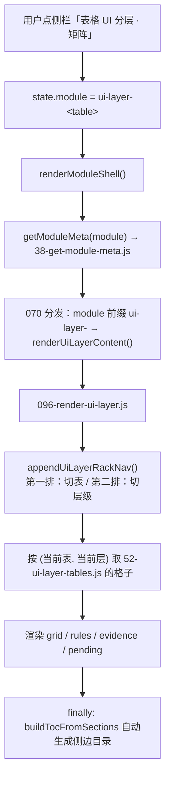
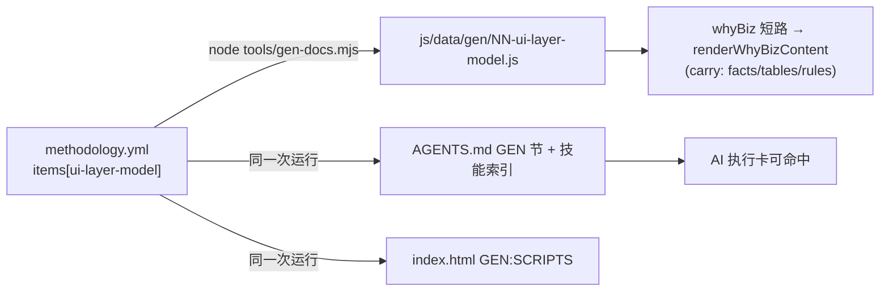

## 产品概述

把《表格 UI 分层抽象提案》的 L1–L5 五层模型，从"未验证提案"提升为文档可视化站点的正式规范，并用它重组整个表格文档体系。

## 核心功能

1. **五层模型规范化入真相源**：新增 1 篇「表格 UI 分层」，五层合一（骨架装配 / 行槽位 / 表格主体 / 单元格 / 确认层），含每层参数表、分层纪律、"不得在 custom 内手写单元格交互"判定标准。生成器自动同步到 AI 执行卡与技能索引。
2. **「表 × 层级」矩阵页**：从使用角度组织——第一排横向切换不同的表，第二排横向切换 L1–L5 层级，格子内显示**该表在该层的真实配置参数**。沿用现有两层横向导航形态，不新造交互。
3. **决策记录**：L1 骨架层落地方案（改造 ViewFrame 支持行槽位数组）写入文档，代码留待下轮执行；提案四阶段迁移路径与已完成情况一并归档。
4. **旧文档承接**：第 8 组「表格功能框架模型」（按数据集合体组织的 9 篇）标记为"数据视角·已由 UI 分层页承接"，内容保留不删。

## 边界（本轮不做）

- 不动任何前端代码：20 个页面 135 处 `renderMode: 'custom'` 留待下轮迁移
- 不新建 `AuxToolbarRow` 组件、不改 `ViewFrame`
- 不改《表格与交互规范》《共享组件与公共能力》《视觉与布局规范》（提案 §六 已声明分工，本文不替代）

## 技术栈

沿用文档可视化站点既有机制，不引入新依赖：

- 真相源：`文档可视化/data-source/methodology.yml`（YAML，items[] 现 34 条）
- 生成器：`tools/gen-docs.mjs`（Node + js-yaml）——yml → `js/data/gen/NN-<navId>.js` + AGENTS.md GEN 节 + 技能索引 + index.html 加载清单
- 站点渲染：原生 JS（全局作用域共享，按 `index.html` 顺序加载），无框架
- 校验：`node tools/check-docs.mjs`

## 实现方案

### 决定性发现：两条路径必须并行

`js/app/070-render-scope-panel-demo.js:318-322` 存在 **whyBiz 优先短路**：

```js
var meta = D.getModuleMeta(state.module);
if (D.whyBiz && D.whyBiz[state.module]) {
  renderWhyBizContent(extra, meta);   // 真相源篇 → carry 结构
  return;                              // 直接 return，走不到手写模块分支
}
```

`renderWhyBizContent`（`030-fallback-copy-text.js:221`）对 `carry` kind 只渲染 intro + facts + tables + rules，**不支持横向切换**。

因此用户的两个需求对应两条不同路径，缺一不可：

| 需求 | 路径 | 承载机制 | 是否支持切换 |
| --- | --- | --- | --- |
| 「新增 1 篇（五层合一）」 | A · 真相源篇 | `methodology.yml` → gen-docs → `whyBiz` | 否（carry 结构） |
| 「每层横向切换不同的表」 | B · 矩阵页 | 手写模块 + rack 渲染器 | 是 |


### 路径 B 复用现有机制，不造新轮子

`js/app/095-render-table-framework.js:115-150` 的 `appendAggregateRackNav` 已是**两层横向导航**成品：

- 第一排 `agg-rack-agg`（集合体）／第二排 `agg-rack-view`（维度）
- 点击 → 改 `state.module` / `state.aggView` → `renderModuleShell()` 重渲染
- 侧边目录由 `renderModuleShell` 的 finally `buildTocFromSections` 自动扫描生成（`030-fallback-copy-text.js:203`）

**改造点只是换轴**：第一排「集合体」→「表/页面」，第二排「维度」→「L1–L5 层级」。CSS 类 `agg-rack` / `agg-tab` / `agg-tab-sub` 直接复用，视觉与现有集合体页完全一致。

### 数据契约

矩阵页数据按「表 × 层」二维组织，沿用 `50-aggregate-rack.js` 的"架子 + 各体填格"模式：

```js
// js/data/51-ui-layer-rack.js —— 架子定义
DOC_VIZ.uiLayerViews = [
  { id: "l1", label: "L1 骨架装配", hint: "这个页面由哪几种行、按什么顺序拼" },
  { id: "l2", label: "L2 行槽位",   hint: "每种行槽位的参数与 UI 形态" },
  { id: "l3", label: "L3 表格主体", hint: "渲染引擎、空行与分页策略" },
  { id: "l4", label: "L4 单元格",   hint: "display × editEntry × valueState" },
  { id: "l5", label: "L5 确认层",   hint: "输入控件与检索档位" }
];
DOC_VIZ.uiLayerList = [
  { id: "ui-layer-quote",     label: "采购报价" },  // 唯一 inline-append 空行录入
  { id: "ui-layer-refund",    label: "售后" },      // 唯一有辅助行
  { id: "ui-layer-product",   label: "产品管理" },  // 可编辑明细
  { id: "ui-layer-purchase",  label: "采购清单" },  // 只读明细
  { id: "ui-layer-inventory", label: "库存台账" },  // number/date 形态
  { id: "ui-layer-audit",     label: "审计日志" }   // enum-tag/只读
];
```

```ts
// 单个「表 × 层」格子的内容契约（渲染器按块类型分派）
interface UiLayerCell {
  kicker?: string;
  title?: string;
  lead?: string;
  /** 参数表：headers + rows，复用 renderGridTable */
  grid?: { headers: string[]; rows: string[][] };
  /** 规则块：条款列表 */
  rules?: { kicker?: string; title?: string; rules: string[][] };
  /** 代码证据路径（可点击跳转/复制） */
  evidence?: { label: string; path: string }[];
  /** 该格暂无内容 → 渲染「待补」占位，禁止静默留白 */
  pending?: string;
}
```

### 架构



真相源篇（路径 A）为独立链路，不经过矩阵页渲染器：



## 实施要点（防回归）

- **gen-docs 侧栏校验会报错**：生成器（`tools/gen-docs.mjs:191-211`）校验真相源每条必须在 `05-nav-groups.js` 有入口。新增条目后必须同步补侧栏，否则校验失败——这是有意设计的防漂移口子。
- **脚本加载顺序 = 依赖顺序**（`index.html`）：新数据文件须排在渲染器之前；渲染器须排在分发逻辑（`070`）之前。参照现有 `50-aggregate-rack.js`（L258）→ `095-render-table-framework.js`（L272）→ `100-dd.js`（L273）。
- **分发分支插入位置**：`070-render-scope-panel-demo.js` 的新分支必须放在 `table-framework` / `table-aggregate-` 分支附近（L341-352），且**天然位于 whyBiz 短路之后**，故模块 id 不得与真相源 navId 重名（用 `ui-layer-*` 前缀，真相源篇用 `ui-layer-model` 单篇 id，二者不冲突）。
- **待补不静默留白**：沿用 `appendAggregatePending` 纪律——某表某层暂无实测数据时，明写"待补 + 补法"，禁止空白。
- **不删旧内容**：第 8 组 9 篇按「演进不改历史」保留，仅在 hint 标注承接关系。
- **本轮不碰前端**：无需跑 `npm run build`；仅跑 `node tools/check-docs.mjs`。

## 目录结构

```
文档可视化/
├── data-source/
│   └── methodology.yml                    # [MODIFY] items[] 末尾新增 ui-layer-model 条目（L1 项目级）：
│                                          #   index.hear / nav / page(kind: carry, facts + tables + rules) / card: {}
│                                          #   内容：五层定义 · 每层参数表 · 分层纪律 · custom 判定标准 ·
│                                          #         L1 ViewFrame 改造决策 · 四阶段迁移路径与完成状态
├── js/
│   ├── data/
│   │   ├── 05-nav-groups.js               # [MODIFY] 两处：① 方法论库组加 ui-layer-model 条目（gen-docs 校验必需）
│   │   │                                  #             ② 表格功能框架模型组 hint 标注"已由 UI 分层页承接"
│   │   │                                  #             ③ 新增「表格 UI 分层」分组承载 6 个矩阵页入口
│   │   ├── 38-get-module-meta.js          # [MODIFY] 加 ui-layer-* 六个模块 id → 数据对象映射（仿 L106-111）
│   │   ├── 51-ui-layer-rack.js            # [NEW] 架子定义：uiLayerViews（L1-L5）+ uiLayerList（6 个表）
│   │   └── 52-ui-layer-tables.js          # [NEW] 各表 × 各层真实配置参数（从代码实测填入，见任务 2）
│   └── app/
│       ├── 096-render-ui-layer.js         # [NEW] 矩阵页渲染器：appendUiLayerRackNav（换轴复用 agg-rack）
│       │                                  #       + renderUiLayerContent + appendUiLayerCell + 待补占位
│       └── 070-render-scope-panel-demo.js # [MODIFY] L349 附近加分發分支：module 前缀 ui-layer- → renderUiLayerContent
├── index.html                             # [MODIFY] 新增脚本加载：51 → 52 → 096（顺序=依赖顺序）
└── js/data/gen/NN-ui-layer-model.js       # [GENERATED] 由 gen-docs 自动生成，禁止手改

用户项目开发文档/架构原则/
└── 表格UI分层抽象提案.md                    # [MODIFY] 状态从「提案（未验证）」改为「已规范化」，指向真相源篇与矩阵页

docs-coverage.md                           # [MODIFY] 回写台账：新增「表格 UI 分层」行 + 更新架构原则台账
```

## 关键代码结构

三条跨文件契约（新增内容必须严格遵守，否则渲染器取不到数据）：

```ts
/** ① 矩阵页「表 × 层」二维数据结构（52-ui-layer-tables.js 的组织方式） */
type UiLayerTableData = {
  [tableId in UiLayerTableId]: {
    [layerId in UiLayerId]?: UiLayerCell;   // 缺键 → 渲染「待补」
  };
};

/** ② 单个格子内容（渲染器按块类型分派，复用现有 appendGridSection / appendRuleLayer） */
interface UiLayerCell {
  kicker?: string;
  title?: string;
  lead?: string;
  grid?: { headers: string[]; rows: string[][] };
  rules?: { kicker?: string; title?: string; rules: string[][] };
  evidence?: { label: string; path: string }[];
  pending?: string;
}

/** ③ 切换状态（沿用现有 state，不改状态机） */
// state.module   = "ui-layer-quote" | "ui-layer-refund" | ...   （第一排：表）
// state.uiLayer  = "l1" | "l2" | "l3" | "l4" | "l5"             （第二排：层）
// 切换后统一调 renderModuleShell() 重渲染
```

## Agent Extensions

### SubAgent

- **code-explorer**
- 用途：批量实测提取 6 个代表性表在 L1–L5 各层的真实配置参数（首排/工具行/统计行/辅助行装配、`emptyRow`/`paging`/`selectable` 引擎参数、各列 `display × editEntry × valueState`、确认层检索分支），并给出代码证据路径
- 预期产出：一份「表 × 层 × 参数 + 证据路径」清单，可直接填入 `52-ui-layer-tables.js`，确保矩阵页内容来自实测而非推测

### Skill

- **lsp-code-analysis**
- 用途：在定位 `ViewFrame` 调用点、`UnifiedTable` 列声明处、`stageActionBar`/`bizStrip` 传参处时，用语义跳转（定义/引用）替代文本搜索，避免遗漏改名或间接引用
- 预期产出：准确的调用点清单，支撑 L1 装配序列与 L3 引擎参数的实测数据