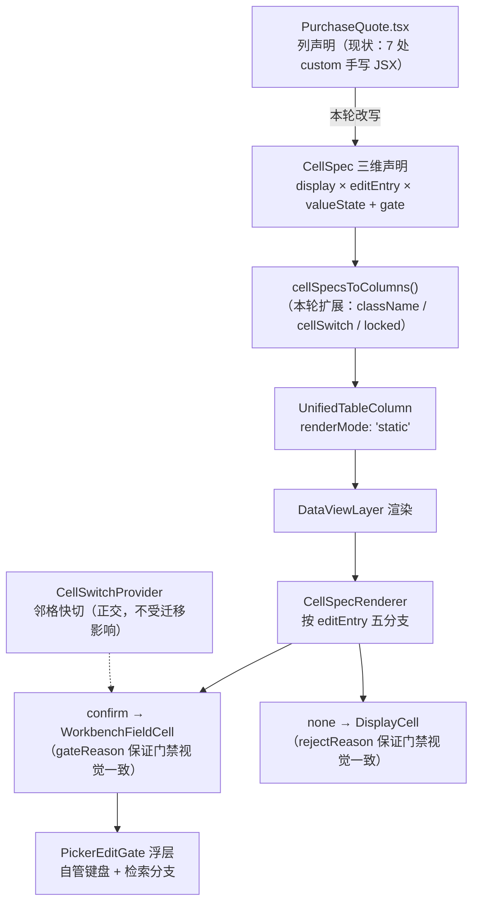
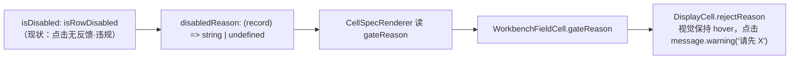

## 产品概述

把《表格 UI 分层抽象提案》的阶段 1 落地：以**采购报价**为样板页，把它的列声明从 `renderMode: 'custom'` 改写为 L4 的 `display × editEntry × valueState` 三维参数，接入已建成但零接入的 `CellSpec` 唯一链路。样板跑通前不推广。

## 核心功能

1. **采购报价 8 列参数化**：7 处 `custom` 全部消灭，改为 CellSpec 三维声明（产品名/品牌/规格/单位/数量/单价/备注走 confirm，金额保持 static 只读派生）。
2. **适配层补齐透传**：`cellSpecAdapter` 现缺 `className`（级联筛列表头样式）、`cellSwitch`（邻格快切）、`locked`（行级锁定）三项，需扩展后才能承载采购报价。
3. **门禁由静默改提示**：现状 `isDisabled: isRowDisabled` 点击无任何反馈（违规）。迁移为 `disabledReason` 后，格子视觉与可编辑格完全一致，点击给「请先 X」提示。
4. **提案第 2 条前提修正并回写真相源**：InteractionLayer 不应接管 confirm 格键盘导航（见技术方案），原验收标准需改写。

## 边界（本轮不做）

- 不推广到其他 19 个页面（样板跑通前不推广）
- 不新建 `AuxToolbarRow`、不改 `ViewFrame`（阶段 2 的事）
- 不改《表格与交互规范》等规则层文档（提案 §六 已声明分工）
- 不推动后端，不改数据库

## 技术栈

沿用现有前端栈，不引入新依赖：React + TypeScript + Vite（`frontend/`，8080 生产 / 8081 dev），antd Table 为渲染底座。

## 实现方案

### 决定性判断：提案第 2 条的前提不成立，需修正而非实现

提案原文要求「验证 `InteractionLayer` 的键盘导航能接管确认层格子（现状接管不到）」。实测三个事实：

1. `UnifiedTable.focusCell`（L560-574）跳过 `renderMode === 'static' || 'custom'` 的列，而 `cellSpecAdapter` 输出的正是 `static` —— 走适配层迁移后**依然接管不到**。
2. `InteractionLayer.tsx` L7-13 职责声明写的是「常驻输入框管理（text/number/picker 三模式）」「编辑态管理（focus/blur，不通过 mount/unmount）」—— 它管的是**常驻输入**格子。
3. confirm 格（`WorkbenchFieldCell`）的语义是「单元格自己管点击与浮层」（`cellSpecAdapter.tsx:7-11` 原注释），其键盘（Esc 关闭 / Enter 确认）由 `PickerEditGate` 浮层自管。

**升维判断**：这属于「表格交互层的职责边界」问题。通用最优是——常驻输入由表格层管键盘；确认层浮层由浮层自管键盘。若表格层也接管 confirm 格，会与浮层**双重管理焦点**（典型的焦点打架）。据此，现状（InteractionLayer 不管 confirm 格）是**正确的**，是提案写错了前提。

修正后的第 2 条验收：「验证键盘可达性与邻格快切在参数化后仍成立」。采购报价的邻格快切由 `CellSwitchProvider colOrder={['productRef','unit','qty','unitPrice','remark']}`（L1589）承担，与 InteractionLayer 是两套正交机制，不受本次迁移影响。

### 两条候选路径的权衡

| 路径 | 做法 | 键盘导航 | 工作量 | 风险 |
| --- | --- | --- | --- | --- |
| A · 扩展适配层（**选此**） | 页面写 CellSpec，经 `cellSpecToColumn` 转成 `static` 列 | 保持现状（浮层自管），不回归 | 小，只改 1 个页面 + 1 个 adapter | 低 |
| B · UnifiedTable 原生接受 cellSpec | 改 `focusCell` 判断 + 表格层接管 confirm 格 | 名义上"接管"，但会与浮层抢焦点 | 大，动公共组件影响 20 个页面 | 高 |


选 A 的理由：`cellSpecAdapter.tsx:13-15` 的 TODO 已写明「本适配层是迁移期的过渡：先让页面用参数声明，再谈交互层接管」——作者本意就是分两步，本轮做第一步。且 B 违反上述职责边界判断。

### 门禁文案口径（已实测现有约定）

项目既有口径是「请先 X」格式，本轮沿用：

- `ProductEditDialog.tsx:1399` → `'请先完成或取消正在新建的规格'`
- `PickerInlineCells.tsx:340` 注释 → 「如「请先填写系列/规格」」
- `resolveGate.ts:10` → `reason: 请先选规格`

采购报价的 `isRowDisabled` 需先读实现反推具体原因（视图锁定 / 单据作废 / 已归档三种冻结条件之一），再写出对应文案，不得写笼统的「不可编辑」。

## 架构设计



门禁链路（本轮从"静默"改为"提示"）：



## 目录结构

```
frontend/src/
├── shared/components/table/
│   ├── cellSpecAdapter.tsx      # [MODIFY] 扩展 CellColumnLayout：新增 className / cellSwitch / locked
│   │                            #           render 内透传 cellSwitch={rowId + spec.key}、locked
│   │                            #           补注释：明确「过滤/门禁/可见性归 CellSpec，排版归列级」
│   └── cellSpec.ts              # [MODIFY] 仅在需要时补字段（预计不动；若 CellSwitch 需 rowId 取值器则加）
└── apps/staff/pages/workbench/views/
    └── PurchaseQuote.tsx        # [MODIFY] 8 列从 custom 改写为 CellSpec：
                                 #   产品名/品牌/规格 → text + confirm + 选用检索（ProductPicker）
                                 #   单位 → text + confirm + 选用检索（ProductPicker / UnitPicker）
                                 #   数量/单价 → number + confirm + 纯值输入（单价有 SKU 时挂选用检索）
                                 #   备注 → text + confirm + 纯值输入（allowEmpty）
                                 #   金额 → number + none（保持只读派生）
                                 #   hidden 承接 hideProductName / hideBrandName / hideSpecModel
                                 #   valueState 承接 warnNonStandard
                                 #   disabledReason 承接 isDisabled（改静默为提示）

文档可视化/data-source/
└── methodology.yml              # [MODIFY] ui-layer-model 条目修正：
                                 #   迁移进度表 阶段 1 改为「进行中/已落地」
                                 #   facts 补「交互层职责边界」：常驻输入归表格层、确认层浮层自管键盘

文档可视化/js/data/
└── 52-ui-layer-tables.js        # [MODIFY] 采购报价 L4 表：现有 renderMode 列全部改为 custom→已参数化，
                                 #         证据行号更新为迁移后位置

用户项目开发文档/架构原则/
└── 表格UI分层抽象提案.md         # [MODIFY] 阶段 1 状态改「已落地」；第 2 条验收标准按修正后的口径改写

docs-coverage.md                 # [MODIFY] 回写：表格 UI 分层行更新阶段 1 进度 + 本次会话落地段
```

## 关键代码结构

适配层扩展后的契约（渲染器已支持，只差透传）：

```ts
export interface CellColumnLayout {
  minWidth?: number;
  align?: 'left' | 'center' | 'right';
  fixed?: 'left' | 'right';
  wrap?: boolean;
  fitContent?: boolean;
  sortable?: boolean;
  /** 列样式类（如 'ds-cascade-col' 级联筛列表头） */
  className?: string;
  /** 邻格快切：需 rowId 取值器，colKey 取 spec.key */
  cellSwitch?: { rowIdOf: (record: any) => string };
  /** 行级锁定（真实状态，允许置灰；与门禁 disabledReason 不同） */
  locked?: (record: any) => boolean;
}
```

门禁迁移契约（页面侧从布尔改文案）：

```ts
/** 迁移前（违规：点击无反馈） */
isDisabled: isRowDisabled,

/** 迁移后：返回字符串 = 门禁（视觉一致 + 提示），undefined = 可编辑 */
disabledReason: (record: PaperRow) => isRowDisabled() ? '请先 X' : undefined,
```

## 实施要点（防回归）

- **先读 `isRowDisabled` 实现再写文案**：它有视图锁定（`useViewLock`）、`isVoided`、`salesArchived` 三个冻结来源（`PurchaseQuote.tsx:176-182`），不同来源应给不同提示，不能一律「不可编辑」。
- **`hidden` 替代手写三元**：现状 `record.hideProductName ? <span/> : ...` 散在三处（L1020 / L1051 / L1081），迁移后统一走 `spec.hidden`，renderer L203 已内建。
- **`getFitText` 不能丢**：多记录列没有 dataIndex，列宽测量靠 `spec.fitText ?? spec.value(record)`（adapter L57 已处理），迁移时保持。
- **表头组件不受影响**：产品名/品牌/规格的 `title` 是 `<HeaderCascadeFilter>` JSX，`CellSpec.title` 类型是 `ReactNode`，可直接承载。
- **改完必跑 `npm run build`**（项目硬纪律），另跑 `npx tsc --noEmit`。
- **浏览器验收**：采购报价须逐列点开确认层验证（7 个 confirm 格 + 1 个只读格），并验证门禁格点击出提示而非静默。
- **Git 按逻辑隔离提交**（adapter 扩展 / 页面迁移 / 文档回写 分开 commit），未获指示不 push。

## 性能与风险

- 迁移后每格多一层 `CellSpecRenderer` 组件包装，8 列 × N 行。renderer 内部无副作用、无订阅，仅按 `editEntry` 分支返回不同元素，开销可忽略；`UnifiedTable` 虚拟滚动阈值 50 行不变。
- 风险集中在「确认层浮层能否正常锚定」：`cellSwitch` 依赖 rowId，空行（无 id）走 `__empty_${seq}` 兜底（L972 现状即如此），迁移时必须保留该兜底，否则空行无法快切。
- 本轮只动 1 个页面，出问题可整体回滚该文件的改动，不影响其余 19 个页面。

## Agent Extensions

### Skill

- **lsp-code-analysis**
- 用途：用语义跳转定位 `isRowDisabled` 的定义与全部引用、`renderSkuPick` / `commitCell` / `handleUnitFreeText` 等回调的签名，确认 `WorkbenchFieldCell` 的 `gateReason` / `pickerRender` / `cellSwitch` 参数契约
- 预期产出：准确的门禁冻结来源清单（用于写「请先 X」文案）与各列回调的正确接线，避免凭文本猜测参数导致类型错误

- **agent-browser**
- 用途：`npm run build` 后打开采购报价页做端到端验收——逐列点开确认层、验证检索分支、验证门禁格点击出提示、验证邻格快切方向钮、验证空行录入晋升
- 预期产出：带截图的行为验收证据，确认 8 列迁移后功能与视觉均无回归