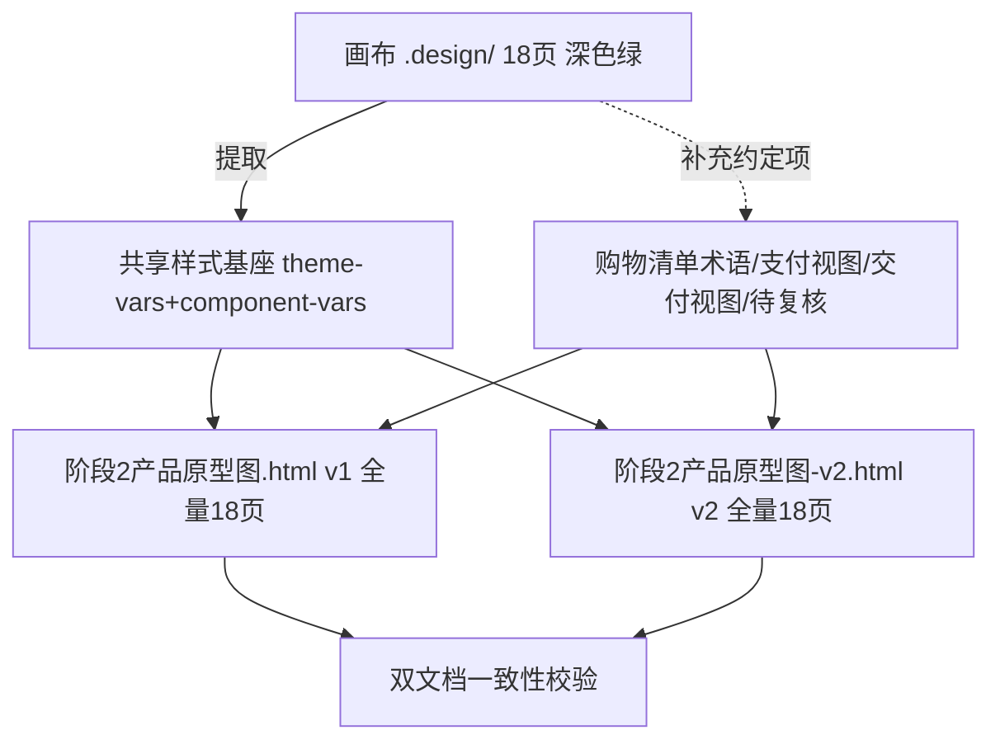

## 用户需求

将产品原型图文档同步至画布（`.design/` 设计文件），消除两者在布局、样式上的差异。

## 产品概述

画布（`.design/customer-app` 与 `.design/staff-admin`）是已较完善的实际设计，采用深色主题 + 品牌绿主色 + 自有组件系统（`.ds-*`）。现有两份原型文档（`阶段2产品原型图.html`、`阶段2产品原型图-v2.html`）仍为浅色 indigo 旧风格，且架构停留在串行流程，已严重落后。需把两份文档改写为与画布一致的深色绿视觉，并逐页覆盖画布全部 18 个页面。

## 核心特性

- **视觉同步**：两份文档统一改为画布的深色绿设计系统（深色背景、品牌绿 `#32F08C`、SF Pro 字体、`.ds-*` 组件类），替换旧浅色 `.wf-*` 类。
- **全量覆盖 18 页**：客户端 7 页（首页/商品详情/购物清单/报价/订单/地址/入口）+ 员工端 11 页（报价工作台/草稿单列表/客户购物清单/产品管理/授权码/客户管理/供应商管理/员工登录/访问申请/管理员用户/审计日志）。
- **术语落地**：画布中的"购物车/客户购物车"统一改为"购物清单/客户购物清单"，避免传统商城购物车概念。
- **补充画布未实现项**：在工作台 `view-switch` 由 3 视图扩展为 **5 视图**（报价/配货/成本标注/支付/交付），交付视图按方式驱动不同字段（现场提货/快递/物流/货拉拉）；并加入"待复核"流程——客户改动已报价/已配货行时，该行标待复核，员工显式确认「保留/删除」，不自动降级。
- **双文档一致**：两份文档内容保持一致（v1 保留 Trae 文档头，v2 保留六视图导引章节，页面正文统一）。
- 不修改画布本身，仅将文档同步至画布。

## 技术栈

- 纯静态 HTML + 内联 CSS（原型文档沿用画布的设计 token 与组件类，无需框架/构建）。
- 设计系统来源：画布 `home.html` 内 `<style id="theme-vars">`（深色 only token）与 `<style id="component-vars">`（`.ds-*` 组件定义）。

## 实现方案

**总体策略**：以画布为唯一视觉/布局/组件基准，把两份文档从浅色 indigo 重写为深色绿；逐页用画布组件重建线框 + 交互说明；在画布已实现的基础上补充约定项（购物清单术语、支付/交付视图、待复核），而非另起炉灶。

**关键技术决策**：

1. **共享样式基座**：从 `home.html` 提取 `theme-vars` + `component-vars`，固化为两份文档顶部共享 `<style>`（深色绿 token + `.ds-*`/工具类），替换文档旧 `.wf-*` 浅色类。避免每页重复定义，保证双文档像素一致。
2. **工作台 3→5 视图**：沿用画布 `view-switch` + `draft-tab` 模式，新增 `支付视图`、`交付视图` 两个 `data-view`；交付视图内部按方式（现场提货/快递/物流/货拉拉）切换不同字段组，与画布"视图即标注层"模式一致。
3. **待复核补丁**：在报价视图、配货视图的相关行嵌入 `.review-card`（画布既有组件类）+"保留/删除"按钮，连接之前约定的防误触流程。
4. **术语替换**：全局将画布文案"购物车"→"购物清单"、"客户购物车"→"客户购物清单"，不打乱画布既有交互逻辑。
5. **双文档对齐**：v1 保留原 Trae 文档头与章节骨架；v2 保留"六视图架构导引"章节；两者页面正文完全一致，仅头部章节差异。

**性能与可靠性**：文档为静态 HTML，无运行时开销；样式内联共享，避免重复渲染。注意 token 与 `.ds-*` 类名在两份文档间零漂移（复制同一 `<style>` 块）。不触碰 `.design/` 画布文件，改坏风险隔离。

## 实现要点

- 画布各页为自包含 HTML（行内 `.flex` 工具类 + token 变量），重建线框时直接复用其结构片段与类名，降低视觉偏差。
- 员工端 11 页中，报价工作台为枢纽（草稿标签 + 5 视图 + 信息栏），优先实现；管理类 8 页按画布既有布局重建即可。
- 交付视图字段差异：现场提货（无单号，直接"已交付"）/快递物流（单号+查询轨迹）/货拉拉（预计送达+监控送达）。

## 架构设计



## 目录结构

```
建材报价系统/
├── 阶段2产品原型图.html        # [MODIFY] 重写为深色绿；保留 Trae 文档头；覆盖全部 18 页线框+交互说明；落实购物清单术语与 5 视图/待复核。
├── 阶段2产品原型图-v2.html     # [MODIFY] 同步为深色绿；保留六视图架构导引章节；覆盖全部 18 页；与 v1 正文一致。
└── .design/                    # [只读参考，不修改] 画布事实源：customer-app(7页)+staff-admin(11页)，深色绿设计系统。
```

## 关键代码/结构参考

- 画布设计 token（节选自 `home.html`）：
- `--bg-base-default:#1A1B1D; --bg-base-secondary:#222427; --bg-brand:#32F08C; --text-default:#D1D3DB;`
- 状态色：`--status-success-default:#33C192; --status-error-default:#F65A5A; --status-primary-default:#387BFF;`
- 工作台视图切换模式（节选）：
- `<button class="view-switch is-active" data-view="quote">报价视图</button>` 扩展 `allocation`(配货) / `cost`(成本标注) / `payment`(支付) / `delivery`(交付)。

## 设计风格

采用画布（`.design`）的深色设计系统：深色背景 + 品牌绿主色 + SF Pro 字体 + `.ds-*` 组件类。原型文档由浅色 indigo 改造为深色绿，逐页用画布组件重建线框，确保与画布视觉一致；并补充购物清单术语、支付/交付视图与待复核流程。整体为扁平化、高对比、组件化的线框原型风格，强调信息层级与视图切换的清晰表达。

## Agent Extensions

### SubAgent

- **code-explorer**
- Purpose: 深度遍历 `.design/` 下 18 个画布页面（单页可达 2300+ 行），精确提取每页的布局结构、组件类名与交互片段，供文档线框重建时对齐，避免逐页全量读取撑爆上下文。
- Expected outcome: 输出 18 页的结构化清单（导航/视图切换/表格/对话框/关键交互），使两份文档的线框与画布像素级一致。