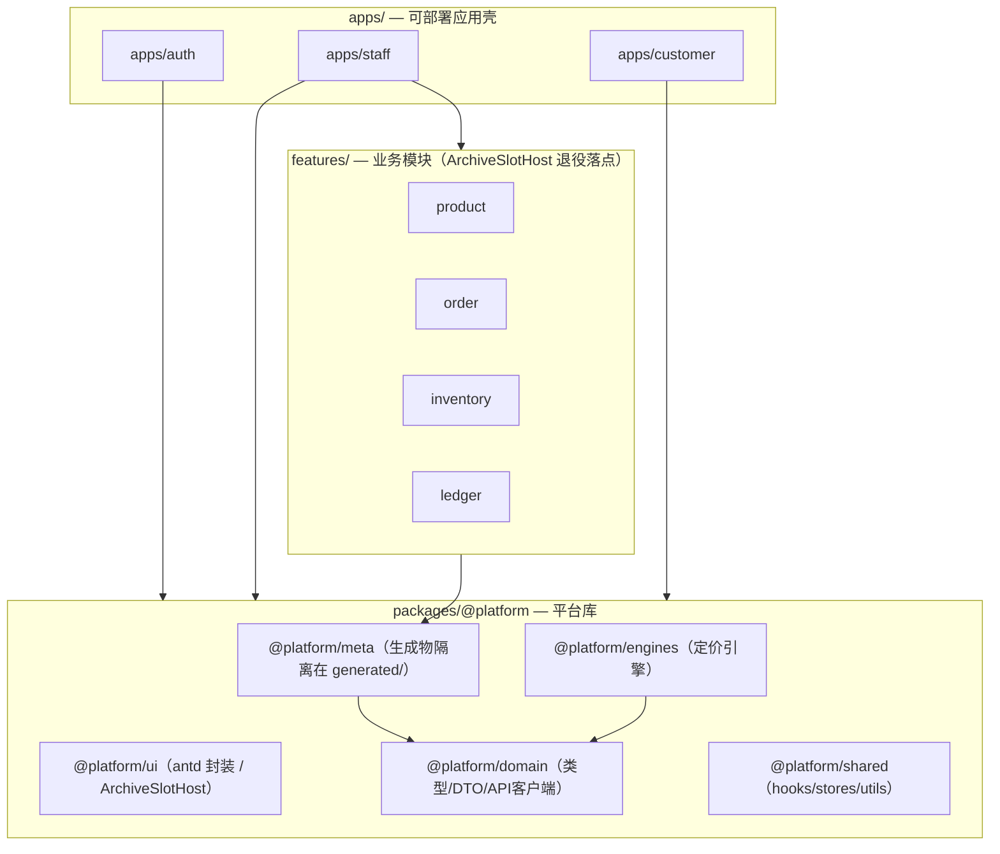
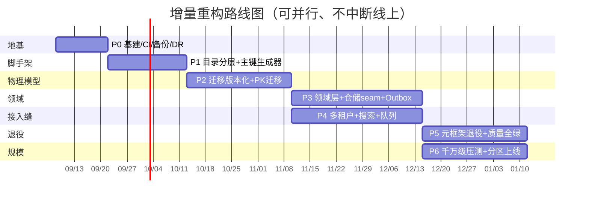

# 建材行业进销存一体化平台 · 目标架构设计文档（重构蓝图）

> **文档性质**：目标态设计（蓝图书），非现状描述，不含任何实现代码。
> **编制**：高见远（软件架构师）
> **基线日期**：2026-09-05（基于仓库实测现状）
> **配套图件**：`diagrams/layered-backend.mermaid`、`diagrams/layered-frontend.mermaid`、`diagrams/er-domain.mermaid`、`diagrams/roadmap.mermaid`

---

## 0. 设计总则与约束

### 0.1 业务目标（用户原话归纳）
建材行业进销存一体化平台，打通 **采购 → 库存 → 销售开单 → 配货履约 → 收付款往来 → 售后** 全链路；远期支撑 **千万级 SKU** 的生产运行。业务用户通过表格/表单、用中文业务字段（如「品牌ID」「品牌名称」）与主外键关系直观地编辑与查看数据。

### 0.2 核心设计原则
1. **标准工程化优先**：按正常软件项目的标准分层、目录、物理模型、领域模型组织，不被现有元框架与历史文档绑架。
2. **可演进、不重写**：严禁大爆炸重写；以增量、可并行、不中断线上业务的方式迁移。
3. **正确性资产不可丢**：v11.0 全域解耦（无物理外键 + 名称快照）、单据快照范式、库存加权均价、审计/变更日志、千万行预规划复合索引——这些是被实测验证过的"正确"，必须保留并提升到一等公民。
4. **分层与边界强约束**：依赖方向单向、编译期可校验；生成物与手写字物理隔离。
5. **为规模预留接入缝（seam）**：读写分离、多租户、独立搜索引擎、异步队列在架构层预留接口，远期无痛落地。
6. **长期生产级稳定性 > 短期最低成本/最快交付**。

### 0.3 关键约束
- 规模目标：千万级 SKU、库存流水（inventory_movement）可达十亿级。
- 当前技术栈（保留并升级）：前端 React 19 + antd 6；后端 NestJS 风格 + Prisma 5 + MySQL 8。
- 质量门禁现状：verify 9 门 8 过 1 红（S1 前端类型检查）；signal 扫描 14 处 MED（"列逃进 custom" 等迁移债）。本项目目标是 9 门全绿 + MED 清零。

---

## 1. 现状基线（实测事实，作为差距参照）

> 以下为 2026-09-05 对仓库 `/Users/mac/Desktop/建材报价系统` 的实测，后续设计以之为准。

### 1.1 前端现状
- 技术：React 19 + antd 6；源码约 265 个文件（`frontend/src`），但全工程含 `node_modules` 等约 21000 文件（9946 js + 8405 ts）。
- 已具雏形分层：`src/apps/{auth,customer,staff}`（应用壳）+ `src/shared/{components,engines,hooks,stores,services,styles,config,types,utils}`（共享库）。
- 存在一套元框架：**「entity-meta 登记表驱动代码生成 + ArchiveSlotHost 统一渲染」**。证据：`shared/config/entityMeta.generated.ts`、`fieldDefs.generated.ts`、`entityRelations.generated.ts`、`pageAssembler.ts`、`shared/components/archive/ArchiveSlotHost.tsx`、`shared/engines/pricing-engine.ts`。
- **乱象**：生成物（`*.generated.ts`）与手写字混放在 `shared/config`；ArchiveSlotHost 作为"统一渲染出口"使页面骨架与业务强耦合；功能完成度约 35/37。

### 1.2 后端现状
- 技术：NestJS 风格 + Prisma 5 + MySQL 8（但 `prisma/dev.db` 仍残留 SQLite）。
- 目录：`src/{controllers,routes,services,engines,middleware,config,types,utils,ws}`——**扁平、无领域分层**；`services/generated` 与 `services/product` 混放。
- **物理模型演进失序**：`prisma/migrations` 目录存在 30+ 个迁移文件夹（命名不一致，部分为 `20260724..._v8_0_init`，部分为 `20260725_v9_0_...`，缺统一时间戳前缀），schema 已从 v2 迭代到 v31，长期靠 `db push`/重置演进，**无干净的线性版本化历史**。
- **主键策略（实测）**：多数表 `id BigInt @id @default(autoincrement())`；业务编码（如 `user_code`、`customer_code`）使用 `String @unique` 的 `P+时间戳+随机` 风格码。两者均为反范式/单点瓶颈，需替换。

### 1.3 基建与质量现状
- **基建近乎为零**：无 Docker / Compose / k8s / Redis / 独立搜索引擎 / 异步队列 / CI / staging / 备份DR / 可观测。部署为单笔记本 + cpolar 公网穿透；运维手册已归入「废弃的可参考文档」。
- **质量门禁**：verify 9 门 8 过 1 红（S1 fe-typecheck 退出码非 0）；signal 14 处 MED（"列逃进 custom" 为元框架半采纳旁证）。已存在 `S0b arch-lint`（架构合规门）可复用强化。

### 1.4 必须保留的正确性资产（重点）
| 资产 | 含义 | 为何正确 |
|---|---|---|
| v11.0 全域解耦 | 无物理外键 + 名称快照 | 避免级联炸库；主档变更不影响历史单据 |
| 单据快照范式 | 单据行存业务快照（名称/品牌/单价），不随主档变 | 历史单据可审计、可追溯 |
| 库存加权均价 | 入库移动加权均价 | 成本计价正确、符合行业惯例 |
| 审计/变更日志 | audit_log / change_log | 合规与排障 |
| 千万行预规划复合索引 | 如 v15.2/v15.4 的索引 | 为规模预留的查询性能基线 |

---

## 2. 分层架构设计

### 2.1 后端标准分层（DDD 四层 + 横切）
将现有扁平 `controllers/services` 重组为 **接口层 / 应用层 / 领域层 / 基础设施层 + 横切**。核心铁律：**领域层零框架依赖**；基础设施层实现领域层定义的仓储接口（依赖倒置）。

| 层 | 目录 | 职责 | 依赖方向 |
|---|---|---|---|
| 接口层 Interface | `src/interface/{controllers,routes,ws,middleware}` | HTTP/WS 接入、鉴权、租户解析、参数校验、DTO↔领域对象映射 | → 应用层 |
| 应用层 Application | `src/application/{purchase,sales,inventory,pricing,ledger}` | 用例编排、事务边界、调用领域与仓储、发布领域事件 | → 领域层 |
| 领域层 Domain | `src/domain/{product,inventory,order,pricing,ledger,partner,shared,tenant}` | 聚合根/实体/值对象、领域服务（加权均价/快照）、领域事件、仓储**接口** | 不依赖任何外层 |
| 基础设施层 Infrastructure | `src/infrastructure/{persistence,search,messaging,datasource}` | Prisma 仓储实现、搜索引擎适配、消息总线、主从/分片数据源 | 实现领域层接口 |
| 横切 Cross-cutting | `src/crosscutting/{config,audit,observability}` | 配置、审计切面、异常/日志/链路追踪 | 被各层使用，不反向依赖业务 |

**依赖规则（编译期可校验）**：`interface → application → domain ← infrastructure`。领域层禁止 `import` 任何 infra/interface 符号；仓储调用一律走领域层定义的接口。

### 2.2 前端标准分层（monorepo + feature 模块化）
将现有 `src/{apps,shared}` 提升为 **pnpm monorepo**：
- `apps/{auth,staff,customer}`：可独立部署的**应用壳**（仅路由装配与全局布局）。
- `packages/@platform/{meta,ui,domain,engines,shared}`：平台库。`@platform/meta` 收纳元框架，**生成物隔离在 `generated/` 由 codegen 独占**；`@platform/ui` 收纳 `ArchiveSlotHost` 等控件（P5 退役）。
- `features/{product,purchase,sales,inventory,fulfillment,ledger}`：业务特性模块（元框架退役后的最终落点）。

### 2.3 分层合规约束（可机器校验）
复用并强化现有 `S0b arch-lint`：在 CI 中以依赖图静态分析强制
1. 后端 `domain` 目录零外依赖；
2. 前端 `features/*` 不得反向依赖 `apps/*`；`@platform/meta/generated` 仅能被 meta 包内部引用；
3. 所有写路径必须经 `application` 层（禁止 controller 直调 Prisma）。

```mermaid
%% 后端分层依赖（flowchart）
flowchart TD
    subgraph Interface["接口层 Interface"]
        CTRL["controllers / routes / ws"]
        MID["middleware: auth, tenant, tracing"]
    end
    subgraph Application["应用层 Application"]
        APP["services: 用例编排 / 事务边界"]
        CMD["Command / Query / DTO"]
    end
    subgraph Domain["领域层 Domain（零框架依赖）"]
        AGG["聚合根 / 实体 / 值对象"]
        DS["领域服务: 加权均价 / 快照"]
        DE["领域事件"]
        REPO_I["仓储接口 Repository"]
    end
    subgraph Infrastructure["基础设施层 Infrastructure"]
        REPO_IMPL["Prisma 仓储实现"]
        SEARCH["SearchAdapter: DB→ES"]
        MQ["EventBus: in-proc→MQ"]
        READ["ReadReplica 数据源 / shard-router"]
    end
    subgraph Cross["横切 Cross-cutting"]
        CFG["config"]
        AUDIT["审计 / 日志 / 异常拦截"]
    end
    MID --> CTRL
    CTRL --> APP
    APP --> AGG
    APP --> DS
    APP --> REPO_I
    APP --> DE
    REPO_I <.. REPO_IMPL
    REPO_IMPL --> READ
    DS --> DE
    DE --> MQ
    DE --> SEARCH
    Cross -.-> Interface
    Cross -.-> Application
```



---

## 3. 标准项目目录结构

### 3.1 后端目录树
```
backend/
├── prisma/
│   ├── schema.prisma                 # 单一真相源（baseline v31 起线性演进）
│   ├── migrations/                   # 线性、版本化迁移（禁止 db push 上线）
│   └── seed.ts
├── src/
│   ├── main.ts                       # 进程启动入口
│   ├── app.module.ts                 # 模块化装配（NestJS Module）
│   ├── interface/                    # 接口层
│   │   ├── controllers/              # REST/JSON 控制器
│   │   ├── routes/                   # 路由注册（含已生成路由，隔离标记）
│   │   ├── ws/                       # WebSocket 网关
│   │   └── middleware/               # auth / tenant / tracing
│   ├── application/                  # 应用层（按业务能力分包）
│   │   ├── purchase/                 # 采购用例
│   │   ├── sales/                    # 销售开单用例
│   │   ├── inventory/                # 库存用例
│   │   ├── pricing/                  # 价格用例
│   │   └── ledger/                   # 收付款往来用例
│   ├── domain/                       # 领域层（零框架依赖，可独立单测）
│   │   ├── product/                  # Product / SKU 聚合
│   │   ├── inventory/                # Inventory 聚合 + 加权均价领域服务
│   │   ├── order/                    # PurchaseOrder / SalesOrder 聚合 + 快照值对象
│   │   ├── pricing/                  # PriceList 聚合
│   │   ├── ledger/                   # 应收/应付 聚合
│   │   ├── partner/                  # Supplier / Customer / Brand 聚合
│   │   ├── shared/                   # 聚合基类、值对象、仓储接口、领域事件基类
│   │   └── tenant/                   # TenantContext 值对象
│   ├── infrastructure/               # 基础设施层
│   │   ├── persistence/              # Prisma 仓储实现（实现 domain 接口）
│   │   ├── search/                   # SearchAdapter（DB→ES seam）
│   │   ├── messaging/                # EventBus（in-proc→MQ seam）
│   │   └── datasource/               # 主/从数据源、shard-router
│   ├── crosscutting/                 # 横切
│   │   ├── config/                   # 配置加载
│   │   ├── audit/                    # 审计/变更日志切面
│   │   └── observability/            # 日志/指标/追踪
│   └── generated/                    # 代码生成物（OpenAPI client / proto），codegen 独占
└── tests/                            # 单测/集成测（be-test 门禁）
```

### 3.2 前端目录树（pnpm monorepo）
```
frontend/
├── apps/                             # 可部署应用壳
│   ├── auth/                        # 登录/鉴权
│   ├── staff/                       # 后台运营（采购/库存/销售/履约/账）
│   └── customer/                    # 客户自助
├── packages/
│   ├── @platform/meta/              # 元框架（entity-meta 注册表）
│   │   ├── src/                     # 手写：注册表/解析器/守卫
│   │   └── generated/               # *.generated.ts 统一出口，codegen 独占（gitignore 可选）
│   ├── @platform/ui/                # antd 封装 + 业务控件（ArchiveSlotHost 降级为可选渲染器）
│   ├── @platform/domain/            # 类型 / DTO / API 客户端 / 校验
│   ├── @platform/engines/           # 定价引擎等纯逻辑（Vitest）
│   └── @platform/shared/            # hooks / stores / utils / styles / config
├── features/                        # 业务特性模块（元框架退役后的落点）
│   ├── product/
│   ├── purchase/
│   ├── sales/
│   ├── inventory/
│   ├── fulfillment/
│   └── ledger/
├── tools/                           # codegen、arch-lint 规则、verify 脚本
└── tests/                           # 单测/组件测（fe-test/fe-typecheck 门禁）
```

### 3.3 目录职责说明（要点）
- **backend `domain` vs `infrastructure`**：领域层只定义"做什么"（聚合行为 + 仓储接口），基础设施层决定"怎么做"（Prisma/ES/MQ）。这把框架耦合锁死在 infra，domain 可单测、可替换。
- **`@platform/meta/generated`**：把当前散落在 `shared/config` 的 `*.generated.ts` 收拢到独立目录，由 codegen 独占写权限，杜绝"手改生成物"导致的 S0 meta-consistency 红。
- **`features/*`**：业务页面从 ArchiveSlotHost 统一渲染，逐步拆分为独立特性模块，最终让元框架退化为"历史兼容层"。

### 3.4 解决"21000 文件堆砌 / 生成物手写字混放"的方案
1. **物理隔离生成物**：`@platform/meta/generated`、`backend/src/generated` 由 codegen 独占，CI 校验"生成物未被手改"（复用 S0）。
2. **模块边界强制**：pnpm workspace + `arch-lint`（强化 S0b）静态校验依赖方向，越界即红。
3. **元框架降级路线**（见 P5）：ArchiveSlotHost 不再作为唯一渲染出口，特性模块可直接用标准 React 组件，元框架仅在兼容期存在。

---

## 4. 物理数据模型（生产级 · 面向千万级 SKU）

### 4.1 主键策略：Snowflake 取代反范式方案
**现状问题（实测 + 用户陈述）**
- ❌ `P+时间戳+随机` 业务编码作身份键：非单调 → B+树插入竞争（新键散落各页）、页分裂与随机 IO；长度不定、不可排序、无法分布式生成；作为聚簇键灾难。
- ❌ `BigInt autoincrement`（当前物理 PK）：单点计数器瓶颈、高并发锁竞争、插入热点在索引高端、持久化前无法预生成 ID（前端/分布式不便）、分库分表后无法全局唯一。

**目标方案：Snowflake 64-bit `BIGINT UNSIGNED` 作为所有实体的聚簇主键**
- 结构：`41bit 时间戳(ms) + 10bit 工作节点(5 datacenter+5 worker) + 12bit 序列号`。
- 优点：趋势递增（聚簇索引顺序写入、避免页分裂）、全局唯一可分布式生成、紧凑 8 字节、可解码时间戳便于排障、可作为 InnoDB 聚簇键。
- 缺点与缓解：时钟回拨（worker id + 序列回退/告警）；需部署期分配 worker id（配置/注册中心）；41bit 毫秒约 69 年够用。
- **备选 UUIDv7**：时间有序 UUID，128bit（存 `binary(16)` 或 36 字符文本），跨语言标准、无时钟依赖；但占空间大、聚簇效率略低、二级索引更胖。**结论**：千万级 InnoDB 聚簇场景首选 Snowflake；若未来强多语言/无中心 worker 管理，可切 UUIDv7（`binary(16)`）。
- **人类可读业务单号**：保留为**独立唯一列**（非 PK），由 `CodeService` 生成（如 `CG-20260905-000123`），可排序、可审计，不参与关联/聚簇。
- **迁移**：旧 `P+时间戳+随机` 编码映射为 `legacy_code` 只读保留；新增写入用 Snowflake PK + 新业务单号；双写过渡（见 P2）。

### 4.2 核心表清单与关键字段（含中文业务字段名）
> 约定：每张表含 `id BIGINT UNSIGNED PK(snowflake)`、`tenant_id BIGINT UNSIGNED NOT NULL`（多租户）、`created_at`/`updated_at`。
> 所有"引用"均为**逻辑引用（无物理外键）**，依赖应用层保证一致。

**主数据（partner / product）**
| 表 | 中文 | 关键字段 |
|---|---|---|
| `brand` | 品牌 | 品牌ID, 品牌名称, 品牌备注, 全局唯一名 |
| `supplier` | 供应商 | 供应商ID, 供应商名称, 联系人, 结算方式, 账期天数 |
| `customer` | 客户 | 客户ID, 客户名称, 折扣率, 发票信息(JSON), 客户类型 |
| `product` | 商品(SPU) | 商品ID, 商品名称, 品牌ID, 分类ID, 规格说明 |
| `sku` | SKU | SKU_ID, SKU编码, 商品ID, 品牌ID, 规格, 单位, 条码 |
| `warehouse` | 仓库 | 仓库ID, 仓库名称, 仓库类型 |
| `dict_*` | 单位/品牌全局字典 | 字典ID, 类型, 名称, 排序 |

**业务单据（order）**
| 表 | 中文 | 关键字段 |
|---|---|---|
| `purchase_order` | 采购订单 | 采购订单ID, 供应商ID, 仓库ID, 单据日期, 状态, 单据快照 |
| `purchase_order_line` | 采购订单行 | 行ID, 采购订单ID, SKU_ID, 数量, 单价, **名称快照**, **品牌快照** |
| `sales_order` | 销售订单 | 销售订单ID, 客户ID, 仓库ID, 状态, 单据日期 |
| `sales_order_line` | 销售订单行 | 行ID, 销售订单ID, SKU_ID, 数量, 单价, **名称快照** |
| `delivery` | 配货/发货单 | 发货单ID, 销售订单ID, 仓库ID, 状态 |
| `after_sale` | 售后单 | 售后单ID, 关联订单ID, 类型(退/换), 数量 |

**库存（inventory）**
| 表 | 中文 | 关键字段 |
|---|---|---|
| `inventory` | 库存余额 | 库存ID, SKU_ID, 仓库ID, 当前数量, 锁定数量, **加权均价** |
| `inventory_movement` | 库存流水 | 流水ID, SKU_ID, 仓库ID, 变动数量, 变动后数量, 业务单号, 类型, 时间 |

**价格（pricing）**
| 表 | 中文 | 关键字段 |
|---|---|---|
| `price_list` | 价格表 | 价格表ID, 名称, 类型, 适用客户/品牌 |
| `price_line` | 价格行 | 价格行ID, 价格表ID, SKU_ID, 价格, 生效时间 |

**往来账（ledger）**
| 表 | 中文 | 关键字段 |
|---|---|---|
| `accounts_receivable` | 应收 | 应收ID, 客户ID, 销售订单ID, 金额, 已收, 余额, 到期日 |
| `accounts_payable` | 应付 | 应付ID, 供应商ID, 采购订单ID, 金额, 已付, 余额 |
| `receipt` | 收款单 | 收款单ID, 客户ID, 金额, 关联应收 |
| `payment` | 付款单 | 付款单ID, 供应商ID, 金额, 关联应付 |

**审计 / 事件（crosscutting）**
| 表 | 中文 | 关键字段 |
|---|---|---|
| `audit_log` | 审计日志 | 日志ID, 操作人, 表, 记录ID, 动作, 前后值, 时间 |
| `change_log` | 变更日志 | 同上（结构化字段） |
| `outbox` | 领域事件出库 | 事件ID, 聚合类型, 聚合ID, 事件类型, 载荷(JSON), 状态, 时间 |

### 4.3 分区 / 分片键设计
- **`inventory_movement`**：`RANGE` 分区 by `created_at`（月/季）。热数据近期、冷数据可归档或下推 OLAP——这是十亿级流水的核心。
- **`inventory`**：多租户下 `LIST` 分区 by `tenant_id`；单租户大表 `HASH` by `warehouse_id` 打散热点。
- **`sku` / `product`**：多租户下 `tenant_id` 分区；极端 SKU 量可 `HASH` by `sku_id`。
- **分库分表**：以 `tenant_id` 为 sharding key（shared-nothing 多租户），或 `sku_id` 范围分片用于极端 SKU 量；`datasource/shard-router` 预留 seam。
- **分区裁剪**：所有按时间/租户查询必带分区键，`EXPLAIN` 验证命中分区。

### 4.4 核心复合索引（千万行预规划）
```
inventory:        UNIQUE(tenant_id, sku_id, warehouse_id);  INDEX(tenant_id, warehouse_id)
inventory_movement: INDEX(tenant_id, sku_id, created_at);
                   INDEX(tenant_id, warehouse_id, created_at);
                   INDEX(tenant_id, biz_order_id, created_at)
sku:              UNIQUE(tenant_id, sku_code);
                   INDEX(tenant_id, brand_id); INDEX(tenant_id, category_id)
sales_order_line: INDEX(tenant_id, sales_order_id);
                   INDEX(tenant_id, sku_id, created_at)
price_line:       UNIQUE(tenant_id, price_list_id, sku_id)
accounts_receivable: INDEX(tenant_id, customer_id, due_date)
```
> 所有索引以 `tenant_id` 为最左前缀（多租户过滤），避免跨租户索引膨胀。

### 4.5 预留接入缝（Seam）
| 能力 | Seam 落点 | 当前实现 | 远期实现 |
|---|---|---|---|
| 读写分离 | `Repository` 接口 + `RepositoryRouter` | 单库直连 | 写主 / 读从（读副本承担 >70% 读） |
| 多租户 | `TenantContext` + 仓储自动 append `tenant_id` | 单租户 | shared-DB shared-schema → 可切 per-tenant schema / 分库 |
| 独立搜索引擎 | `SearchService` 接口 | DB `LIKE`/ngram | ES / MeiliSearch（可回退 DB） |
| 异步队列 | `DomainEventBus` 接口 + `outbox` 表 | in-process emitter | Redis Stream / RabbitMQ / Kafka（至少一次投递） |

---

## 5. 逻辑 / 领域数据模型（聚合与关系）

### 5.1 核心聚合（含中文业务字段）
- **Brand / Supplier / Customer**（主数据聚合）：生命周期独立，被单据以 ID 引用。
- **Product (SPU)**（聚合根）：含基础商品信息；**SKU 为独立聚合**（见边界说明），Product 仅持 `product_id` 引用。
- **SKU**（聚合根）：可销售最小单位，被库存/价格/订单围绕。持 `商品ID`、`品牌ID`、`规格`、`单位`、`条码`。
- **Inventory**（聚合根）：标识 `(sku_id, warehouse_id)`，维护 `当前数量` + `加权均价`；库存变动作为内部领域事件落 `inventory_movement`。
- **PriceList**（聚合根）：含 `PriceLine` 值对象（价格表 + 价格行的一致性边界）。
- **PurchaseOrder / SalesOrder**（聚合根）：含 `POLine`/`SOLine` 实体，**行内嵌业务快照值对象**（sku 名称/品牌/单价快照，不随主档变）。
- **Delivery**（聚合根）：配货履约，引用 `SalesOrder`。
- **AccountsReceivable / AccountsPayable**（聚合根）：往来账，引用订单与客户/供应商。
- **AfterSale**（聚合根）：售后，引用销售订单。

### 5.2 ER 图（逻辑引用，无物理外键）
```mermaid
%% 领域/ER 关系（逻辑引用，无物理外键；订单行存业务快照）
erDiagram
    BRAND ||--o{ SKU : "品牌ID"
    PRODUCT ||--o{ SKU : "商品ID"
    SUPPLIER ||--o{ PURCHASE_ORDER : "供应商ID"
    CUSTOMER ||--o{ SALES_ORDER : "客户ID"
    WAREHOUSE ||--o{ INVENTORY : "仓库ID"
    SKU ||--o{ INVENTORY : "SKU_ID"
    SKU ||--o{ SALES_ORDER_LINE : "SKU_ID(快照)"
    SKU ||--o{ PURCHASE_ORDER_LINE : "SKU_ID(快照)"
    PURCHASE_ORDER ||--o{ PURCHASE_ORDER_LINE : "采购订单ID"
    SALES_ORDER ||--o{ SALES_ORDER_LINE : "销售订单ID"
    SALES_ORDER ||--o{ DELIVERY : "销售订单ID"
    PRICE_LIST ||--o{ PRICE_LINE : "价格表ID"
    SKU ||--o{ PRICE_LINE : "SKU_ID"
    CUSTOMER ||--o{ ACCOUNTS_RECEIVABLE : "客户ID"
    SALES_ORDER ||--o{ ACCOUNTS_RECEIVABLE : "销售订单ID"
    SUPPLIER ||--o{ ACCOUNTS_PAYABLE : "供应商ID"
    PURCHASE_ORDER ||--o{ ACCOUNTS_PAYABLE : "采购订单ID"
    SALES_ORDER ||--o{ AFTER_SALE : "销售订单ID"
    INVENTORY ||--o{ INVENTORY_MOVEMENT : "库存ID"
    note right of SKU : 所有关系为逻辑引用(无物理外键)\n订单行存业务快照，主档变更不影响历史单据
```

### 5.3 聚合边界（一致性边界 vs ID 引用）
- **同一事务 / 一致性边界内**：PO 与其 POLine；SO 与其 SOLine；PriceList 与其 PriceLine；Inventory 余额变更与 Movement 记录（聚合内、movement 作为内部事件）；Product 与其基础属性。
- **仅 ID 引用（最终一致，无物理外键）**：订单引用 Supplier/Customer/SKU（通过**快照**存业务名，主档变更不影响历史单据）；Inventory 引用 SKU；往来账引用订单；Delivery 引用 SO。
- 这正是 **v11.0 全域解耦资产**的领域化表达：物理无 FK + 名称快照 → 领域层以"快照值对象 + ID 引用"固化。

### 5.4 正确性资产 → 领域模型映射
| 正确性资产 | 目标领域归属 |
|---|---|
| 无物理外键 + 名称快照 | 领域规则：逻辑 FK + `Snapshot` 值对象（OrderLine 内嵌） |
| 单据快照范式 | `OrderLine.snapshot: { skuName, brandName, unitPrice }` 一等公民 |
| 库存加权均价 | `Inventory` 聚合的 `MovingAverageService` 领域服务（原样迁入 + 单测） |
| 审计/变更日志 | `crosscutting/audit` 切面自动落 `audit_log`/`change_log` |
| 千万行复合索引 | §4.4 索引清单直接纳入 baseline 迁移 |

---

## 6. 增量式重构路线图

> 原则：每阶段可独立上线、可并行（P3/P4 并行）、不中断线上；每阶段带**可机器判定**的验收点。



### 6.0 门禁命名与阶段映射（S0–S11，与 QA 对齐）
沿用 verify 既有门禁 **S0–S5**（实际含 S0/S0b/S1/S2/S3/S3b/S3c/S4/S5），新增 **S6–S11**。阶段名沿用 **P0–P6**（7 阶段）。任一脚本退出码非零即失败；CI 强制 `ranIds == wantedIds`。

| 门禁 | 启用阶段 | 检查内容 |
|---|---|---|
| S0 meta-consistency | P0/P1 | 生成物未被手改 |
| S0b arch-lint | P1 | 依赖方向合规（domain 零外依赖等） |
| S1 fe-typecheck | **P0 出口 + 持续** | 前端全量类型检查（现有红，须前置修绿） |
| S2 fe-lint | P1 | 前端 lint |
| S3 fe-dupe | P1 | 前端重复检查 |
| S3b fe-test | P1 | 前端单测 |
| S3c cell-layer | P1 | 单元格层守卫 |
| S4 be-test | P3 | 后端单测 |
| S5 be-lint | P1 | 后端类型检查 |
| **S6** Snowflake 主键契约 | P1 | 唯一性(硬)+同节点严格递增(硬)+跨节点禁回退超阈值(软) |
| **S7** 接缝 e2e | P4 | 多租户自动 tenant_id / 搜索可回退 DB / 队列消费 outbox |
| **S8** 基座+迁移 | P0+P2 | docker/mysql 起、删 dev.db、migrate status 绿、禁 db push、PK=BIGINT UNSIGNED、legacy_code 只读 |
| **S9** 性能 | P6 | 分区裁剪 EXPLAIN、1000万 SKU P99<阈值、读副本>70% |
| **S10** 信号 | P5 | signal-scan `liveCustom==0` 且 MED==0 |
| **S11** 领域/依赖图 | P3 | domain 不依赖 infra / 写路径经 Repository 覆盖率100% / outbox 事件 |

### 6.1 阶段明细与可机器判定验收点
**P0 — 地基与护栏（1–2 周）**
- 交付：Docker Compose（MySQL 8 主 + 待加从）；退役 `dev.db`/SQLite；staging 环境；每日备份 + DR 演练；CI 基础（lint/typecheck/test 卡 PR 合入）。
- 验收：`docker compose up` 起 MySQL 成功；CI 流水线存在且 S0..S5 在 PR 触发；`prisma/dev.db` 已删除且 `.env` 指向 MySQL；**`S1`(fe-typecheck) 修到绿作为 P0 出口标准之一**（现有阻断项，须前置止血，不能拖到 P5，否则 P1 的 `pnpm -r build` 会因类型错误先挂）。

**P1 — 目录脚手架 + 分层固化 + 主键生成器（2–3 周）**
- 交付：后端按 §3.1 重组；前端 monorepo 强化（§3.2）；生成物隔离到 `generated/`；引入 `SnowflakeGenerator`（可单测）。
- 验收：`pnpm -r build` 通过；`arch-lint`（强化 S0b）通过；**Snowflake 门禁（S6）三档判定**：①唯一性（硬）100 万次生成零冲突；②同节点序列严格递增（硬，固定 workerId/datacenterId）；③跨节点时间戳高位禁止回退超阈值（软，允许并列）。**禁止用「全局严格单调递增」作判定（分布式下数学上不可证，会假绿）**；新目录结构存在。

**P2 — 物理模型版本化 + 主键迁移（3–4 周，双写过渡）**
- 交付：以当前 schema v31 为 baseline 重新生成**线性**迁移历史（`prisma migrate diff`）；所有表加 `tenant_id NOT NULL` + Snowflake PK（新增表用 Snowflake；存量表双写：旧码→`legacy_code` 只读，新 PK→Snowflake）；退役 `db push`。
- 验收：`prisma migrate status` 全绿（无 drift）；部署脚本**不含** `db push`；新表 PK 类型为 `BIGINT UNSIGNED`；旧表 `legacy_code` 存在且只读。

**P3 — 领域层抽取 + 仓储 seam + Outbox（4–6 周）**
- 交付：从现有 services 抽取聚合/实体/值对象到 `domain/`；定义 `Repository` 接口；infra 实现 Prisma 仓储 + 读写分离 seam；引入 `outbox` 表 + 领域事件发布（in-process）。加权均价/快照算法迁入 domain service。
- 验收：所有写路径经 `Repository` 接口（覆盖率脚本 100%）；`outbox` 表存在且有测试产生事件；S4(be-test) 绿；依赖图满足 `domain` 不依赖 `infrastructure`。

**P4 — 多租户 + 搜索引擎 + 异步队列 接入缝落地（4–6 周，与 P3 并行）**
- 交付：`TenantContext` 全链路；`SearchService` 实现切换 ES/MeiliSearch（先 DB 后 ES，可回退）；事件总线替换为 Redis Stream/RabbitMQ（`outbox` 保证至少一次）。
- 验收：多租户查询自动带 `tenant_id`（单测）；搜索走 `SearchService` 且可切回 DB；队列消费者消费 `outbox` 事件；集成测试通过。

**P5 — 元框架退役与质量全绿（3–4 周）**
- 交付：将 `ArchiveSlotHost` 生成的档案类页面拆为 `features/*` 模块；保留 meta 为只读兼容层逐步下线；S1(fe-typecheck) 修到绿；14 处 MED 信号清理。
- 验收：**复用 `signal-scan` 的 `liveCustom==0` 作为判定**——`ArchiveSlotHost.tsx` 内 custom 渲染入口计数 = 0 且其余页面 custom 列数 = 0（14 MED 中最大头）；**不以 import 引用计数为判定（会假绿）**；verify 9 门全过（**S1 已于 P0 修绿**）；MED 信号 = 0。

**P6 — 千万级压测与分区上线（2–4 周，与 P5 并行）**
- 交付：`inventory_movement`/`inventory` 分区上线；读副本接入；`shard-router` seam 验证；1000 万 SKU 写入/查询 SLA 压测。
- 验收：分区裁剪 `EXPLAIN` 验证通过；1000 万 SKU 写入 P99 < 目标阈值；读副本承担 >70% 读流量。

### 6.2 资产保留与迁移映射表
| 资产 | 现状位置 | 目标归属 | 迁移方式 |
|---|---|---|---|
| v11.0 全域解耦 | schema/服务逻辑 | Domain 约束：逻辑 FK + 快照值对象 | 抽为领域规则，代码评审固化 |
| 单据快照范式 | 订单行业务字段 | `OrderLine.snapshot` 值对象 | 提升为领域模型一等公民 |
| 库存加权均价 | services 计算 | `Inventory` 聚合的 `MovingAverageService` | 算法原样迁入 + 单测 |
| 审计/变更日志 | audit/change 表 | `crosscutting/audit` 切面 | 接 AOP/拦截器自动记录 |
| 千万行复合索引 | v15.2/v15.4 迁移 | §4.4 索引清单 | 直接纳入 baseline 迁移 |

### 6.3 风险与回滚
- **P2 主键迁移风险**：存量数据 ID 重映射成本高。缓解：双写过渡 + `legacy_code` 保留；灰度单表切流；迁移脚本可幂等重跑。
- **P4 搜索引擎切换风险**：ES 与 DB 数据不一致。缓解：`SearchService` 可回退 DB；双写校验任务。
- **P5 元框架退役风险**：页面行为回退。缓解：feature 模块与 ArchiveSlotHost 并存期对比测试；保留 meta 只读兼容层。

---

## 7. 当前状态 → 目标状态 差距清单

### 7.1 分层
| 维度 | 当前 | 目标 |
|---|---|---|
| 后端 | 扁平 `controllers/services`，无领域分层 | DDD 四层 + 横切，依赖单向、编译期可校验 |
| 前端 | `apps`+`shared` 雏形，ArchiveSlotHost 统一渲染 | monorepo + `features/*`，元框架降级为兼容层 |

### 7.2 目录
| 维度 | 当前 | 目标 |
|---|---|---|
| 生成物 | `*.generated.ts` 混放 `shared/config` | 隔离 `@platform/meta/generated`，codegen 独占 |
| 规模 | 21000 文件堆砌 | workspace 边界 + arch-lint 强制 |
| backend | 无 domain/infra 划分 | `domain`/`infrastructure`/`application`/`interface` 明确 |

### 7.3 物理模型
| 维度 | 当前 | 目标 |
|---|---|---|
| 主键 | `P+时间戳+随机` 业务码 + `autoincrement` | Snowflake `BIGINT UNSIGNED` 聚簇 PK + 独立业务单号 |
| 迁移 | 30+ 非线性的混乱迁移、`db push` 演进 | baseline v31 起线性迁移，禁 `db push` |
| SQLite | `prisma/dev.db` 残留 | 退役，纯 MySQL 8 |
| 分区 | 无 | `inventory_movement` 按时间分区等 |
| 索引 | 部分预规划 | §4.4 千万行复合索引全量纳入 |

### 7.4 领域模型
| 维度 | 当前 | 目标 |
|---|---|---|
| 聚合 | 元框架驱动、边界模糊 | 显式聚合根/实体/值对象 + 明确一致性边界 |
| 引用 | 物理 FK 风险 / 快照半采纳 | 逻辑 ID 引用 + 快照值对象（固化 v11.0） |

### 7.5 基建
| 维度 | 当前 | 目标 |
|---|---|---|
| 容器/编排 | 无 | Docker/Compose，远期 k8s |
| CI/staging | 无 | CI 卡合入 + staging |
| 缓存/搜索/队列 | 无 | Redis / ES / MQ seam 预留并落地 |
| 备份/DR/可观测 | 无 | 每日备份 + DR 演练 + 日志/指标/追踪 |

### 7.6 质量
| 维度 | 当前 | 目标 |
|---|---|---|
| 门禁 | 9 门 8 过 1 红（S1） | 9 门全绿 |
| 信号 | 14 MED | MED = 0 |
| 架构合规 | S0b 存在但弱 | 强化 arch-lint 强制依赖方向 |

---

## 8. 重要取舍与备选（Trade-off Register）

| # | 决策点 | 选择 | 备选 | 理由 |
|---|---|---|---|---|
| T1 | 主键 | Snowflake `BIGINT` | UUIDv7 `binary(16)` | 千万级 InnoDB 聚簇顺序写入最优；UUIDv7 空间大、索引胖 |
| T2 | 多租户 | shared-DB shared-schema + `tenant_id` | per-tenant schema / 独立库 | 起步成本低、易演进；seam 预留升级路径 |
| T3 | 搜索 | `SearchService` 接口，先 DB 后 ES | 直接 ES | 接口解耦、可回退；避免早期过度建设 |
| T4 | 异步 | `DomainEventBus` 接口 + `outbox`，先 in-proc 后 MQ | 直接 MQ | 保证可靠投递（outbox）；平滑升级 |
| T5 | 元框架 | 降级为兼容层，逐步退役 | 完全保留 / 完全重写 | 兼顾不中断业务与标准化；避免大爆炸 |
| T6 | 迁移策略 | 双写 + `legacy_code` 过渡 | 一次性重映射 | 规避存量 ID 重映射风险，可灰度回滚 |
| T7 | 分区 vs 分库分表 | 先分区（时间/租户），shard-router 预留 | 直接分库分表 | 分区成本低、先解流式数据；分片按需启用 |

---

## 附录 A：Mermaid 图索引（独立文件）
- `diagrams/layered-backend.mermaid` — 后端分层依赖图
- `diagrams/layered-frontend.mermaid` — 前端分层依赖图
- `diagrams/er-domain.mermaid` — 领域/ER 关系图
- `diagrams/roadmap.mermaid` — 增量重构路线图

## 附录 B：术语表
- **聚合根 (Aggregate Root)**：一致性边界的入口实体。
- **快照 (Snapshot)**：单据行内嵌的业务字段副本，使历史单据不随主档变更。
- **Seam（接入缝）**：架构中预留的接口边界，使远期能力（读写分离/多租户/搜索/队列）可无损接入。
- **Outbox**：领域事件可靠投递模式（先写本地表，再由消费者转发到 MQ）。
- **Snowflake**：64 位分布式 ID 算法（时间戳+节点+序列）。
