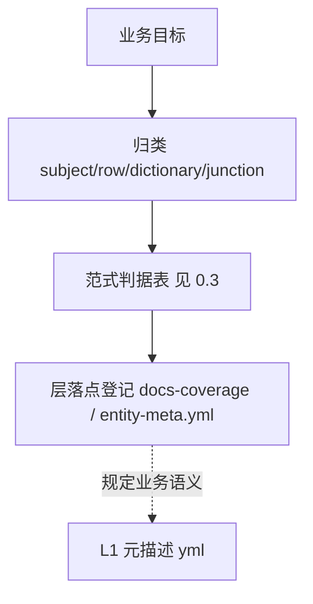

# 架构蓝图 v3（双向架构 · 本项目方向性总纲）

> 本蓝图定义系统的**双向架构**：
> **上半部＝自上而下推导链**（业务目标 → 归类 → 范式判据 → 层落点，回答"造什么形状"）；
> **下半部＝L1–L5 层落地**（回答"按声明放哪、怎么单向依赖落地"）+ "完成"的判定门禁。
> 所有 AI 开发与人工验收以此为准。它是结束"反复返工循环"的根本控制件。
>
> **v3 修订说明（2026-09-05）**：经产品管理重析（宽表 + 自造产品名字典弯路）与用户反思确认——
> v2 只覆盖了"自下而上"这一半（层归属 + 门禁，已被机制强制、确实清晰），缺"自上而下"的
> 业务目标 → 范式推导链：**层只保证东西放对层，不保证开工前造的是对的形状**。
> v3 新增上半部推导链，下半部保留 v2 全部实证内容（L1–L5 / 红线 / DoD 门禁）作层落地指南，
> 并记录 2026-09-05 裁决（product 名全局唯一收口、v23 字典撤销）。详见 §9 决策记录与《根因分析与预防措施.md》。
>
> **v2 修订说明（历史）**：v1 基于印象撰写，经代码实证与行业检索后修正 4 处事实错误、补 1 处关键漏项、并把 3 项设计选择定案（§3.2 / §4.2 / §3.3）。所有关键论断均已对账真实代码。

---

## 0.0 为什么需要这份蓝图（循环的根因 + 行业实证）

当前痛点不是"AI 不会写代码"，而是两件事同时缺失：

**(1) 没有一份被强制执行的架构蓝图** → 每个功能各自长、互相漂移 → bug 积累 → 打补丁 → 更漂移 → 循环返工，基础功能做不完。

**(2) "做完了"由 AI 自评，而不是由机器判定**。Anthropic 官方点名该失败模式：agent 会"自信地夸自己的工作，即使质量明显平庸"（谄媚偏差）。**问 agent「做完了吗」永远得到 yes**。

> 行业结论：只认**agent 无法说谎的客观信号**——类型检查通过、build 产出、测试退出码、Playwright 结果。`Stop` 类钩子在 agent 声称完成时自动跑门禁，非零退出即判定未完成。

蓝图的作用 = **控制**：定义每样东西放哪一层（L1–L5）、通用能力何时抽象（§3.2 三次原则）、以及"生产级可用"由门禁判定（§4）。v3 在它之前补上另一半：**推导链决定"造什么"，层栈保证"造得对、放得对"。**

---

# ▲ 上半部：自上而下推导链（设计期 · 先选范式再落层）

> 本部分是 v3 新增。下半部（`## 1` 起的 L1–L5 层栈 / 红线 / 门禁）原样保留为层落地指南。

## 0.1 为什么 v2 只解决了一半（双向不对称）

| 方向 | 回答的问题 | 靠什么保证 | 现状 |
|---|---|---|---|
| **自下而上（实现期·层落地）** | 造好后放哪、依赖朝哪、怎么声明 | 机制强制：真相源 yml → 生成配置 → 平台内核 → UI 装配，单向依赖 + 守卫 + 可验证 | ✅ 清晰（v2 已立） |
| **自上而下（设计期·范式选择）** | 业务目标下这数据**天生是什么形状** | v2 只有"先升维再动手"软纪律，无硬步骤 | ❌ 缺推导链（v3 补） |

## 0.2 推导链五步（设计期硬步骤，先答再动）

1. **业务目标**：一句话说清"这笔业务要达成什么、会被谁引用"，禁止先画表。
2. **归类**：subject / row / dictionary / junction（对应"货和人怎么存在"）。
3. **范式判据**（见 0.3 表）：先答四问，**禁止直接用"页面要宽表 / 字段要唯一"当设计依据**。
4. **层落点登记**：答案落档 `docs-coverage.md`（判据四问勾选）与 `entity-meta.yml`（结构声明）。
5. **反推验收**：从判据反推"怎样算做对"，写进集合验收标准。

## 0.3 范式判据表（先对标准形状，再落笔）

| 判据 | 决策 | 本项目实证 |
|---|---|---|
| 这个"词"被**多对多共享 / 第二实体引用**？ | 是 → 抽**全局字典**（改名全局生效、引用按 ID） | brand（挂多产品/多规格）、unit（被多规格引用）、category（被 product + 供应商经营范围引用） |
| 只是**唯一约束**？ | 用**唯一索引**表达；**禁止为唯一造字典** | product.name：290 名两两不同、无第二实体引用 → `@@unique([name])`，字典已撤销 |
| 两张表 **1:1 且无第二引用方**？ | **1:1 不拆表**（拆表＝过度归一化） | product 与 product_name 曾 1:1 拆表 → 回退 |
| 读缓存 / 宽表（性能诉求）？ | **派生读投影，必须 `@escape: 原因+到期条件`**，标注"由 3NF regenerate、非结构真相" | `product_sku_search` 宽表已 v30 物理删除 |
| 多对多？ | M:N 用**联结表** | product_brand / spec_unit / product_category（后者暂缓，非本判据不实施） |

## 0.4 使用方式（接缝到下半部）

- 任何**新建/改实体或 schema**：先走 0.2 推导链，再进入 §5 工作流判层编码；异常"另搞的结构"先消再写码。
- 推导链是**横切总开关**，不属于任何一层；下半部 L1–L5 回答执行细节。
- 首个执行案例＝product 名全局唯一收口（2026-09-05，见 §9）。

---

# ▼ 下半部：自下而上层落地（v2 既有 · L1–L5 / 红线 / 门禁）

> 自 v2 起的内容原样保留。v3 对其的增补：§4.2 已结案注记、§5 工作流加推导链第一步、§7 红线加第 9 条、文末 §9 决策记录。

## 1. 现状实证盘点（已对账真实代码，非印象）

| 事实 | 实测值 | 对蓝图的含义 |
|---|---|---|
| `frontend/src` 规模 | **260 个文件**（148 tsx + 106 ts） | 全量 typecheck 很便宜，**不必限定目录** |
| 静态检查基建 | npm scripts 已有 `typecheck`(tsc -b)、`lint`(oxlint)、`check:dupe`(js 重复检查)、`build:check`(串联) | **G1 基建现成，直接复用，不重建** |
| 单元测试 | **`*.test.*` = 0 个**，无 vitest/jest | **G2 需先建基建**（选 Vitest，配 Vite 最顺） |
| 浏览器验证 | `e2e_browser/` **约 70 个 Playwright 脚本**，含 `smoke_prod.js`（真冒烟：登录→建单→选品落库，API+browser 混合、headless、有 pass/fail 记录） | **G3 是"收敛现有脚本"，不是"新写"** |
| 真相源链路 | `data-source/entity-meta.yml`（唯一真相源）→ `tools/gen-entity-meta.mjs` → 生成 fe/be 两份 `entityMeta.generated.ts` | L1→L2 链路**真实存在**，真相源是 **yml 不是 md** |
| 既有铁律 | **`*.generated.ts` 禁止手改；override 写旁侧 `*.override.ts`** | 必须写入蓝图红线 |
| 欠债项（台账） | `users/roles`（605/512 行）各自手写待收框架、旧 `-model` 组待退役、`actions.generated.js` 死代码 | 蓝图是目标态、现实是欠债态 → 见 §1.1 |

### 1.1 现状差距与迁移清单（目标态 vs 欠债态）

蓝图 §3 宣称"通用能力在 L3 唯一一份"，但现实存在违反项。**这些不是要一次性重写，而是按棘轮随开发收敛**（见 §4.2）：

| 欠债项 | 目标 | 收敛时机 |
|---|---|---|
| `users/roles` 各自手写（未走档案框架） | 收归 L3 框架 | 下次触碰该文件时（棘轮） |
| 旧 `-model` 数据组未退役 | 退役，由 `07-archive-framework` 吸收 | 定时任务，不与功能开发混同 |
| `actions.generated.js` 死代码 | 删除 | 立即（无消费方） |

> ⚠️ `e2e_browser/` 里 `verify_v*`/`test_*` 带版本号的一次性脚本堆积，**本身就是"循环"的产物**：每次改完写一个一次性验证脚本，从不沉淀成回归套件。它们是要收敛的**原材料**，不是资产。

---

## 2. 五层资产模型（映射到本项目真实路径）

### L1 业务元描述层（人阅读）
- **真相源**：`data-source/entity-meta.yml`（机器真相源）+ 业务文档 md（人读）+ `docs-coverage.md`（台账/对账）。
- 内容：业务集合定义、字段矩阵、UI 五层对照、实体关系、**每个集合的验收标准**。
- 负责人：**你（业务架构师）**。
- ✅ 描述需求、界面表现、约束规则、验收标准。
- ❌ 禁止写实现代码。
- ⚠️ **一致性要求**：md ↔ yml ↔ `*.generated.ts` 三方一致。`generated` 由脚本保证；**真正会漂的是 md 与 yml** → G1 需校验。

### L2 运行时配置层（机器读取）
- 存放：`frontend/src/shared/config/*.generated.ts`、`backend/src/services/generated/*.generated.ts`。
- 由 `tools/gen-entity-meta.mjs` 从 yml 生成。
- ✅ 改配置 = 改 yml 后重跑生成器。
- ❌ **禁止手改 `*.generated.ts`**；需要覆盖时写旁侧 `*.override.ts`。

### L3 平台内核层（通用能力唯一一份）★循环终止核心
- 存放：`frontend/src/shared/**`（ArchiveListPage / UnifiedTable / InteractionLayer / editorRegistry / HeaderCascadeFilter 等）+ 后端通用 CRUD、字典查询、关系表读写、统一返回/异常。
- ✅ 在 `shared` 内完善/修复/新增通用能力 + 补单测。
- ❌ **禁止**在业务页复制平台代码改副本；**禁止**为单页写 if 绕过平台（隐式绕过）。
- 抽象时机见 §3.2；允许的例外见 §3.3。

### L4 业务胶水层（仅平台配置表达不了的计算）
- 存放：`frontend/src/apps/*/pages/*` 内少量脚本。
- ✅ 报价计算、退货分摊、特殊状态流转等纯业务计算。
- ❌ 禁止在此重写表格/弹窗/单元格分发/浮层（那是 L3）。

### L5 数据持久层（MySQL）
- 第三范式：主表 + 独立字典表 + 多对多中间关系表。
- AI 生成建表/索引 SQL **草稿**，**必须经你确认后**才执行。

---

## 3. 平台内核边界（结束循环的纪律）

### 3.1 红线
1. 通用 UI / 通用后端能力**只在 L3 实现唯一一份**。
2. 修一个平台 bug = 所有业务页同时受益；**禁止为单页写临时补丁绕过平台**。
3. bug 先分类（平台 / 配置 / 胶水 / 数据），在**对应层**修，**禁止跨层打补丁**。

### 3.2 【已定案 A】通用 vs 业务的判定 —— 三次原则 + 第二次登记

采用 Martin Fowler《Refactoring》**三次原则**（DRY 与 YAGNI 的折中，行业默认判据），并针对 AI 会话无记忆补一处强化：

| 第几次出现 | 该怎么做 |
|---|---|
| 第 1 次 | 写在**业务层 L4**，不抽象（避免过早抽象 / 上帝框架） |
| 第 2 次 | **允许复制，但必须登记**到 `docs-coverage.md` 标注为"重复候选项"+ 位置 |
| 第 3 次 | **必须抽到 L3**，并补单测 |
| **例外** | 涉及**安全 / 权限 / 金额计算**的，第 2 次即须统一，不等第 3 次 |

> 为什么补"第二次登记"：AI 会话之间没有记忆，第二次若不登记，第三次永远不会触发收敛——登记是让三次原则真正生效的唯一保障。
> 为什么不是"≥2 次就抽"：过早抽象会养出臃肿的通用框架，且第 2 次时往往还没看清真正的通用形状。

### 3.3 【已定案 C】逃逸口 —— 允许显式逃逸，禁止隐式绕过

- **允许**：某页明确标注不走框架，但必须写 `@escape: 原因 + 到期条件`，并登记入 `docs-coverage.md` + 在掌控台可见。
- 该逃逸项在**同类需求第二次出现时自动升级为 L3 候选**（按 §3.2 处理）。
- **禁止**：默默绕过平台——区分「显式逃逸（允许、可审计）」与「隐式绕过（禁止）」。

> 理由：强制一切走框架会养出上帝框架；行业做法是保留逃逸口，但要求**显式、可审计、有到期条件**。

---

## 4. 完成定义（DoD）+ 验收门禁（让"生产级可用"可被判定）

每次交付必须过以下门禁；任一不过 → **不能标记"已交付"**，回 `项目掌控台` 偏差区，修到绿。

| 门禁 | 具体命令 / 内容 | 浏览器？ |
|---|---|---|
| **G1 静态** | `npm run typecheck`（**全量**，非限定目录）+ `npm run lint` + `npm run check:dupe` + yml↔md↔generated 一致性校验 | 否 |
| **G2 单测** | Vitest（**待建基建**）；改 L3 必补/跑单测，全绿才可发布 | 否 |
| **G3 冒烟** | 收敛 `e2e_browser/` 现有脚本为**可回归套件**（首条主冒烟优先），headless 自动 | headless，**不用你点** |
| **G4 人工** | 真机视觉 / 复杂交互手感，按每集合验收清单抽样 | 是（仅少数） |

规则：G1/G2/G3 任一红 → 不交付。**不要问 AI「做完了吗」**，只看这四项的退出码。

### 4.1 门禁的机器强制（关键）

光写进 `AGENTS.md` 不够——AI 会自我评分偏乐观。必须有**统一 runner**：

- 建 `tools/verify.mjs`：一条命令串起 G1（`typecheck`+`lint`+`check:dupe`+一致性）→ G2（vitest）→ G3（冒烟套件），输出结构化报告（供掌控台回写）。
- 在「AI 声称完成」的时刻自动触发（对应行业 `Stop` 钩子思路），非零退出 → 判定未完成，禁止标记已交付。

### 4.2 【已定案 B】tsc 存量策略 —— Allowlist + 棘轮（不是全修，也不是放任）

> ✅ **结案更新（2026-09-05）**：类型债已全量收敛为 `strict: true` 零错误，allowlist + 棘轮方案**作废**；
> 且 tsc 已禁增量缓存（`incremental: false`，避免 `tsc -b`/`-p` 结果不可复现）。本节保留作为历史决策记录。

**绝不一次性全仓开 strict**（行业实证：3400 错误 → 分支被放弃 → 18 个月后仍在 backlog，代码库又长两万行松散代码 = 正是你的循环）。采用增量硬化的标准路径：

1. **跑基线**：记录当前 `npm run typecheck` 错误数与位置，登记入台账（**存量冻结**）。
2. **建 `tsconfig.strict.json`**：`extends` 主配置 + `strict: true` + `files: [初始仅含已确认干净的 leaf 模块]`，配套 `typecheck:strict` script。
3. **棘轮三规则**（缺一不可）：
   - ① `typecheck:strict` 失败即判定不交付；
   - ② guard 检查 `files` 数组**只增不减**（防止压力下删行）；
   - ③ **任何被本次改动触碰的文件，必须在同一次改动中加入白名单并修好** —— 这是让迁移真正收敛的棘轮，把严格性绑到本来就要改的代码上。
4. 顺序：allowlist 模型下**直接开全 strict（含 `strictNullChecks`）**，不必按"便宜 flag 优先"——因为爆炸半径已被文件列表限制，而 `strictNullChecks` 才是运行时 bug 的主要防线。

> 我们只有 260 个文件（远小于行业案例的 5 万行），收敛会很快；且价值从第一周就开始——棘轮阻止未类型化面积继续增长。

### 4.3 G3 冒烟：收敛而非新增

- 先确立**一条主冒烟**（覆盖最重要的用户流程，行业称其为"ROI 最高的一小时"），复用 `smoke_prod.js` 的 API+browser 混合模式。
- 再把 `e2e_browser/` 中有效的 `verify_*` 收敛为**按业务集合的回归套件**；一次性诊断脚本归档，不再维护。
- **禁止**继续新增一次性 `verify_v*` 脚本（那正是循环的产物）。

---

## 5. AI 开发工作流（固定顺序，不可跳步）

> 行业共识：**验收标准必须在动手前写定**（Spec-Driven），否则"做完了吗"没有判据，AI 会自己发明一个宽松标准。
> v3：动手前**再加一步推导链**（先选范式，再谈落层与验收）。

0. **先走推导链（v3 新增）**：业务目标 → 归类 → 范式判据四问（§0.3：抽字典？1:1 拆表？派生 `@escape`？）→
   定"造什么形状"，**标准模式已提供却另搞的结构先消再写码**；判据四问勾选落档 `docs-coverage.md`。
1. **先定验收标准**：读需求 → 在 L1 写明"怎样算做完"（可机器验证的条件优先）。
2. **判层**：规则/UI 描述 → L1；配置 → L2（改 yml 后重跑生成器）；通用组件/接口 → L3；纯业务计算 → L4；SQL → L5。
3. 在对应层实现，守 §3 红线（含 §3.2 三次原则、§3.3 逃逸登记）。
4. 跑 **`npm run verify`**（S0 对拍 → S1 类型 → S2 lint → S3/S3b → S4 → S5 → S6 冒烟，服务在线）/ `npm run verify:static`（服务不在，此时不得标"已交付"），出报告。
5. 全绿 → 回写台账 / 掌控台"已交付"；有红 → 进偏差区，修到绿再交付。
6. 你反馈 bug → **先分类层** → 对应层修 → 重跑门禁。

---

## 6. 与现有机制的衔接

- `docs-coverage.md` = L1/L2 对账 + 待办源 + **重复候选项登记处**（§3.2）+ **逃逸登记处**（§3.3）。
- `项目掌控台` = 开发驱动台 + **验收门禁结果展示**（待加"验收门禁"区，消费 `tools/verify.mjs` 报告）。
- `AGENTS.md` = 本蓝图的 AI 行为约束摘要（红线 + 工作流 + 门禁强制）。
- `data-source/entity-meta.yml` = 唯一真相源（`*.generated.ts` 禁手改，override 走 `*.override.ts`）。

---

## 7. 红线总览（给 AI 的硬约束）

1. **不改顶层架构方向**——蓝图由你定，AI 只提不改。
2. 通用能力只在 L3 一份；**禁止隐式绕过平台**（显式逃逸须登记）。
3. 抽象按**三次原则 + 第二次登记**（安全/权限/金额第 2 次即统一）。
4. 改动先判层、按层修，**禁止跨层打补丁**。
5. **禁止手改 `*.generated.ts`**；override 走 `*.override.ts`。
6. 交付前必跑 **`tools/verify.mjs`**（G1+G2+G3），不过不交付；**不询问 AI 是否完成，只看退出码**。
7. SQL / 数据变更须经你确认才执行。
8. 禁止新增一次性 `verify_v*` 脚本；浏览器验证进回归套件。
9. **开发前先走推导链（v3 新增）**：任何建/改实体或 schema，先答范式判据四问并落档 `docs-coverage.md`，再判层编码；禁止为"唯一"造字典、禁止 1:1 拆表、读缓存/宽表必须显式 `@escape`。

---

## 8. 落地第一步（按此顺序，不要跳）

1. `frontend` 装依赖（`npm install`，当前无 node_modules）→ 跑 `npm run typecheck` **取基线错误数**。
2. 建 `tsconfig.strict.json` + `typecheck:strict` + 白名单 guard（§4.2）。
3. 建 Vitest 基建 + `shared` 首批单测（§4 G2）。
4. 收敛 `e2e_browser/` 出**一条主冒烟**（§4.3）。
5. 写 `tools/verify.mjs` 串联 G1–G3 并输出报告。
6. 把 §7 红线 + §5 工作流写进 `AGENTS.md`；掌控台加"验收门禁"区消费报告。

---

## 9. 决策记录（v3 · 2026-09-05）

- **双向架构升版**：用户裁决 v3 为"双向架构"——上半部自上而下推导链（本蓝图 `▲ 上半部`）补 v2 缺的"目标 → 范式"推导；下半部 L1–L5 层栈原样保留作落地指南。架构从"层归属图"升级为"指导全局开发的推导 + 落地总纲"。
- **product 名全局唯一收口（撤字典）**：用户裁决产品名不需要独立字典（"唯一"是约束不是对象）；v23 ①③（`product_name` 全局字典 + `product_category` 关系表）作废并已外科手术式回退；唯一键从 `[categoryId, name]` 收紧为 `[name]` 全局唯一，DB 迁移走用户确认闸门。实证：290 产品名两两不同、跨分类同名 0。
- **机器守卫（B 同实体双定义拦截 / C 层边界 arch-lint）**：⏳ 后续单独排期，未随本升版实施。
- 根因与预防全文见《根因分析与预防措施.md》（定稿 2026-09-05）；台账见 `docs-coverage.md` v23 段（已标"字典已撤销"）。

---

*本蓝图 v3 为双向架构总纲，随项目演进由你（业务架构师）修订。AI 任何架构性提议须显式标注所属层别并等你确认。*
