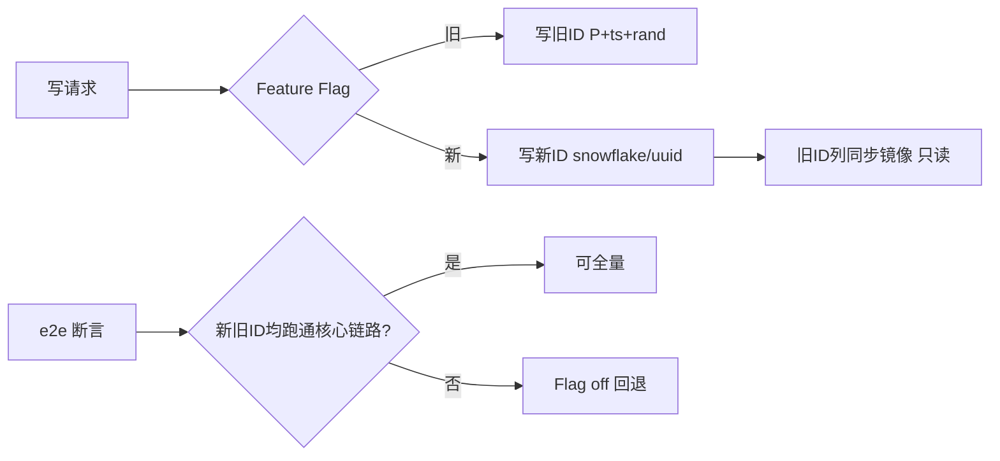
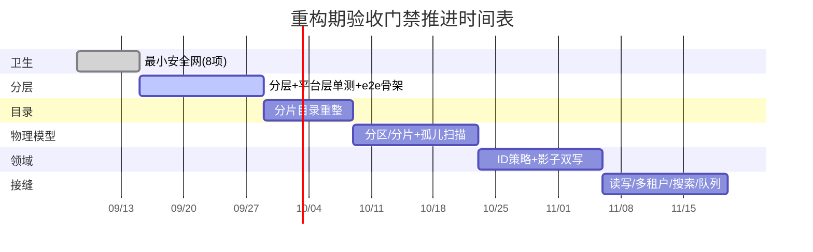

# 增量重构期间的质量安全网方案

> 作者：Edward（严过关）/ QA 工程师
> 适用项目：建材报价系统（前端 ~21000 文件 React 19 + antd 6；后端 ~2700 文件 NestJS + Prisma 5 + MySQL 8）
> 目标：在不中断线上业务的前提下做增量重构，保证「不把系统改坏」
> 本文档定位：**测试策略 + 验收门禁设计**，不含实现代码。

---

## 0. 适用范围与核心原则

### 0.1 当前真实现状（实测，非臆测）

| 维度 | 现状 |
|---|---|
| 前端规模 | ~21000 文件，React 19 + antd 6 |
| 后端规模 | ~2700 文件，NestJS + Prisma 5 + MySQL 8 |
| 现有门禁 | `npm run verify` 9 道门，当前 **8 过 1 红**：S1 前端类型检查未过 |
| 信号扫描 | `signal-report.json`：14 处 MED「列逃进 custom」（业务表格列绕过 L4 三维参数在 `custom` 里手写） |
| 测试基础 | 前端单测（S3b）、后端单测（S4）覆盖低，仅平台层纯逻辑 |
| 历史事故 | 「绿灯但零验证」——tsc 增量缓存既假绿又假错；浏览器冒烟脚本 15 个 URL 全过期却永远 `exit 0` |

### 0.2 核心原则（贯穿全文，门禁必须遵守）

1. **真实**：门禁必须跑真实检查，不允许缓存、不允许空跑。
2. **可机判**：通过与否只能由退出码 / 断言结果决定，`exit code ≠ 0` 即失败、即阻断合并。
3. **非 0 即失败**：不存在「警告通过」「人工放行绿灯」。黄灯视为红灯处理。
4. **禁止 AI 自评算通过**：任何「我看了代码觉得没问题」「模型判定通过」都不能作为门禁依据；门禁结论只能来自脚本退出码或断言产物。
5. **证据留痕**：每道门禁产出机器可读报告（JSON），记录 `ranIds == wantedIds`、`exitCode`、`wallMs`、指纹，供审计回溯。

---

## 1. 重构期必须存在的安全网（四大支柱）

> 策略层描述：每根支柱说明「测什么、为什么、判定标准、用什么手段（不写代码）」。

### 1.1 前后端接口契约测试（防字段 / 参数悄悄变更）

**为什么必须**：后端 NestJS 与前端 21k 文件通过接口耦合。重构最容易发生的破坏是「后端改了字段名 / 参数类型 / 是否必填，前端没人发现」，单测和类型检查都拦不住（因为是跨进程边界）。这是静默改坏的头号来源。

**策略**
- **真相源 = 后端 OpenAPI（Swagger）**：由 NestJS 在构建期生成 `openapi.json`，作为契约真相源提交进仓库（纳入 S0 `meta-consistency` 对拍逻辑，改了接口必须重生成契约）。
- **契约 diff 门禁**：每次 PR 将 PR 分支生成的 `openapi.json` 与 `main` 的基线做 diff。
  - 允许的变更：新增端点、新增**可选**字段。
  - 阻断的变更（breaking）：删除 / 重命名字段、字段类型收窄、必填项新增、路径参数变更、HTTP 状态码语义变化。阻断必须显式「接口变更申请」+ 架构师审批，否则 CI 红。
- **前端消费侧契约**：前端按 `openapi.json` 生成请求客户端 / MSW mock；前端单测跑在 mock 上，若契约变更未同步，前端构建即红（双重锁）。
- **运行时兜底**：后端对关键端点做「响应 schema 断言」单测（Pact 风格或 zod 校验），保证实现不偏离契约。

**判定标准**：`openapi diff` 无 breaking 项（或 breaking 项已带审批）；前端生成物与契约一致。

### 1.2 黄金路径 e2e（核心业务流：开单 → 配货 → 收款）

**为什么必须**：单测覆盖低、前端规模大，真正能证明「业务没断」的是端到端跑通核心链路。

**策略（两层金字塔，克制投入）**
- **底层：API 层 e2e（稳定骨架，优先立）**。用 NestJS 测试模块 + 真实 MySQL（事务回滚 / 独立测试库），脚本化走完「开单创建 → 配货分配 → 收款确认」三条主链路及异常分支（库存不足、重复收款、部分配货）。API 层不依赖浏览器，最快最稳，是主安全网。
- **顶层：浏览器层 e2e（薄，随 UI 稳定补）**。仅对 3 条核心流用 Playwright 跑一遍关键 UI 路径，**必须断言真实 DOM / 接口返回**，不复用那条「15 个过期 URL 永远 exit 0」的冒烟脚本。

**关键修复（针对历史事故）**
- 旧冒烟脚本必须重写：每个 URL 断言 HTTP 状态 + 关键内容存在，任一失败 `exit 1`；URL 清单从配置读取并定期（季度）巡检有效性。
- 浏览器 e2e 跑在固定 staging 环境与固定种子数据上，禁止「连不上就当过」。

**判定标准**：3 条核心链路全绿；异常分支按约定行为校验；`exit code == 0` 且生成 e2e 报告。

### 1.3 数据迁移回放测试（旧 schema → 新 schema 数据一致性）

**为什么必须**：重构涉及物理数据模型演进、ID 策略变更、SQLite→MySQL 残留清理。数据一旦迁错不可回退，是最高危区域，必须「先回放校验、再上线」。

**策略**
- **版本化迁移**：所有 schema 变更走 Prisma migration，每个 migration 文件带 checksum，提交即锁版本。
- **回放 harness（CI 必备）**：
  1. 取生产子集（脱敏导出）或固定种子数据集；
  2. 在全新 MySQL 实例从空库 `migrate deploy` 到目标版本；
  3. 载入子集数据，跑迁移后的数据修复脚本；
  4. **一致性断言**：每张逻辑表行数一致、关键列聚合校验和（checksum）一致、业务不变量成立（如「已收款金额 ≤ 开单金额」）。
- **schema 哈希门禁**：迁移后实际 schema 计算哈希，与期望哈希比对，不匹配即红。
- **SQLite→MySQL 残留清理门禁**：仓库内不得残留 `dev.db` / `*.sqlite` / `provider = sqlite` 引用；`schema.prisma` 的 `provider` 必须为 `mysql`，否则 CI 红。

**判定标准**：回放后行数 / checksum / 业务不变量 100% 一致；schema 哈希匹配；无 sqlite 残留。

### 1.4 性能基线与回归门禁（千万级 SKU 量级）

**为什么必须**：目录重整、物理模型演进（分区 / 分片键）、索引变化会悄悄拖垮查询。21k 前端体量下，一次 N+1 或全表扫描即线上雪崩。

**策略**
- **一次性基线测量**：在具备生产量级数据（千万级 SKU）的 staging 上，用 k6 对 4 类核心查询压测：开单创建、配货检索、收款确认、报表聚合。记录 p50 / p95 / p99 延迟与错误率，存为基线 JSON（带数据量指纹）。
- **回归门禁**：每次触及查询路径 / 索引 / 分片的 PR，在同等 staging 上重跑核心查询，对比基线：
  - 阻断：`p95` 超过基线 × 1.2，或错误率 > 0。
  - 允许：需架构师审批的已知退化（如分区切换过渡期），但必须登记并设回收期限。
- **新查询路径灰度**：新实现先用 feature flag 包裹，canary 小流量对比，再全量。

**判定标准**：核心查询 p95 ≤ 基线 × 1.2 且零错误；基线 JSON 随数据量变化需重新测量并留痕。

---

## 2. 每阶段可机器判定的验收门禁（基于 verify 升级）

### 2.1 门禁总览表

在现有 9 门基础上，**保留并加固** S0/S0b/S1/S2/S3/S3b/S3c/S4/S5，并**新增**重构期专属门禁。所有门禁的 `why` 与「防什么」一一对应。

| 门禁 | 名称 | 类型 | 当前 | 重构期要求 | 防什么 |
|---|---|---|---|---|---|
| S0 | meta-consistency | 静态 | PASS | 保留；合约 `openapi.json` 纳入对拍 | yml/生成物漂移 |
| S0b | arch-lint | 静态 | PASS | 保留；新增「custom 列逃逸」「目录越界」阻断 | 架构违规、列逃进 custom |
| **S1** | fe-typecheck | 静态 | **FAIL** | **必须修**；去增量缓存、全量 `--noEmit` | 类型假绿（历史事故） |
| S2 | fe-lint | 静态 | PASS | 保留 | 前端风格 |
| S3 | fe-dupe | 静态 | PASS | 保留 | 重复文件 |
| S3b | fe-test | 单测 | PASS | 保留；补平台层 + 定价/税额纯逻辑 | 前端纯逻辑回归 |
| S3c | cell-layer | 静态 | PASS | 保留；`custom` 出口守卫强化 | 单元格层多元复活 |
| S4 | be-test | 单测 | PASS | 保留；补业务契约 + 迁移回放单测 | 后端逻辑回归 |
| S5 | be-lint | 静态 | PASS | 保留 | 后端类型 |
| **S6** | api-contract | 契约 | 新增 | 阻断 breaking diff | 字段/参数静默变更 |
| **S7** | golden-e2e | e2e | 新增 | 核心链路全绿 | 业务流断 |
| **S8** | migrate-replay | 数据 | 新增 | schema 哈希 + 回放一致 | 数据迁错/丢失 |
| **S9** | perf-gate | 性能 | 新增 | p95 ≤ 基线×1.2 | 查询退化 |
| **S10** | signal-block | 信号 | 新增 | 14 MED 清零或带审批白名单 | 技术债累积 |

> 合计重构期 **10 + 原 9（其中 S1 须修红）= 对外可见 10 道重构门禁**（S0~S5 沿用 verify 既有框架，S6~S10 为新增）。

### 2.2 门禁防假绿技术约束（针对历史事故，强制执行）

1. **S1 去增量缓存**：`tsc --noEmit --incremental false`，全量、确定性。禁止 `--incremental` 复用 `.tsbuildinfo`（历史假绿根因之一）。S1 红必须解决或显式 quarantine（带 owner + 截止日期），**不得长期静默红**。
2. **`ranIds == wantedIds` 强制**：verify 报告必须证明「想跑的门都跑了」。若有门禁未执行（脚本崩溃、被 `|| true` 吞掉），整条流水线视为 **FAIL**，不允许「少跑几道也算过」。
3. **脚本退出码审计**：任何门禁脚本末尾禁止 `|| true`、`2>/dev/null`、裸 `catch` 吞错；CI 以最后一个非零退出码为准。
4. **冒烟 / e2e 断言化**：URL 清单、接口断言必须校验真实响应；URL 失效或连接失败 = 失败，不是跳过。
5. **随机性受控**：涉及数据的门禁（迁移回放 / e2e）用固定种子，保证可复现，避免「这次碰巧过了」。

### 2.3 失败处理规则

```
门禁 FAIL
  ├─ 阻断合并（PR 不得合入 main）
  ├─ 自动 comment 到 PR：门禁 ID + 报告链接 + 失败摘要
  ├─ 通知负责人（按门禁归属：S1 前端、S6 后端+架构、S8 DBA/架构）
  └─ 处理路径
       ├─ 真 bug → 修代码 → 重跑
       ├─ breaking 变更属预期 → 走「变更申请 + 架构师审批」白名单（仅 S6/S9 允许，且留痕）
       └─ 历史债（如 14 MED）→ 进 S10 白名单须带 owner + 截止，到期转阻断
```

- **不存在「先合后修」**：红门禁上的 merge 一律拒绝。
- **白名单是例外不是常态**：S6/S9 的 breaking / 退化白名单必须登记原因、审批人、回收日期，超时自动变红。

### 2.4 明确禁止：AI 自评算通过

- ❌ 「我（模型）审阅了代码，认为接口兼容，门禁通过」——**无效**。
- ❌ 用自然语言总结代替退出码 —— **无效**。
- ✅ 唯一有效的通过依据：`verify-report.json` 中对应门禁 `status == PASS` 且 `exitCode == 0`，或 e2e / 迁移 / 性能报告断言全绿。
- CI 系统只认产物文件与退出码，不读任何对话摘要。

---

## 3. 关键风险点的验证与回滚策略

### 3.1 数据迁移（SQLite→MySQL 残留清理 + 版本化回放）

**风险**
- 残留 `dev.db` / sqlite provider 引用混入生产构建，导致连接错库或迁移失败。
- 旧 schema → 新 schema 字段映射错误、数据丢失、业务不变量破坏。

**验证策略**
- 残留清理门禁（并入 S0b / S8）：grep 仓库禁止 `provider = "sqlite"`、`*.sqlite`、`dev.db` 提交；`schema.prisma` provider 校验为 `mysql`。
- 版本化回放（S8）：见 1.3。每个 migration 带 checksum；CI 从空库 `migrate deploy` → 加载子集 → 修复脚本 → 一致性断言（行数 + 列 checksum + 不变量）。
- 下迁移（down）仅在隔离环境验证可逆性，**不在生产直接回滚**（用 gh-ost 类在线变更保证可反向）。

**回滚策略**
- 在线 schema 变更走 **gh-ost / pt-osc**，可中断、可回退，不锁表。
- 数据修复脚本幂等 + 可反向；上线前在 staging 完整回放验证。

### 3.2 ID 策略变更（反范式 `P+时间戳+随机` → snowflake / uuid）

**风险**：ID 出现在 URL、导出 Excel、合作方对接、前端路由参数、localStorage 缓存、审计日志。一旦格式变，外部系统全断。

**验证策略**
- **契约门禁（S6）**：任何端点 ID 字段格式变化触发 breaking diff，必须审批。
- **影子双写测试（S4/S7）**：过渡期后端同时写旧 ID 与新 ID，前端按 flag 读取；e2e 断言新旧 ID 都能正确走完核心链路，且无孤立引用（逻辑外键全部可解析）。
- **回放映射测试**：抽取生产数据，旧 ID → 新 ID 映射后，校验所有引用字段（订单→客户、配货→开单）无断链。

**回滚策略**
- 旧 ID 列保留为只读镜像，feature flag 控制前端读哪套；flag off 即回退旧 ID 权威。
- 新 ID 生成器可切换算法（snowflake/uuid）由配置决定，便于回退。



### 3.3 物理模型演进（分区 / 分片键、无物理 FK 的解耦模型）

**风险**
- 改分区键 / 分片键 = 表重建，易丢数据或长时间锁表。
- 无物理 FK 的解耦模型：引用完整性靠应用层，迁移后极易产生孤儿行。

**验证策略**
- **分区 / 分片回放（S8）**：迁移后按分区统计行数，与原 schema 同口径对比，checksum 一致。
- **孤儿行扫描（S4/S8 关键）**：迁移后跑校验 SQL —— 每张子表 `ref` 必须存在于父表；孤儿数必须为 0，否则门禁红。这是无物理 FK 模型的安全底线。
- **在线变更**：分区 / 分片切换用 gh-ost，影子表全量校验后再 cut-over。

**回滚策略**
- gh-ost 影子表未 cut-over 前随时可废弃；cut-over 为原子 rename，失败秒回。
- 孤儿行扫描在 staging 先行，生产前清零。

### 3.4 读写分离 / 多租户 / 独立搜索 / 异步队列接入缝

**读写分离**
- 验证：写后立读必须看到自己写入（同事务走主库，或读从库等延迟达标）；门禁测「写主读从延迟 SLA」（如 < 200ms 内可见）。
- 回滚：读流量开关切回全主库。

**多租户**
- 验证：多租户数据集回放 + API 层断言「租户 A 不可见租户 B 数据」；SQL 执行计划断言含租户过滤条件（防漏筛）。
- 回滚：租户路由配置回退。

**独立搜索（ES / Meili 等）**
- 验证：写后搜索「最终一致」SLA 内可见；搜索 API schema 纳入契约（S6）；一致性校验脚本抽样比对新库与索引。
- 回滚：搜索查询降级回 DB 查询（feature flag）。

**异步队列**
- 验证：事件流重放测试断言**幂等**（重复投递结果一致）、**顺序/乱序**处理正确、**毒消息**进死信队列不阻塞。
- 回滚：消费者版本化，旧消费者并行消费至新链路稳定。

---

## 4. 测试优先级与落地顺序（止血 → 随阶段 → 后置）

| 层级 | 项 | 时机 | 投入 | 拦截价值 | 判断 |
|---|---|---|---|---|---|
| **止血** | 修 verify 假绿（S1 全量 + ranIds 强制 + smoke 断言） | 立刻，重构首合前 | 低 | 高（杜绝假绿） | **必做** |
| **止血** | 契约 diff 门禁 S6 | 立刻 | 低 | 高（拦静默字段变更） | **必做，ROI 最高** |
| **止血** | 14 MED custom 列门禁化 S10 | 立刻 | 低 | 中（防架构债累积） | **必做** |
| **止血** | 迁移回放骨架 S8（schema 哈希级） | 首 schema 变更前 | 中 | 高（拦数据丢失） | **必做** |
| 随阶段 | 黄金路径 API e2e S7 | 分层/目录重整期 | 中 | 高 | 优先 API 层 |
| 随阶段 | 性能基线 S9 | staging 有生产量级数据后 | 中 | 高 | 一次性测 + 门禁 |
| 随阶段 | ID 影子双写测试 | ID 策略阶段 | 中 | 高 | 配 flag |
| 随阶段 | 物理模型/分区回放 S8 数据级 | 物理模型阶段 | 高 | 高 | 配 gh-ost |
| 随阶段 | 读写/多租户/搜索/队列缝测试 | 对应接缝阶段 | 中 | 中高 | 按阶段 |
| **后置** | 全面单测覆盖 | 长尾 | 极高 | 低（21k 前端不现实） | **不追求全覆盖** |
| **后置** | 完整搜索一致性套件 / 全量报表回归 | 长尾 | 高 | 中 | 按需 |

**投入产出结论**
- 最高 ROI：**契约 diff（S6）+ 迁移回放（S8）+ 去假绿**——投入小、直接拦住「静默改坏」与「数据丢失」两类最致命问题。
- 次高 ROI：**API 层 e2e（S7）+ 性能基线（S9）**——稳定、直接证明业务与性能没坏。
- 低 ROI、后置：**21k 前端全量单测**——规模决定全覆盖不现实，只补定价/税额/库存分配等纯逻辑与平台层（S3b 已覆盖方向）。
- 浏览器 e2e 易碎、贵，保持「薄」——只覆盖 3 条核心流，不为覆盖率堆量。

---

## 5. 重构前最小安全网清单（必须具备，否则禁止动核心代码）

- [ ] **verify 去假绿**：S1 全量类型检查（`--incremental false`）；`ranIds == wantedIds` 强制；任何脚本禁止 `|| true` 吞错。
- [ ] **契约提取 + breaking diff 门禁（S6）**：`openapi.json` 生成并入库，PR diff 阻断 breaking 变更。
- [ ] **迁移回放骨架（S8）**：空库 → `migrate deploy` → schema 哈希校验通过（数据级回放随首变更补全）。
- [ ] **黄金路径 API e2e（S7）**：`开单 → 配货 → 收款` 至少一条稳定链路全绿。
- [ ] **14 MED custom 列门禁化（S10）**：`liveCustom > 0` 或 14 处未清零即红，分配 owner + 截止。
- [ ] **signal-scan 接入 CI 阻断**：`npm run signal-scan` 进流水线，MED 不清零不允许合入。
- [ ] **性能基线测量一次（S9）**：staging 千万级 SKU 下 4 类核心查询 p95/错误率存基线 JSON。
- [ ] **SQLite 残留门禁**：仓库无 `dev.db` / `*.sqlite` / `provider = sqlite`，`schema.prisma` provider = mysql。

> 以上 8 项齐备，才算「安全网就位」，可启动不中断业务的增量重构。

---

## 6. 按阶段推进的验收门禁时间表

| 阶段 | 目标（架构师设计） | 本阶段激活/强化的门禁 | 退出标准（机器判定） |
|---|---|---|---|
| **Phase 0 卫生** | 修假绿、立最小安全网 | S1(修红) / S6 / S8(骨架) / S10 / signal-block / sqlite 残留 | 8 项最小清单全绿 |
| **Phase 1 分层重构** | 引入分层（L0/L1…），抽平台层 | S0 / S0b / S3c / S3b(补平台层单测) / S7(API e2e 立骨架) | 分层无越界 + 核心链路 e2e 绿 |
| **Phase 2 目录结构重整** | 分片目录、文件归位 | S0(meta-consistency) / S0b(目录越界) / S2 / S3(dupe) | 生成物与真相源对拍一致、无重复 |
| **Phase 3 物理模型演进** | 分区/分片键、无物理 FK 解耦 | **S8(数据级回放 + 孤儿行扫描)** / S6(契约) / S9(性能) | 行数+checksum 一致、孤儿=0、p95≤基线×1.2 |
| **Phase 4 领域模型梳理** | ID 策略变更、领域聚合 | **S6(ID breaking)** / **S4(影子双写)** / S7 / S8(映射回放) | 新旧 ID 双跑通、无断链 |
| **Phase 5 接缝接入** | 读写分离/多租户/独立搜索/异步队列 | **S7(缝 e2e)** / S6(搜索契约) / S4(队列幂等) | 隔离/一致性/幂等断言全绿 |



> 说明：时间为相对排期示意，实际以架构师阶段切分为准；每阶段「退出标准」全部机器判定，未达标不得进入下一阶段。

---

## 7. 附录：门禁运行与证据留痕

- 每次 `npm run verify` 产出 `verify-report.json`：`generatedAt` / `fingerprint` / `ranIds` / `wantedIds` / 各门 `exitCode` / `wallMs` / `summary{passed,failed,skipped}`。
- 新增门禁（S6~S10）统一产出同名 JSON（`contract-report.json` / `e2e-report.json` / `migrate-report.json` / `perf-report.json` / `signal-report.json`），CI 汇总为单一质量门面板。
- 审计规则：`skipped > 0` 或 `ranIds ≠ wantedIds` 或任意 `exitCode ≠ 0` → 整体 FAIL，阻断合入。
- 所有白名单（breaking 变更、性能退化、技术债豁免）登记于 `质量白名单.json`，含原因/审批人/回收日期，超时自动转红。

---

> 本文档为策略与门禁设计，落地实现（测试代码、CI 配置、harness 脚本）由工程与 QA 按本方案分阶段实施。核心红线不变：**真实、可机判、非 0 即失败、禁止 AI 自评通过。**
